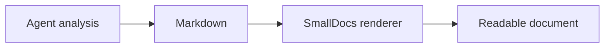
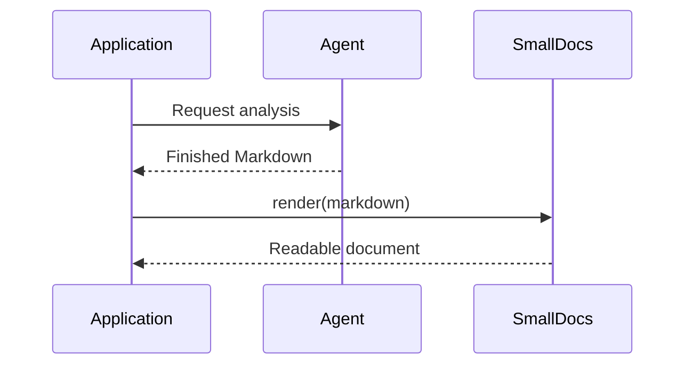

# Mermaid diagrams

Use a `mermaid` fence when structure, sequence, state, or relationships are easier to understand visually than as prose.

````md

````

Common diagram declarations include:

- `flowchart` or `graph` for processes and component relationships
- `sequenceDiagram` for interactions over time
- `classDiagram` for type relationships
- `stateDiagram-v2` for state transitions
- `erDiagram` for data relationships
- `gantt` and `timeline` for schedules
- `pie` for a small proportional breakdown
- `journey`, `gitGraph`, `mindmap`, and `sankey-beta` for their corresponding models

## Sequence example

````md

````

Do not add Mermaid `init` directives. SmallDocs controls Mermaid configuration and removes document-level initialisation directives. Keep each diagram under 64 KB and a document under 50 Mermaid blocks.

Prefer a small number of labelled nodes and explicit edges. Split a dense diagram into several diagrams when labels or crossings make it difficult to read.
