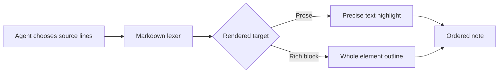

# Signals and systems

This document checks whether a walkthrough can frame complex rendered elements without knowing their internal DOM structure.

## Request flow

The diagram shows a request moving through validation, rendering, and a reader-facing walkthrough.



## Adoption evidence

The visual pattern is more important than any one monthly value.

```chart
{
  "type": "line",
  "title": "Walkthrough completion rate",
  "labels": ["May", "Jun", "Jul", "Aug"],
  "datasets": [
    {"label": "Text-only review", "values": [0.62, 0.66, 0.68, 0.71]},
    {"label": "Guided walkthrough", "values": [0.69, 0.76, 0.84, 0.89]}
  ],
  "format": "percent",
  "min": 0.5,
  "max": 1
}
```

## Scenario workbook

The two sheets share one workbook. Advancing to the summary step should reveal its tab automatically.

```cells Inputs
Metric,Value
Readers,120
Completion rate,0.89
Minutes saved per reader,6
```

```cells Summary
Metric,Value
Completed walkthroughs,=Inputs!B2*Inputs!B3
Hours returned,=Inputs!B2*Inputs!B4/60
```

## Review prompt

The form is another rich target. It remains interactive while the walkthrough frames the whole component.

```form
id: walkthrough-demo-review
fields:
  - name: clearest_target
    type: select
    label: "Which rich target is clearest?"
    options: [Diagram, Chart, Sheet, Form]
    default: Diagram

  - name: notes
    type: textarea
    label: "What would you refine?"
    rows: 3
    placeholder: "Optional review note"

buttons:
  - name: save_review
    label: "Save review"
    final: true
```
