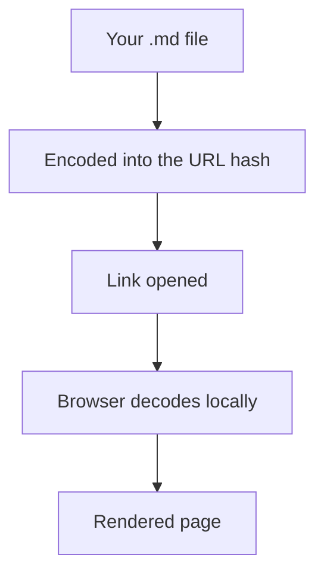

# Layout gallery

A tour of what the new `:::grid` containers can do. None of this is about the
homepage; it is just to show the shapes you (and your agents) can now build
inside an ordinary Markdown file. Every block below is live.

## Two columns of text

The simplest case: split a passage into two columns that stack on a phone.

:::grid cols=2
:::col
**The problem.** Markdown is a single tall column. Long comparisons, side
notes, and anything that wants to sit beside something else all end up stacked
one after another, so the reader scrolls past context instead of seeing it
together.
:::
:::col
**The change.** A container lets two passages sit next to each other. On a
narrow screen they fall back to one column automatically, so nothing breaks on
a phone.
:::
:::

## A row of cards

Three cards, each a small self-contained panel. Good for features, steps, or
options.

:::grid cols=3
:::card
### Read
Open any `.md` file in the browser with comfortable styling, no preview mode,
no code editor.
:::
:::card
### Style
Fonts, colour, spacing - all from the panel, saved into the file's front
matter so the look travels with it.
:::
:::card
### Share
Copy an encrypted link. The server only ever sees ciphertext.
:::
:::

## A comparison, side by side

The same shape reads well for a before / after or this / that.

:::grid cols=2
:::card
### Plain Markdown
- One vertical column
- Static once exported
- Tables, but nothing live
- Read it in a code editor
:::
:::card
### A SmallDoc
- Columns and grids
- Live charts, sheets, slides
- Edits and formulas that compute
- Read it in any browser
:::
:::

## A small dashboard

Mix big numbers, a chart, and a live sheet. The top row is three stat cards;
below them a chart and a sheet share a row.

:::grid cols=3
:::card
## 17,816
visits this quarter
:::
:::card
## 99.9%
uptime
:::
:::card
## 239
links shared
:::
:::

:::grid cols=2
:::card
### Growth
```chart
{
  "type": "line",
  "title": "Weekly visits",
  "labels": ["W19", "W20", "W21", "W22", "W23"],
  "values": [7882, 1280, 708, 560, 910],
  "dataLabels": false
}
```
:::
:::card
### The same numbers, as a sheet
```cells
format: B=
Week,Visits
W19,7882
W20,1280
W21,708
W22,560
W23,910
Total,=SUM(B2:B6)
```
:::
:::

## A diagram beside its explanation

Put the prose on one side and the picture on the other, so the reader sees both
at once instead of scrolling between them.

:::grid cols=2
:::col
**How a SmallDoc travels.** Your file is encoded into the link itself - the
part after the `#`, which browsers never send to a server. Open the link and
the browser decodes and renders it locally.

The server only serves the empty page. It never receives the document.
:::
:::col

:::
:::

## Nesting and spanning

A cell can span more than one column, and a grid can sit inside another grid.

:::grid cols=3
:::card span=2
### A wide cell
This card is told to span two of the three columns, so it takes up two thirds
of the row while the card on the right keeps a third.
:::
:::card
### Narrow
One third.
:::
:::

:::grid cols=2
:::card
### Outer card
And inside this one is a whole grid of its own:

:::grid cols=2
:::col
nested left
:::
:::col
nested right
:::
:::
:::
:::card
### Plain neighbour
Containers nest as deep as you need. Each level stacks on mobile in turn.
:::
:::

---

To use any of this, run `sdoc layout` for the full reference, or just describe
the layout you want to your agent.
