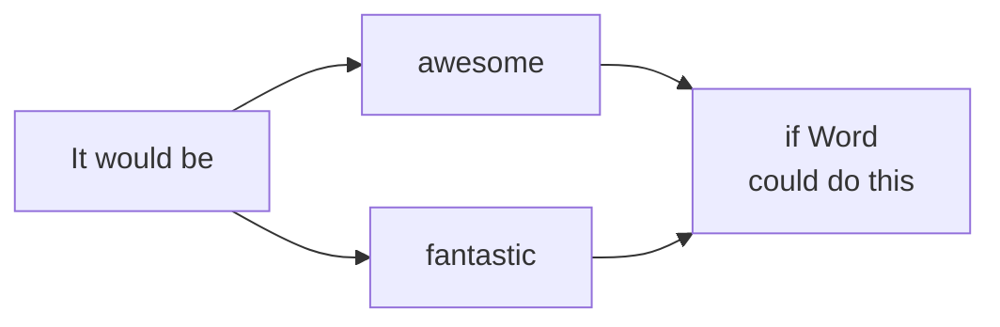
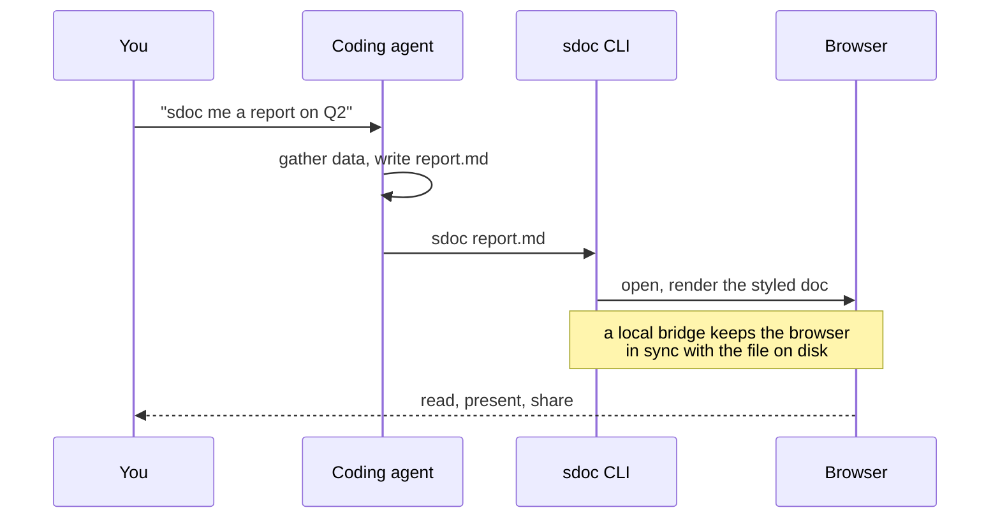

# A SmallDoc is a new type of document

One plain-text file that reads like a Word document, charts like a spreadsheet, and presents like a PowerPoint - with additions no traditional document format can do.

## Some of the things a SmallDoc can do:

### Renders text, like a Word doc

Very obvious, because you're reading it: headings, links, block-quotes etc. But markdown lets you style Markdown documents in remarkable ways.


(Check out: [Letters](https://smalldocs.org/#md=G9UHAJwHti1qt_BRaYTFBQs3-TXn19NUb7iQEFNor7Ipl6T-ADeyl6BqR34H8vcT5yslkYVNDaIgMzMVQNrgPxxjVFIzK4la391HRbchSa1Rkoakr9Hq8jOwMBAHA3ekKAoB3bfQOmhqSY_gVilCPLwEmPQEAPzydJIU4AtErBBGWr7IKMBBiWqsjp56Aanjlbx4NiGZBBlQKu6RCqox3FsrKJdQyHzpXunM8a9sfD31TuIHe227e-Vx6wG6YHb12GU2R7GobIsvavp_Vn_dEt7piW4-ievY0recacZxlEp67l4owbpDIJ7HKGV_jRysH0Mr_W0xa6kX0x6p9Z_Ae7ztpnmW6n8u8HO3oVwpNbX11LVJ-Dec96GWwj2ro9q15R46cw6GzNmZvEEySjpXoqGK6il8nAnGBv-PKPGEMLMzTa6zXPGftKAC4HTNhyIwfs_rxsYMx0G9wJOoLtWGKjTd4X6qwOBJmUWzoG10XbK5IEjVxaCvwzspMvBLGXlXtNbZjQk6PWaSFO9AiYOiUzQhAhZuzkHLihGbGPV0j_yAHaEu3fYjbsJ09mHErIonlovSzigolaTyQnfNwVo0GK9ZXxyMPxZXO8Ev5fjC2mYjrqP_SHGDNY0NgiiZyMVqut1TdNhO3VUubSA2uoKCx5EVtgqaO1HnQMW_MWHVKzd0-WCyREndvadf1ipcLS62SC_G_TF75tsRNwyxtNKMHvhFkINe264APrECX1a_cm_SjqFlBckHWaLJgjQeoJtTYhJ9tF8I2yoPYlDjNPWH8tkrrPbQTFHtLpqG99LpFV5-_B6C8Lb6koxWUAilMUaUJa5DMMezttiJYHB_b11_3bVrjBlmWjgwHpVT9xhXqsn1ZMFfcB4iYyis1bcSB6X2v58dFRyY14h62yA2_CHoSYkXYKPEKtpwAuDOar_gT-yUZwZxmBU-ZVgtcown5nZBuV7fSWHRXNMRDHlcckHfy-mPklaFpLjNWA7VBvg73Oh723W83BETi0bU_DPvhk8dVqhqGPc5ylewUzRLMNBvswSDOc5H1QE&theme=light) | [Investor Update](https://smalldocs.org/#md=GyYLAJwHtpuVQYhvYSgo1IWbrqlZT1Pt4JAEwwLKlWP1OaEDnbkELzg7F13jBjSUnNQgCixES2HP73-_ds4mS5TmiZIWato7M_-tOiQxn4eoJQ6JqElKIxYeQ7X_eR5iKITUbK2MMWK7p0Pfa74ZYMkZKZwVBmUpSXlLF0COMiCM7FAaQEwgZgWBpJEdLAkIVMQ1ysirjxlCnkqdR1-yk7Ui_DFBcF0Wxtr4ju6MwzBKTT3v43jj8Foll8VHsa_LS40QzuusE7puQD6BXJVb_9oOeku1zIjSMBw3S6Yg2poDDnBUvr6hazlUdGA9YARg5pBQKNhbUP81dAdRttrS2FGpE2TjzgW-9XmgbMbCQKfURSh11lWNse2_JQa0qqLBdqKTrhkFjdCuUzLYHS8JreCcNjOMo1M5cqJZuZy-MEUb7Ab1DKC4dPSqSxQ4rjA2_cKgUWFbGbga2yieldtD7Q8sRyQbZok1GjPYf83XlpIqdtIdqFwtxPGxyF6weynd-w6nj9Nh2rBsT_yURwtzyPlhm0P5NTAU3o_q06v-HwLifyN-wdVEyeBFOCqvlWmn_2cbQTV78D685_DpNhAb6eixsenIFoRYI7Z5IhkmNaFLsEX7E9w6-C1IUN3aGdnZ0WYhVJvSsj_Pp2sHa3_HzBBUR_pelf6DkbcmATZ7gf_t9MMH8Bt4jz2fDxJswi1o3OPIv3__AGsESQCobsfA9gcbtvPrzTbTwqTJ59WW84KjgOzLvteWCNmG0vbATxqHFlqg0pl4DbHNCGtf8ImjwTLy2wfG2K5hGguyeXbraG2Bm2OXBndTZfG2nqmbYTTjlLaqbb22p6PuucvSvZia6Us4kpwwJO2OGfKcFZT9IiBIIxs-cyvwiZGeIYRxW1gObMhY9WIhu42MAmrIQNOOyN5NXKlB300kl2DaMlM4xWf0xyjgbv_CUGZTv8yYHxIPfB3FC5diCEFk7oX6D99qwuPW7WZ-My_7qwYzFTsl-yV4Mdh2FIb7WrM0JEBqXcOAhgwpILSqTcllF4Q5Yo9-hGn76lM4K_jwoBeD8iC7wMaAwDXwPL8a1W5dodC_sVsLjmfP_emdTys1u0KWhi4bgLJ-AhWp81Z951lGQDwZh86LHw5yRI_YMeMVXLmBE5onmk3MKxFem4lYHeidVKcv74BGQb00dBSG1dGhCRpRk8ZLB31jDWpFE-ohvl42bI6_GGsmAjmcsnSIWnJ6agFU4kbBMu9zeBMy3LtMd0FbhXTOcsAdTA50TT9IcsAOMsE5djY3rXyMzoLm16iB0Na3sww9uuG5NBD5qocSCE7Y5-Vo7n-0hsgaY0LOVJ7CFoG6ubJPQZV1c4qzpUzfMnhIGjWb2oS58-3K5DDdQz-SEHbu4rJI8OWWpnQc8RnO8NDppkwwDT9UIE8kyKFIlT7wTKzRMQVgaGeazN8IA3EKKSDG98ibloPVCvjx9P2CUoYOcG0ymyUhJ6kw4j26w3DgjvGPboFtEM6t1s2WsLeULi4kEQ&theme=light) | [Lisbon](https://smalldocs.org/#md=G0MNIJwH2SnzJNPvVHCBYHHTpur7O5cJJ6fy9OhW0tqvZYZEyEYsAToCSvo-vUptbRAFlbahAP_9T_8nFL57NF1YrGTPPRlWLjV5tNCH0lryKKU5FAuhnv6lqyYFjyNpjGGXXAmd33zzkIPjOKleLFM8E0kGFviFrVGpQobjFEBBJvjP6qT6a2r4WgWABo3eqrgy0tUny30AEUpV47plOgSAHH-wk68Byaj24ToW-BvFqlop4-3AsobSlj7IxUXa1jCOY6hqRtsjtV0F30PPy4A9EQdWafenjdeEm7fP5XjViYA_59UNkOPR4xq06Pa7HVU17GxOKvRL8VOM3HfmqRs4yxvCvKjSvMay2-IaDU6Gi3hOINr2yu0DO2yWh31V_ymp73zdpo5k8Wq3WbTpOl-52q122w8C3N68XtFqf6jS8w4sFyvWuALTQYq-sa2yyEtcrtv3q7QHWreLLiq4kwuHXXs4hl1A1P--Hu5z02zedOW5P_wubIkwvz5Nyct135Jeb7ldHZat56cbLM_PymvdcXW7yrK2dtO81Df93dn0XIUK-bswg7o4VPjnowJKBuQgWOBfal_QECo5v5R4I-yipJkA1ZAMMjE4wZJsXFY2I0fZtKDjhdls9XcZ3V3_Ev0sHH6YhoaKK7ym_oxZGYr20CVjK5IhNtlMGQ7HT8zCXfOi73BAvqn0Nm3rZ3lmzV1YacP6tQqyDkNwFKKeZmUYosGzJf-jXc6zCj1Py8fFGbxTmI6JkIcduGDWqWh4mi6ILrySF_iLsARppgMCbCk3Kq6GCkpuNJwdIrpYiPHX0AMy2lryw6JBVvhb-7Q4-cKQCJGHkQpjH3vtDJBwv9EQFWve-PvQV1a7Jn-zg4rJqmT1J3aw0XfTXTk8REF3WP4OzUG8SzvYbqn_G1AXXqvc9zG7VdYe44QFhdZuKk1p45G6hbyk_tYQ_kDzW2yQ6df_A-hwOK0XONR4YZZJgMaM_5e8Ii1gbCf0jYcDDRZA0hvujHxCCr1PE-OvKmhO5XOMaU6WBgXmG8JZtL3yXXt0Nm38Bwa2ThsDYJ2R8DvtnlCq14msZChmmrjHRFVKZtZ_lNvS8kjwF2EffpmkvQA62M87WosPhZVOd50L9z1lGP3QNMq_umdUR1ey9KX4054FX9VSxgJnc7F_uV0w-WARARnvdZVzoZxmKhH6VA2lyw4qphZCvwB7KiwTxPhiUp7WcMYexjSHKY7hOqUJS638PPRmaJA_YXa7HYVeF0bssbWjLkHc5s6uWvsf5ZWWK9yDV5pum4_Yr1-fP2Jmo5NzL9TDpplcOQJ0FQRQena0DORSaMsQruE1i1Cx4-Yfx9N6ASs1a202M75-LjH-U_ADmSFkhD8n4iFHOUmnWpwS8cyores4Wa29EBnVta_RAW8y059jLAR2LXK5__10Lj_jir0D1w7OVOH2THIHjGFtZQL7FkVfLa9NHkgeNH_GjWhOPWQCQcdIPDKqKeXPxceRI0UKk99zxSJnPLV7VKVLlyhs48dlmapSJlJThR9Gi3F1iAM2wE5wHJyHsZCbrhQNAcqcuMl1-CUTJuvchginmltpZ8Gv0zznCkw8Vk2jKSAbvCMH7ToAGS-aF-rvusarRM8tptGGu1SiJ8LxNwuw5w2e24gN64SU3WNWmApenXEDY_wFR4xxmL-Z7dHuyctel50dkAKEs-2OCwdViGRG8sKlhNZdT6I0ijv96_ELF2Wym8IqDoJEMSogi1p1-goPiDqtPxBuyD-SypwrjZJxHA7jgCbATv3fcEugC0jkAaCTcHM3CbdTT74LR968TGpE8DeLFwQ0QLgTrHvvtCWLjwpyeY2BFsjePzxr8mtX2S-LmlS_F9sBdW_a5hDPLO9ZLhhruUxyBeMI1eKYoUqnVABn7XLGCTlNf-1W8MGbUcmmG9OJ7li1YXemygA&theme=light) | [On Foot](https://smalldocs.org/#md=G8sPAJwFdptLwd1GjPOwYNhcSCGN8evUmTvLdHJKpdUtytTmZGoHPh4LbCPOwBeD1pX6bD1QDyDSL2foYxRXzTIgEGiV35OH7rOzbQWQtr0Q3y9rBziWR4jDFAiZgvArkRgXhLnt99_Oxr_pQlKEFOfPXVZXqBDtOXA5aYwTLIe6fzQliDgjdAd9_6VAH2iC30S4bU0Pyj2iWPZAA8ARnd9_uQm1dVI8iAKgtVXKuISvXgIy6J5vN31HQIH7WQ2PK7iqhtA040sgnHlvfMBfHx9rQQ2nOU1CbdAbRjHTlSep8hqjVv_GbEQl2uZNqzytMu8C7JjcIdvjkZwT418lWc3cj2cg1sIkqNGhpF6gZMaszvX9qwZbZOQjyUConbYZej7O6LBk4TA84rbOhH9FeafZiQL7iO-kbwgEcPysGV-SPdVbGhJJJotSwzTr7h3BPbRpzwm7miiclFzdHiqHKjLx24qFO1P6uNWuMlt9SB0JzCW-ZX1OzfH7EGC7UWY1q9E85JI7n3XIfTzOv893FCNde-GMRyzbZbWqc4zRVXfhEWfsiV1ZwwYKqt-7StuxL0lbf9iNByZFCXAPKQTC2sWeHBY0WQWqChGDWToCZSoQWKq3cZ3EIkQ18vxRm0komPJsV0h8WPXwVvz7Bzs7pRUrcwA0Mk9AWkUlkB5WyFWv8rANzYb8yzp7wlWvEzq10XR6Li8X_cTjI2MWAqP-RmLUKlgXxyr2l0_FrTXgLHyRUVYoO7AD0tz9577opTgdaXAmD2YpUkt2mmzPYxwoyxeVUX_iHoCQ6XjzBVgthAJV4XVcUxYZhlFjjJM7QGWyZd5_cSIKNAIBCbUf4xouK_w5ruFpXbGahVPsr4e4Q3Pc6Fxct9vJiDrxZgrcd5jJHZXY6heTQU9LeNuj3jq2D-i5lSDwPT5EgmkkKkVSi0g2ihSXSD2prfN1kIKua0XjQg15Q4AITSumqGN4hnDimvA7h13YTXvliApYqHLSgUVdxMELUrFUaA2d1xwqsZJLewzF9Ld_wRZ5IImLiq9MM8gH4Y86mmMmaxLP713jgm6wRldnwXZ56ENJmwJ5__ZrPKHvUk_dOtgnWoHBGWeD8rIWAtkIAw5bgIDdpgXK_oVhfJeSh6veADXgyBDqfurV5h4bwT5sjcuOHzfua0_QxQohP_uxombj7krxgGTcHdY4WVTcQTfcWQ0lBgRWiWnruCBI_Cw8KvzzlCEICn3m_fJSjM7YKAP7-0-08JKiw1ccGSWk62gU4XfVudICLvWsi5mZJFk4iwORK7OtERHKQVmGpSMdEzvQxI4ahltGz4bWXle38r4ZO3mSeOjPiiuj11EHBafKGC3lpkcMeS4gmipW3rA0Gh1wY5ouXlqPD5Ku0hlL-oi2ElZtsVxxVTPGRhmktbKugTUgEc1N_vfvtTLhqB_YGZ6QwcrOKWp3hE_LLZarLW-0XGQ50wqKrQVBrqetiMjJveiNjXndBfTqHIMd3wEekaupLMPjo9RK1JxmFtAcAwvQdHlDRorKNhgucAVG9k2WG0FfwEDOY_PbzrUj2qynNhrAfKWrJP7sbOzhbgb_squPQPy915s7mCcEZDEuT6OZxTwF5PbXC17iUhRvcfVqD6qJiUoTly5NTExUuriIdFExaRIP8vPG9C3p-nD4o91orDOz3ed6wwzLeT6bZsiFMOLCEkJiYuIzCfL7vWt36jTgyN55dhUhz6bL2Ses6A1Mel_Y3otOiaqna4gkmZL1VSZTfwLVHqQaxRBkldH7maQuJ5ydXLBJEYLOhwmZ6E2QkzZkQ8RP5eaNCmYVQbTA1BZZ9Q5AB1pJv02cK7vQcIMgDLSgMNwWa7Rhal5yvDw2GPVTkFJYhs6KGw57-Drmkr51jn-0cBCp_COkjoOkoq697alcue46SFfp-z0as2B5XOwXvo7q48Qh5LEC6InpFCg_6rPYbofbEZeJVXkEMUMdormwjv5BWRU&theme=light))

### Analyses data, like a spreadsheet

Real numbers from smalldocs.org's own analytics. The Returning share column and the Total row are formulas, computed live - select a range for quick stats, sort a column, or download the sheet as an Excel workbook with the formulas still working.

```cells
format: B=, C=, D=%.0
Week,Visits,New visitors,Returning share
W19,7882,6923,=(B2-C2)/B2
W20,1280,736,=(B3-C3)/B3
W21,708,352,=(B4-C4)/B4
W22,560,324,=(B5-C5)/B5
Total,=SUM(B2:B5),=SUM(C2:C5),=(B6-C6)/B6
```

And the same file charts that data:

```chart
{
  "type": "bar",
  "title": "Spend on AI agents",
  "subtitle": "Market size, USD billions - roughly 8 in 2025, ~294 by 2035",
  "labels": ["2025", "2026", "2030", "2035"],
  "values": [7.9, 11.5, 52, 294],
  "yAxis": "USD (billions)",
  "prefix": "$",
  "dataLabels": true
}
```

```chart
{
  "type": "line",
  "title": "Returning visits by cohort",
  "subtitle": "Each line is a weekly cohort of smalldocs.org visitors over time",
  "labels": ["W16", "W17", "W18", "W19", "W20", "W21"],
  "datasets": [
    { "label": "W15 cohort", "values": [496, 213, 148, 504, 164, 135] },
    { "label": "W16 cohort", "values": [null, 353, 155, 308, 68, 57] },
    { "label": "W17 cohort", "values": [null, null, 40, 80, 30, 31] },
    { "label": "W18 cohort", "values": [null, null, null, 17, 6, 7] },
    { "label": "W19 cohort", "values": [null, null, null, null, 273, 89] },
    { "label": "W20 cohort", "values": [null, null, null, null, null, 34] }
  ],
  "yAxis": "Visits",
  "tension": 0.3,
  "dataLabels": false
}
```

### Houses slides, like a PowerPoint

~~~slide
grid 100 56.25
r 12 16 76 4 text=caption align=left color=#e0701e | A NEW TYPE OF DOCUMENT
r 12 21 76 11 text=title align=left color=#1c1a17 | SmallDocs
r 12.5 33.5 14 0.6 fill=#4d65ff
r 12 36.5 76 6 text=subtitle align=left color=#8a8378 | Word, a spreadsheet and PowerPoint, in one plain-text file
~~~

~~~slide
grid 100 56.25 bg=#0e1330
r 6 4 88 3 text=caption align=left color=#f59e3b | ONE FILE, RENDERED EVERY WAY
r 6 7.5 88 5 text=subtitle align=left color=#ffffff | report.md
r 6 15 42 17 fill=#161b3d stroke=#39406f strokeWidth=0.02
r 9 17.5 30 2 text=caption align=left color=#9aa3c7 | CHART
r 11 24 4 4 fill=#ffd9b3
r 17 21 4 7 fill=#f59e3b
r 23 18.5 4 9.5 fill=#e0701e
r 29 22 4 6 fill=#4d65ff
r 35 19.5 4 8.5 fill=#7c8cff
r 52 15 42 17 fill=#161b3d stroke=#39406f strokeWidth=0.02
r 55 17.5 30 2 text=caption align=left color=#9aa3c7 | SLIDE
r 55 21 36 2.4 fill=#e0701e
r 55 24.5 36 1.2 fill=#39406f
r 55 26.5 28 1.2 fill=#39406f
r 55 28.5 32 1.2 fill=#39406f
r 6 34 42 17 fill=#161b3d stroke=#39406f strokeWidth=0.02
r 9 36.5 30 2 text=caption align=left color=#9aa3c7 | DIAGRAM
c 13 44 2 fill=#e0701e
c 24 44 2 fill=#f59e3b
c 35 44 2 fill=#4d65ff
a 15 44 22 44 color=#9aa3c7 strokeWidth=0.04
a 26 44 33 44 color=#9aa3c7 strokeWidth=0.04
r 52 34 42 17 fill=#0a0e24 stroke=#39406f strokeWidth=0.02
r 55 36.5 30 2 text=caption align=left color=#9aa3c7 | CODE
r 55 40 12 1.3 fill=#4d65ff
r 55 42.3 20 1.3 fill=#7c8cff
r 58 44.6 16 1.3 fill=#f59e3b
r 58 46.9 22 1.3 fill=#39406f
r 55 49.2 10 1.3 fill=#7c8cff
r 6 53 88 2.5 text=caption align=left color=#8a93b5 | Four documents, one source file - laid out with raw shapes, no design tool.
~~~

### Draws diagrams, like you're in the future

A diagram, drawn from a description rather than dragged into place. It would be nice if a Word doc could do this:



And it scales to real architecture - here is how an agent actually drives SmallDocs, end to end:



And a diagram can live inside a slide, too:

~~~slide
grid 100 56.25
r 6 4 88 4 text=subtitle align=left color=#c2540e | A diagram, living inside a slide
r 8 13 84 38 align=center valign=center |
  ```mermaid
  flowchart LR
    A[coding agent] -->|writes .md| B[sdoc]
    B -->|opens| C[browser renders]
  ```
~~~

### Renders code, like a GitHub repository

```bash
sdoc report.md        # opens it, styled, in the browser
sdoc share report.md  # an encrypted link; the server sees only ciphertext
```

### Adds a library for your Markdown

SmallDocs adds a library for your agent-generated Markdown. Every Markdown file on your machine, gathered into a searchable place. Filter by project, path, agent, date, or tag.

[](https://smalldocs.org/library?demo=1)

Browse a [sample library](https://smalldocs.org/library?demo=1).

Teams using SmallDocs get a company-wide Markdown cloud library.

---

## Built for the agentic paradigm

### Markdown-first, command-line-first

Agents love to write Markdown, and the command line is where the strongest of them are most at home. A SmallDoc is simply Markdown, rendered with one command.

### SmallDocs changes how you talk to agents

All your locally running agents know about SmallDocs. This changes your document creation work into:

> "Claude, sdoc me a report on Q2's financials."
>
> "Codex, draw up the architecture for our email service."
>
> "Claude, dig into our analytics and sdoc me an analysis of our funnel."
>
> "Codex, ssh onto the server and sdoc a bug report re our outage."
