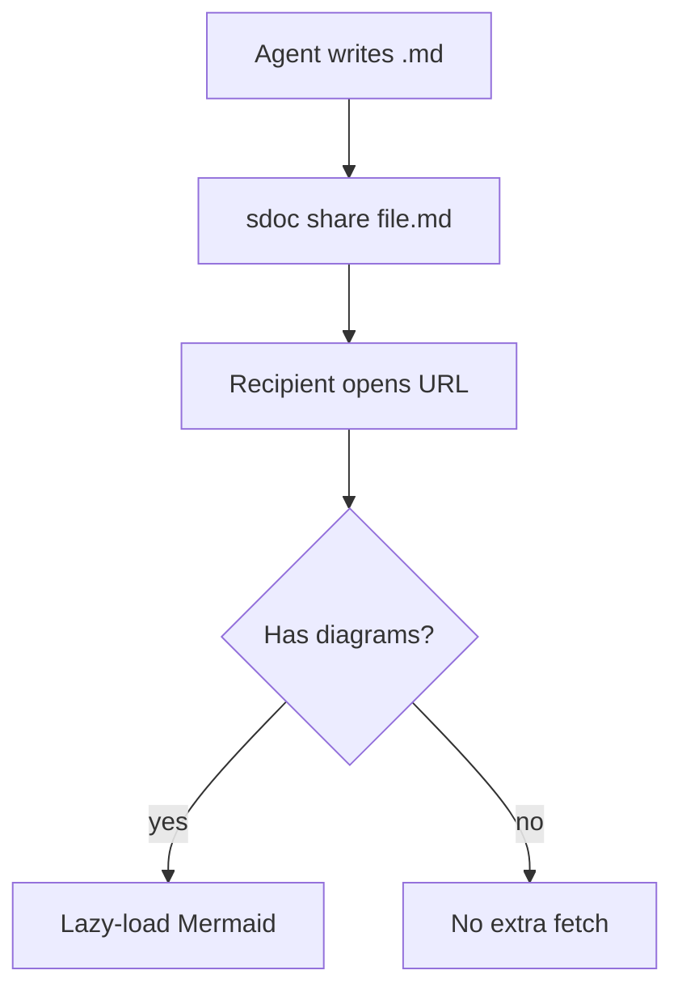

# Meet `sdoc`: Markdown without the frustrations


(**TLDR:** `sdoc path/to/README.md` opens your file at https://smalldocs.org with pleasant default styles which can be altered. Share the url to share your file + custom styling. **Your file never hits the SDocs server:** Encoded file content lives in the URL fragment (`#...` part) which browsers don't send to servers. CLI: `curl -fsSL https://smalldocs.org/install | sh`. SDocs is [open-source](https://github.com/espressoplease/SDocs). You're reading markdown right now.)

---

Markdown is great for agents, but a bit annoying for humans. Quickly and elegantly reading a `.md` file requires you to open your code editor and enter "preview" mode. Sharing a markdown file requires you to actually send the file to someone. They then have to download it and find the least annoying way to read it.

SmallDocs is an [open-source](https://github.com/espressoplease/SDocs) attempt at something different. It lets you (or your agent) easily, elegantly and <ins>100% privately</ins> **read**, **format**, **share** and **export** `.md` files.

Reading a `.md` file in SmallDocs feels just like this (you're reading markdown right now). And by playing with the styles, you can create things like:


(Check out: [Letters](https://smalldocs.org/#md=G9UHAJwHti1qt_BRaYTFBQs3-TXn19NUb7iQEFNor7Ipl6T-ADeyl6BqR34H8vcT5yslkYVNDaIgMzMVQNrgPxxjVFIzK4la391HRbchSa1Rkoakr9Hq8jOwMBAHA3ekKAoB3bfQOmhqSY_gVilCPLwEmPQEAPzydJIU4AtErBBGWr7IKMBBiWqsjp56Aanjlbx4NiGZBBlQKu6RCqox3FsrKJdQyHzpXunM8a9sfD31TuIHe227e-Vx6wG6YHb12GU2R7GobIsvavp_Vn_dEt7piW4-ievY0recacZxlEp67l4owbpDIJ7HKGV_jRysH0Mr_W0xa6kX0x6p9Z_Ae7ztpnmW6n8u8HO3oVwpNbX11LVJ-Dec96GWwj2ro9q15R46cw6GzNmZvEEySjpXoqGK6il8nAnGBv-PKPGEMLMzTa6zXPGftKAC4HTNhyIwfs_rxsYMx0G9wJOoLtWGKjTd4X6qwOBJmUWzoG10XbK5IEjVxaCvwzspMvBLGXlXtNbZjQk6PWaSFO9AiYOiUzQhAhZuzkHLihGbGPV0j_yAHaEu3fYjbsJ09mHErIonlovSzigolaTyQnfNwVo0GK9ZXxyMPxZXO8Ev5fjC2mYjrqP_SHGDNY0NgiiZyMVqut1TdNhO3VUubSA2uoKCx5EVtgqaO1HnQMW_MWHVKzd0-WCyREndvadf1ipcLS62SC_G_TF75tsRNwyxtNKMHvhFkINe264APrECX1a_cm_SjqFlBckHWaLJgjQeoJtTYhJ9tF8I2yoPYlDjNPWH8tkrrPbQTFHtLpqG99LpFV5-_B6C8Lb6koxWUAilMUaUJa5DMMezttiJYHB_b11_3bVrjBlmWjgwHpVT9xhXqsn1ZMFfcB4iYyis1bcSB6X2v58dFRyY14h62yA2_CHoSYkXYKPEKtpwAuDOar_gT-yUZwZxmBU-ZVgtcown5nZBuV7fSWHRXNMRDHlcckHfy-mPklaFpLjNWA7VBvg73Oh723W83BETi0bU_DPvhk8dVqhqGPc5ylewUzRLMNBvswSDOc5H1QE&theme=light) | [Investor Update](https://smalldocs.org/#md=GyYLAJwHtpuVQYhvYSgo1IWbrqlZT1Pt4JAEwwLKlWP1OaEDnbkELzg7F13jBjSUnNQgCixES2HP73-_ds4mS5TmiZIWato7M_-tOiQxn4eoJQ6JqElKIxYeQ7X_eR5iKITUbK2MMWK7p0Pfa74ZYMkZKZwVBmUpSXlLF0COMiCM7FAaQEwgZgWBpJEdLAkIVMQ1ysirjxlCnkqdR1-yk7Ui_DFBcF0Wxtr4ju6MwzBKTT3v43jj8Foll8VHsa_LS40QzuusE7puQD6BXJVb_9oOeku1zIjSMBw3S6Yg2poDDnBUvr6hazlUdGA9YARg5pBQKNhbUP81dAdRttrS2FGpE2TjzgW-9XmgbMbCQKfURSh11lWNse2_JQa0qqLBdqKTrhkFjdCuUzLYHS8JreCcNjOMo1M5cqJZuZy-MEUb7Ab1DKC4dPSqSxQ4rjA2_cKgUWFbGbga2yieldtD7Q8sRyQbZok1GjPYf83XlpIqdtIdqFwtxPGxyF6weynd-w6nj9Nh2rBsT_yURwtzyPlhm0P5NTAU3o_q06v-HwLifyN-wdVEyeBFOCqvlWmn_2cbQTV78D685_DpNhAb6eixsenIFoRYI7Z5IhkmNaFLsEX7E9w6-C1IUN3aGdnZ0WYhVJvSsj_Pp2sHa3_HzBBUR_pelf6DkbcmATZ7gf_t9MMH8Bt4jz2fDxJswi1o3OPIv3__AGsESQCobsfA9gcbtvPrzTbTwqTJ59WW84KjgOzLvteWCNmG0vbATxqHFlqg0pl4DbHNCGtf8ImjwTLy2wfG2K5hGguyeXbraG2Bm2OXBndTZfG2nqmbYTTjlLaqbb22p6PuucvSvZia6Us4kpwwJO2OGfKcFZT9IiBIIxs-cyvwiZGeIYRxW1gObMhY9WIhu42MAmrIQNOOyN5NXKlB300kl2DaMlM4xWf0xyjgbv_CUGZTv8yYHxIPfB3FC5diCEFk7oX6D99qwuPW7WZ-My_7qwYzFTsl-yV4Mdh2FIb7WrM0JEBqXcOAhgwpILSqTcllF4Q5Yo9-hGn76lM4K_jwoBeD8iC7wMaAwDXwPL8a1W5dodC_sVsLjmfP_emdTys1u0KWhi4bgLJ-AhWp81Z951lGQDwZh86LHw5yRI_YMeMVXLmBE5onmk3MKxFem4lYHeidVKcv74BGQb00dBSG1dGhCRpRk8ZLB31jDWpFE-ohvl42bI6_GGsmAjmcsnSIWnJ6agFU4kbBMu9zeBMy3LtMd0FbhXTOcsAdTA50TT9IcsAOMsE5djY3rXyMzoLm16iB0Na3sww9uuG5NBD5qocSCE7Y5-Vo7n-0hsgaY0LOVJ7CFoG6ubJPQZV1c4qzpUzfMnhIGjWb2oS58-3K5DDdQz-SEHbu4rJI8OWWpnQc8RnO8NDppkwwDT9UIE8kyKFIlT7wTKzRMQVgaGeazN8IA3EKKSDG98ibloPVCvjx9P2CUoYOcG0ymyUhJ6kw4j26w3DgjvGPboFtEM6t1s2WsLeULi4kEQ&theme=light) | [Lisbon](https://smalldocs.org/#md=G0MNIJwH2SnzJNPvVHCBYHHTpur7O5cJJ6fy9OhW0tqvZYZEyEYsAToCSvo-vUptbRAFlbahAP_9T_8nFL57NF1YrGTPPRlWLjV5tNCH0lryKKU5FAuhnv6lqyYFjyNpjGGXXAmd33zzkIPjOKleLFM8E0kGFviFrVGpQobjFEBBJvjP6qT6a2r4WgWABo3eqrgy0tUny30AEUpV47plOgSAHH-wk68Byaj24ToW-BvFqlop4-3AsobSlj7IxUXa1jCOY6hqRtsjtV0F30PPy4A9EQdWafenjdeEm7fP5XjViYA_59UNkOPR4xq06Pa7HVU17GxOKvRL8VOM3HfmqRs4yxvCvKjSvMay2-IaDU6Gi3hOINr2yu0DO2yWh31V_ymp73zdpo5k8Wq3WbTpOl-52q122w8C3N68XtFqf6jS8w4sFyvWuALTQYq-sa2yyEtcrtv3q7QHWreLLiq4kwuHXXs4hl1A1P--Hu5z02zedOW5P_wubIkwvz5Nyct135Jeb7ldHZat56cbLM_PymvdcXW7yrK2dtO81Df93dn0XIUK-bswg7o4VPjnowJKBuQgWOBfal_QECo5v5R4I-yipJkA1ZAMMjE4wZJsXFY2I0fZtKDjhdls9XcZ3V3_Ev0sHH6YhoaKK7ym_oxZGYr20CVjK5IhNtlMGQ7HT8zCXfOi73BAvqn0Nm3rZ3lmzV1YacP6tQqyDkNwFKKeZmUYosGzJf-jXc6zCj1Py8fFGbxTmI6JkIcduGDWqWh4mi6ILrySF_iLsARppgMCbCk3Kq6GCkpuNJwdIrpYiPHX0AMy2lryw6JBVvhb-7Q4-cKQCJGHkQpjH3vtDJBwv9EQFWve-PvQV1a7Jn-zg4rJqmT1J3aw0XfTXTk8REF3WP4OzUG8SzvYbqn_G1AXXqvc9zG7VdYe44QFhdZuKk1p45G6hbyk_tYQ_kDzW2yQ6df_A-hwOK0XONR4YZZJgMaM_5e8Ii1gbCf0jYcDDRZA0hvujHxCCr1PE-OvKmhO5XOMaU6WBgXmG8JZtL3yXXt0Nm38Bwa2ThsDYJ2R8DvtnlCq14msZChmmrjHRFVKZtZ_lNvS8kjwF2EffpmkvQA62M87WosPhZVOd50L9z1lGP3QNMq_umdUR1ey9KX4054FX9VSxgJnc7F_uV0w-WARARnvdZVzoZxmKhH6VA2lyw4qphZCvwB7KiwTxPhiUp7WcMYexjSHKY7hOqUJS638PPRmaJA_YXa7HYVeF0bssbWjLkHc5s6uWvsf5ZWWK9yDV5pum4_Yr1-fP2Jmo5NzL9TDpplcOQJ0FQRQena0DORSaMsQruE1i1Cx4-Yfx9N6ASs1a202M75-LjH-U_ADmSFkhD8n4iFHOUmnWpwS8cyores4Wa29EBnVta_RAW8y059jLAR2LXK5__10Lj_jir0D1w7OVOH2THIHjGFtZQL7FkVfLa9NHkgeNH_GjWhOPWQCQcdIPDKqKeXPxceRI0UKk99zxSJnPLV7VKVLlyhs48dlmapSJlJThR9Gi3F1iAM2wE5wHJyHsZCbrhQNAcqcuMl1-CUTJuvchginmltpZ8Gv0zznCkw8Vk2jKSAbvCMH7ToAGS-aF-rvusarRM8tptGGu1SiJ8LxNwuw5w2e24gN64SU3WNWmApenXEDY_wFR4xxmL-Z7dHuyctel50dkAKEs-2OCwdViGRG8sKlhNZdT6I0ijv96_ELF2Wym8IqDoJEMSogi1p1-goPiDqtPxBuyD-SypwrjZJxHA7jgCbATv3fcEugC0jkAaCTcHM3CbdTT74LR968TGpE8DeLFwQ0QLgTrHvvtCWLjwpyeY2BFsjePzxr8mtX2S-LmlS_F9sBdW_a5hDPLO9ZLhhruUxyBeMI1eKYoUqnVABn7XLGCTlNf-1W8MGbUcmmG9OJ7li1YXemygA&theme=light) | [On Foot](https://smalldocs.org/#md=G8sPAJwFdptLwd1GjPOwYNhcSCGN8evUmTvLdHJKpdUtytTmZGoHPh4LbCPOwBeD1pX6bD1QDyDSL2foYxRXzTIgEGiV35OH7rOzbQWQtr0Q3y9rBziWR4jDFAiZgvArkRgXhLnt99_Oxr_pQlKEFOfPXVZXqBDtOXA5aYwTLIe6fzQliDgjdAd9_6VAH2iC30S4bU0Pyj2iWPZAA8ARnd9_uQm1dVI8iAKgtVXKuISvXgIy6J5vN31HQIH7WQ2PK7iqhtA040sgnHlvfMBfHx9rQQ2nOU1CbdAbRjHTlSep8hqjVv_GbEQl2uZNqzytMu8C7JjcIdvjkZwT418lWc3cj2cg1sIkqNGhpF6gZMaszvX9qwZbZOQjyUConbYZej7O6LBk4TA84rbOhH9FeafZiQL7iO-kbwgEcPysGV-SPdVbGhJJJotSwzTr7h3BPbRpzwm7miiclFzdHiqHKjLx24qFO1P6uNWuMlt9SB0JzCW-ZX1OzfH7EGC7UWY1q9E85JI7n3XIfTzOv893FCNde-GMRyzbZbWqc4zRVXfhEWfsiV1ZwwYKqt-7StuxL0lbf9iNByZFCXAPKQTC2sWeHBY0WQWqChGDWToCZSoQWKq3cZ3EIkQ18vxRm0komPJsV0h8WPXwVvz7Bzs7pRUrcwA0Mk9AWkUlkB5WyFWv8rANzYb8yzp7wlWvEzq10XR6Li8X_cTjI2MWAqP-RmLUKlgXxyr2l0_FrTXgLHyRUVYoO7AD0tz9577opTgdaXAmD2YpUkt2mmzPYxwoyxeVUX_iHoCQ6XjzBVgthAJV4XVcUxYZhlFjjJM7QGWyZd5_cSIKNAIBCbUf4xouK_w5ruFpXbGahVPsr4e4Q3Pc6Fxct9vJiDrxZgrcd5jJHZXY6heTQU9LeNuj3jq2D-i5lSDwPT5EgmkkKkVSi0g2ihSXSD2prfN1kIKua0XjQg15Q4AITSumqGN4hnDimvA7h13YTXvliApYqHLSgUVdxMELUrFUaA2d1xwqsZJLewzF9Ld_wRZ5IImLiq9MM8gH4Y86mmMmaxLP713jgm6wRldnwXZ56ENJmwJ5__ZrPKHvUk_dOtgnWoHBGWeD8rIWAtkIAw5bgIDdpgXK_oVhfJeSh6veADXgyBDqfurV5h4bwT5sjcuOHzfua0_QxQohP_uxombj7krxgGTcHdY4WVTcQTfcWQ0lBgRWiWnruCBI_Cw8KvzzlCEICn3m_fJSjM7YKAP7-0-08JKiw1ccGSWk62gU4XfVudICLvWsi5mZJFk4iwORK7OtERHKQVmGpSMdEzvQxI4ahltGz4bWXle38r4ZO3mSeOjPiiuj11EHBafKGC3lpkcMeS4gmipW3rA0Gh1wY5ouXlqPD5Ku0hlL-oi2ElZtsVxxVTPGRhmktbKugTUgEc1N_vfvtTLhqB_YGZ6QwcrOKWp3hE_LLZarLW-0XGQ50wqKrQVBrqetiMjJveiNjXndBfTqHIMd3wEekaupLMPjo9RK1JxmFtAcAwvQdHlDRorKNhgucAVG9k2WG0FfwEDOY_PbzrUj2qynNhrAfKWrJP7sbOzhbgb_squPQPy915s7mCcEZDEuT6OZxTwF5PbXC17iUhRvcfVqD6qJiUoTly5NTExUuriIdFExaRIP8vPG9C3p-nD4o91orDOz3ed6wwzLeT6bZsiFMOLCEkJiYuIzCfL7vWt36jTgyN55dhUhz6bL2Ses6A1Mel_Y3otOiaqna4gkmZL1VSZTfwLVHqQaxRBkldH7maQuJ5ydXLBJEYLOhwmZ6E2QkzZkQ8RP5eaNCmYVQbTA1BZZ9Q5AB1pJv02cK7vQcIMgDLSgMNwWa7Rhal5yvDw2GPVTkFJYhs6KGw57-Drmkr51jn-0cBCp_COkjoOkoq697alcue46SFfp-z0as2B5XOwXvo7q48Qh5LEC6InpFCg_6rPYbofbEZeJVXkEMUMdormwjv5BWRU&theme=light))

Creating a SmallDoc for a `.md` file (+ automatically opening your browser to read it) is as simple as:

```
# curl -fsSL https://smalldocs.org/install | sh
sdoc README.md                # open styled in browser
sdoc share README.md          # copy shareable link to clipboard
```
Or telling your agent to *"sdoc it"*.

From personal experience, SDocs is great for sharing agent debugging reports across teams, doing in-depth reading on a topic and presenting agent output in a copyable format (e.g. a series of bash commands that need to be ran).

#### Claude Code + SDocs

Teach [Claude Code](https://docs.anthropic.com/en/docs/claude-code) about `sdoc` so it can read, style, and share `.md` files across all your projects:

```bash
curl -fsSL https://smalldocs.org/install | sh
cat >> ~/.claude/CLAUDE.md << 'SDOC'

<!-- sdocs-agent-block:start v=9 -->
## SDocs

The `sdoc` CLI (`sdoc path/to/file.md`) is installed globally and renders local Markdown files securely in the browser (at https://smalldocs.org) in a way that's comfortable for your user to read and share. Nothing hits a server unless the user explicitly saves the file to the SmallDocs cloud or runs `sdoc share`.

Use it (or offer it) when the user wants to read, share, or export a `.md` file, or when a styled / interactive artifact will land harder than chat prose. Skip it for quick Q&A that already fits in a reply - SDocs adds friction without value when there's no document, no rendering opportunity, and nothing to share.

### Basic `sdoc` usage

- `sdoc file.md` - the default way to open a file, for comfortable reading or quick sharing.
- `sdoc bridge file.md` - open a live editing session while you iterate on a file with the user: edits in the browser autosave to the file on disk, and your edits to the file push to the open page. It parks the terminal until the tab closes, so run it in the background when you want to keep working. The first time the page connects, the browser asks to reach a local process (Chrome calls this "Apps on device" / Local Network Access) - the user has to accept, or the page stays read-only. Reach for this when you and the user are working a file back and forth, not for a one-off open.
- `sdoc library` - opens a library view in the browser. SDocs automatically indexes every `.md` under the user's home directory; filter by directory, date, or tags (the index doesn't search file content - fall back to `grep` for that). Opt out per-directory with `.sdocsignore` or per-file with `sdocs-library: false` in front matter. (`sdoc library --help` for the full reference.)
- `sdoc file.md +tag1 +tag2` - open the file and inject tags into its YAML front matter which persist. The `+` prefix is shell-safe. Tag files when they're worth rediscovering - the library filters by tag, not by content.
- `sdoc library ls --tags` - print the tags (tag - count) for the current project directory. If you think you might tag the file, run this first so you reuse the project's existing tag vocabulary instead of inventing parallel ones.
- `sdoc share file.md` - copy an encrypted short URL to the clipboard for sending to someone else. The link decrypts in the recipient's browser; the server only sees ciphertext. The agent can't actually deliver - paste the link into wherever the user talks to that person.
- `sdoc --help` - full reference.

### SmallDocs expands what you can create with Markdown

SDocs uses the browser to extend what Markdown can be: a styled doc, a chart, a diagram, a slide deck, or an interactive form whose answers come back to you. Reach for one of these when a visual or interactive artifact will land harder than prose - not as a default for every reply. To create something new, write the `.md` file first, then `sdoc path/to/file.md`.

Each command below prints its reference when run with no arguments - run it before writing the matching fenced block. The JSON / DSL shapes are specific and easy to get wrong from memory.

- `sdoc charts` - rendering inline charts (```chart blocks)
- `sdoc diagrams` - rendering inline Mermaid diagrams (```mermaid blocks; has full-screen mode for zoom). Reach for this when drawing system or architectural diagrams (sequence, flow, component layout) - a diagram often communicates the shape of something faster than the equivalent prose.
- `sdoc slides` - inline slide decks (```slide / ~~~slide blocks; has full-screen presentation mode). Slides can be standalone exported as `.pdf` or `.pptx`. `sdoc present file.md` - open file directly in fullscreen presentation mode.
- `sdoc cells` - rendering spreadsheets (```cells blocks): CSV rows where plain values and =formulas (SUM, AVERAGE, IF, ROUND...) sit in the same grid and compute live. The reader can sort, select ranges for quick stats, edit a scratch copy fullscreen, and download the sheet as Excel (.xlsx) with the formulas still working. Reach for this when handing the user numbers they will want to check or play with - totals, budgets, projections. `sdoc report.csv` opens a CSV file directly as a sheet.
- `sdoc schema` - styling Markdown (fonts, colors, spacing). The default styles are already comfortable to read; reach for this only when they aren't enough - client-facing polish or a bit of fun.
- `sdoc feedback` - rendering interactive elements (```form blocks) to receive structured input from the user. Run `sdoc feedback file.md` and the user's submission lands as a JSON line on stdout. Good for eliciting complex/subtle feedback. All standard interactive HTML elements with prefilled (but editable) content of your choosing.
<!-- sdocs-agent-block:end -->
SDOC
```

Or run `sdoc setup` once installed to do this automatically.

#### Codex + SDocs

Teach [Codex](https://developers.openai.com/codex) about `sdoc`:

```bash
curl -fsSL https://smalldocs.org/install | sh
cat >> ~/.codex/AGENTS.md << 'SDOC'

<!-- sdocs-agent-block:start v=9 -->
## SDocs

The `sdoc` CLI (`sdoc path/to/file.md`) is installed globally and renders local Markdown files securely in the browser (at https://smalldocs.org) in a way that's comfortable for your user to read and share. Nothing hits a server unless the user explicitly saves the file to the SmallDocs cloud or runs `sdoc share`.

Use it (or offer it) when the user wants to read, share, or export a `.md` file, or when a styled / interactive artifact will land harder than chat prose. Skip it for quick Q&A that already fits in a reply - SDocs adds friction without value when there's no document, no rendering opportunity, and nothing to share.

### Basic `sdoc` usage

- `sdoc file.md` - the default way to open a file, for comfortable reading or quick sharing.
- `sdoc bridge file.md` - open a live editing session while you iterate on a file with the user: edits in the browser autosave to the file on disk, and your edits to the file push to the open page. It parks the terminal until the tab closes, so run it in the background when you want to keep working. The first time the page connects, the browser asks to reach a local process (Chrome calls this "Apps on device" / Local Network Access) - the user has to accept, or the page stays read-only. Reach for this when you and the user are working a file back and forth, not for a one-off open.
- `sdoc library` - opens a library view in the browser. SDocs automatically indexes every `.md` under the user's home directory; filter by directory, date, or tags (the index doesn't search file content - fall back to `grep` for that). Opt out per-directory with `.sdocsignore` or per-file with `sdocs-library: false` in front matter. (`sdoc library --help` for the full reference.)
- `sdoc file.md +tag1 +tag2` - open the file and inject tags into its YAML front matter which persist. The `+` prefix is shell-safe. Tag files when they're worth rediscovering - the library filters by tag, not by content.
- `sdoc library ls --tags` - print the tags (tag - count) for the current project directory. If you think you might tag the file, run this first so you reuse the project's existing tag vocabulary instead of inventing parallel ones.
- `sdoc share file.md` - copy an encrypted short URL to the clipboard for sending to someone else. The link decrypts in the recipient's browser; the server only sees ciphertext. The agent can't actually deliver - paste the link into wherever the user talks to that person.
- `sdoc --help` - full reference.

### SmallDocs expands what you can create with Markdown

SDocs uses the browser to extend what Markdown can be: a styled doc, a chart, a diagram, a slide deck, or an interactive form whose answers come back to you. Reach for one of these when a visual or interactive artifact will land harder than prose - not as a default for every reply. To create something new, write the `.md` file first, then `sdoc path/to/file.md`.

Each command below prints its reference when run with no arguments - run it before writing the matching fenced block. The JSON / DSL shapes are specific and easy to get wrong from memory.

- `sdoc charts` - rendering inline charts (```chart blocks)
- `sdoc diagrams` - rendering inline Mermaid diagrams (```mermaid blocks; has full-screen mode for zoom). Reach for this when drawing system or architectural diagrams (sequence, flow, component layout) - a diagram often communicates the shape of something faster than the equivalent prose.
- `sdoc slides` - inline slide decks (```slide / ~~~slide blocks; has full-screen presentation mode). Slides can be standalone exported as `.pdf` or `.pptx`. `sdoc present file.md` - open file directly in fullscreen presentation mode.
- `sdoc cells` - rendering spreadsheets (```cells blocks): CSV rows where plain values and =formulas (SUM, AVERAGE, IF, ROUND...) sit in the same grid and compute live. The reader can sort, select ranges for quick stats, edit a scratch copy fullscreen, and download the sheet as Excel (.xlsx) with the formulas still working. Reach for this when handing the user numbers they will want to check or play with - totals, budgets, projections. `sdoc report.csv` opens a CSV file directly as a sheet.
- `sdoc schema` - styling Markdown (fonts, colors, spacing). The default styles are already comfortable to read; reach for this only when they aren't enough - client-facing polish or a bit of fun.
- `sdoc feedback` - rendering interactive elements (```form blocks) to receive structured input from the user. Run `sdoc feedback file.md` and the user's submission lands as a JSON line on stdout. Good for eliciting complex/subtle feedback. All standard interactive HTML elements with prefilled (but editable) content of your choosing.
<!-- sdocs-agent-block:end -->
SDOC
```

Or run `sdoc setup` once installed to do this automatically.

#### Gemini CLI + SDocs

Teach [Gemini CLI](https://github.com/google-gemini/gemini-cli) about `sdoc`:

```bash
curl -fsSL https://smalldocs.org/install | sh
cat >> ~/.gemini/GEMINI.md << 'SDOC'

<!-- sdocs-agent-block:start v=9 -->
## SDocs

The `sdoc` CLI (`sdoc path/to/file.md`) is installed globally and renders local Markdown files securely in the browser (at https://smalldocs.org) in a way that's comfortable for your user to read and share. Nothing hits a server unless the user explicitly saves the file to the SmallDocs cloud or runs `sdoc share`.

Use it (or offer it) when the user wants to read, share, or export a `.md` file, or when a styled / interactive artifact will land harder than chat prose. Skip it for quick Q&A that already fits in a reply - SDocs adds friction without value when there's no document, no rendering opportunity, and nothing to share.

### Basic `sdoc` usage

- `sdoc file.md` - the default way to open a file, for comfortable reading or quick sharing.
- `sdoc bridge file.md` - open a live editing session while you iterate on a file with the user: edits in the browser autosave to the file on disk, and your edits to the file push to the open page. It parks the terminal until the tab closes, so run it in the background when you want to keep working. The first time the page connects, the browser asks to reach a local process (Chrome calls this "Apps on device" / Local Network Access) - the user has to accept, or the page stays read-only. Reach for this when you and the user are working a file back and forth, not for a one-off open.
- `sdoc library` - opens a library view in the browser. SDocs automatically indexes every `.md` under the user's home directory; filter by directory, date, or tags (the index doesn't search file content - fall back to `grep` for that). Opt out per-directory with `.sdocsignore` or per-file with `sdocs-library: false` in front matter. (`sdoc library --help` for the full reference.)
- `sdoc file.md +tag1 +tag2` - open the file and inject tags into its YAML front matter which persist. The `+` prefix is shell-safe. Tag files when they're worth rediscovering - the library filters by tag, not by content.
- `sdoc library ls --tags` - print the tags (tag - count) for the current project directory. If you think you might tag the file, run this first so you reuse the project's existing tag vocabulary instead of inventing parallel ones.
- `sdoc share file.md` - copy an encrypted short URL to the clipboard for sending to someone else. The link decrypts in the recipient's browser; the server only sees ciphertext. The agent can't actually deliver - paste the link into wherever the user talks to that person.
- `sdoc --help` - full reference.

### SmallDocs expands what you can create with Markdown

SDocs uses the browser to extend what Markdown can be: a styled doc, a chart, a diagram, a slide deck, or an interactive form whose answers come back to you. Reach for one of these when a visual or interactive artifact will land harder than prose - not as a default for every reply. To create something new, write the `.md` file first, then `sdoc path/to/file.md`.

Each command below prints its reference when run with no arguments - run it before writing the matching fenced block. The JSON / DSL shapes are specific and easy to get wrong from memory.

- `sdoc charts` - rendering inline charts (```chart blocks)
- `sdoc diagrams` - rendering inline Mermaid diagrams (```mermaid blocks; has full-screen mode for zoom). Reach for this when drawing system or architectural diagrams (sequence, flow, component layout) - a diagram often communicates the shape of something faster than the equivalent prose.
- `sdoc slides` - inline slide decks (```slide / ~~~slide blocks; has full-screen presentation mode). Slides can be standalone exported as `.pdf` or `.pptx`. `sdoc present file.md` - open file directly in fullscreen presentation mode.
- `sdoc cells` - rendering spreadsheets (```cells blocks): CSV rows where plain values and =formulas (SUM, AVERAGE, IF, ROUND...) sit in the same grid and compute live. The reader can sort, select ranges for quick stats, edit a scratch copy fullscreen, and download the sheet as Excel (.xlsx) with the formulas still working. Reach for this when handing the user numbers they will want to check or play with - totals, budgets, projections. `sdoc report.csv` opens a CSV file directly as a sheet.
- `sdoc schema` - styling Markdown (fonts, colors, spacing). The default styles are already comfortable to read; reach for this only when they aren't enough - client-facing polish or a bit of fun.
- `sdoc feedback` - rendering interactive elements (```form blocks) to receive structured input from the user. Run `sdoc feedback file.md` and the user's submission lands as a JSON line on stdout. Good for eliciting complex/subtle feedback. All standard interactive HTML elements with prefilled (but editable) content of your choosing.
<!-- sdocs-agent-block:end -->
SDOC
```

Or run `sdoc setup` once installed to do this automatically.

#### opencode + SDocs

Teach [opencode](https://opencode.ai) about `sdoc`:

```bash
curl -fsSL https://smalldocs.org/install | sh
mkdir -p ~/.config/opencode
cat >> ~/.config/opencode/AGENTS.md << 'SDOC'

<!-- sdocs-agent-block:start v=9 -->
## SDocs

The `sdoc` CLI (`sdoc path/to/file.md`) is installed globally and renders local Markdown files securely in the browser (at https://smalldocs.org) in a way that's comfortable for your user to read and share. Nothing hits a server unless the user explicitly saves the file to the SmallDocs cloud or runs `sdoc share`.

Use it (or offer it) when the user wants to read, share, or export a `.md` file, or when a styled / interactive artifact will land harder than chat prose. Skip it for quick Q&A that already fits in a reply - SDocs adds friction without value when there's no document, no rendering opportunity, and nothing to share.

### Basic `sdoc` usage

- `sdoc file.md` - the default way to open a file, for comfortable reading or quick sharing.
- `sdoc bridge file.md` - open a live editing session while you iterate on a file with the user: edits in the browser autosave to the file on disk, and your edits to the file push to the open page. It parks the terminal until the tab closes, so run it in the background when you want to keep working. The first time the page connects, the browser asks to reach a local process (Chrome calls this "Apps on device" / Local Network Access) - the user has to accept, or the page stays read-only. Reach for this when you and the user are working a file back and forth, not for a one-off open.
- `sdoc library` - opens a library view in the browser. SDocs automatically indexes every `.md` under the user's home directory; filter by directory, date, or tags (the index doesn't search file content - fall back to `grep` for that). Opt out per-directory with `.sdocsignore` or per-file with `sdocs-library: false` in front matter. (`sdoc library --help` for the full reference.)
- `sdoc file.md +tag1 +tag2` - open the file and inject tags into its YAML front matter which persist. The `+` prefix is shell-safe. Tag files when they're worth rediscovering - the library filters by tag, not by content.
- `sdoc library ls --tags` - print the tags (tag - count) for the current project directory. If you think you might tag the file, run this first so you reuse the project's existing tag vocabulary instead of inventing parallel ones.
- `sdoc share file.md` - copy an encrypted short URL to the clipboard for sending to someone else. The link decrypts in the recipient's browser; the server only sees ciphertext. The agent can't actually deliver - paste the link into wherever the user talks to that person.
- `sdoc --help` - full reference.

### SmallDocs expands what you can create with Markdown

SDocs uses the browser to extend what Markdown can be: a styled doc, a chart, a diagram, a slide deck, or an interactive form whose answers come back to you. Reach for one of these when a visual or interactive artifact will land harder than prose - not as a default for every reply. To create something new, write the `.md` file first, then `sdoc path/to/file.md`.

Each command below prints its reference when run with no arguments - run it before writing the matching fenced block. The JSON / DSL shapes are specific and easy to get wrong from memory.

- `sdoc charts` - rendering inline charts (```chart blocks)
- `sdoc diagrams` - rendering inline Mermaid diagrams (```mermaid blocks; has full-screen mode for zoom). Reach for this when drawing system or architectural diagrams (sequence, flow, component layout) - a diagram often communicates the shape of something faster than the equivalent prose.
- `sdoc slides` - inline slide decks (```slide / ~~~slide blocks; has full-screen presentation mode). Slides can be standalone exported as `.pdf` or `.pptx`. `sdoc present file.md` - open file directly in fullscreen presentation mode.
- `sdoc cells` - rendering spreadsheets (```cells blocks): CSV rows where plain values and =formulas (SUM, AVERAGE, IF, ROUND...) sit in the same grid and compute live. The reader can sort, select ranges for quick stats, edit a scratch copy fullscreen, and download the sheet as Excel (.xlsx) with the formulas still working. Reach for this when handing the user numbers they will want to check or play with - totals, budgets, projections. `sdoc report.csv` opens a CSV file directly as a sheet.
- `sdoc schema` - styling Markdown (fonts, colors, spacing). The default styles are already comfortable to read; reach for this only when they aren't enough - client-facing polish or a bit of fun.
- `sdoc feedback` - rendering interactive elements (```form blocks) to receive structured input from the user. Run `sdoc feedback file.md` and the user's submission lands as a JSON line on stdout. Good for eliciting complex/subtle feedback. All standard interactive HTML elements with prefilled (but editable) content of your choosing.
<!-- sdocs-agent-block:end -->
SDOC
```

Or run `sdoc setup` once installed to do this automatically.

## How SmallDocs work

### URLs

The URL format for SmallDocs is:

```
https://smalldocs.org/#md={compressed & encoded .md}
```

Your entire document (content and styles) lives in the URL hash.

To keep URLs as short as possible, SmallDocs compresses your markdown using [Brotli](https://en.wikipedia.org/wiki/Brotli) (a compression algorithm developed by Google, loaded via a small WebAssembly module) and then encodes the result with [base64url](https://en.wikipedia.org/wiki/Base64#URL_applications) (a URL-safe variant of base64 that avoids characters like `+`, `/`, and `=` which would otherwise need percent-encoding). Style properties that match built-in defaults (e.g. `fontFamily: Inter`, `baseFontSize: 16`) are omitted from the URL — only values that differ from defaults are included.

The `mode` parameter controls which view opens. Valid values are `read` (clean reading view, style panel hidden), `style` (style panel visible), and `raw` (raw markdown editor). When sharing a link for someone to read, use `mode=read`:

```
https://smalldocs.org/#md=...&mode=read
```

You can also link directly to a section using the `sec` parameter. Click any heading's link icon to copy its section URL:

```
https://smalldocs.org/#md=...&sec=url-formatting
```

The `sec` value is the heading text slugified (lowercased, spaces become hyphens, special characters stripped). The page will scroll to that section on load.

The `theme` parameter forces a specific theme: `theme=light` or `theme=dark`. This is useful when sharing a link where the document looks best in a particular theme. The override is view-only — it applies for that view but won't change the reader's saved theme preference.

### Privacy

Because the SmallDocs url format is:

```
https://smalldocs.org/#md={compressed & encoded .md}
```

Your document never hits the SDocs server.

This layer of privacy is built into how HTTP works. The hash fragment (everything after the `#` in a URL) is never sent to the server by the browser. It always stays entirely client-side:

> "The fragment is not sent to the server when the URI is requested; it is processed by the client" - [MDN Web Docs](https://developer.mozilla.org/en-US/docs/Web/URI/Reference/Fragment)

The [smalldocs.org](https://smalldocs.org) site is purely a rendering space. JavaScript reads `window.location.hash`, decompresses and decodes the content, and renders your `.md` locally.

#### Bridge mode trust boundary

When you run a `sdoc` command and the SmallDocs page opens with a local bridge connection, the bridge accepts WebSocket connections only from pages served by `smalldocs.org` (or its subdomains), only with a session token the CLI minted, and only when the Host header matches the loopback address it bound to. That keeps other websites and other processes on your machine from talking to the bridge.

It does not protect you from the SmallDocs page itself. The bridge trusts whatever JavaScript the smalldocs.org HTTPS page is currently running. If that page were ever compromised - a hostile dependency, a supply-chain attack, a stolen deploy key - the JavaScript it served could ask the bridge to write to the file you opened. The bridge would oblige, because from its point of view that's a legitimate request from the allowed origin.

The mitigations that exist:

- The bridge can only touch the files passed on the `sdoc` command line. Files outside that allowlist are unreachable.
- The bridge holds the file by inode at session start; replacing the file underneath the session is refused.
- The token in the URL fragment never reaches the SmallDocs server.

The mitigation that does not exist: there is no cheap way for the bridge to know that the smalldocs.org page is the version we shipped rather than a tampered one. Subresource integrity protects individual scripts but not the page that loads them. Treat the bridge as having the same trust level as the website itself.

### Short links

Short links are an optional feature that produces a much shorter URL for sharing. When implementing them we've tried to balance our focus on privacy with the need to store some aspect of your document on our server (which is what enables the URL to be short). We feel we found a clever solution, but you can be the judge.

To maximize privacy the document is encrypted in your browser before upload. The SDocs server only receives (and stores) ciphertext, not the original (human readable) text. The decryption key required to convert the ciphertext into readable text stays with you.

Clicking **Generate** creates a short link of the form:

```
  https://smalldocs.org/s/{short id}#k={encryption key}
                      └────┬───┘   └───────┬──────┘
                           │               │
                      sent to           never leaves
                       server           your browser
```

The `{short id}` is what allows the server to find the relevant encrypted copy of the document. The `{encryption key}` is what's required to turn the encrypted copy back into readable text.

The `{encryption key}` lives in the URL's **hash fragment** (everything after the `#`) and, as the [Privacy](#privacy) section explains, browsers never send hash fragments to a server the request is being made to. So even though the URL is shareable, **the encryption key only ever exists in the URL itself**, on the screens and clipboards of whoever holds the link. Our server only ever sees the `{short id}` part.

The rest of this section walks through exactly what the server receives and what it doesn't.

Before you click Generate, here's what each side has:

```
  Your browser                       SDocs server
  ────────────                       ────────────
  • the document                     (nothing)
```

**Step 1: your browser generates a random 256-bit encryption key** just for this document. That's 32 random bytes, encoded as [base64url](https://en.wikipedia.org/wiki/Base64#URL_applications) so it's safe to drop into a URL:

```
// pseudocode
key = randomBytes(32)
// → "k8Xq-7mYp_NrT4vBjH2sRwDcE9LaQoV5Zi6MxF3ueKt"
```

Updated picture:

```
  Your browser                       SDocs server
  ────────────                       ────────────
  • the document                     (nothing)
  • the encryption key
```

**Step 2: your browser encrypts the document** with that key using [AES-GCM](https://en.wikipedia.org/wiki/Galois/Counter_Mode), the same algorithm HTTPS uses to protect your traffic to sites like your bank:

```
// pseudocode
ciphertext = AES_GCM.encrypt("The cat sat on the mat", key)
// → "nQ7xK_2pVmZ8rL4cBjH1sRwDcE5LaQoV9Zi3MxF7ueKt..."
```

The ciphertext is a blob of random-looking bytes that cannot be read without the key. Anyone who doesn't have the key sees only noise.

Updated picture:

```
  Your browser                       SDocs server
  ────────────                       ────────────
  • the document                     (nothing)
  • the encryption key
  • the encrypted blob
```

**Step 3: your browser uploads only the encrypted blob** to the SDocs server. **The key stays in your browser.** The server stores the blob under a short random ID and sends the ID back:

```
  Your browser                       SDocs server
  ────────────                       ────────────
  • the document                     • the encrypted blob
  • the encryption key               • the short id
  • the encrypted blob
  • the short id
```

**Step 4: your browser assembles the short link** by joining the short ID (from the server) with the encryption key (which never left your browser). The finished link has the same two-part shape shown at the top of this section: the short ID goes in the URL path, and the encryption key goes in the URL hash.

When someone opens the link, their browser sends the short ID to the server, receives the encrypted blob back, reads the key from the URL hash, and decrypts the blob locally. The server never sees the plain document or the key, only ciphertext. This pattern is called [end-to-end encryption](https://en.wikipedia.org/wiki/End-to-end_encryption): the two "ends" are your browser and the recipient's browser, and everything in between (our server included) handles ciphertext only.

To confirm this, open your browser's developer tools, switch to the Network tab, click **Generate**, and inspect the request body. You will see a base64-encoded blob of random bytes, not your document. The source is at [SDocs on GitHub](https://github.com/espressoplease/SDocs) if you want to read the exact code that runs before the upload.

Short links are opt-in. The default `#md=...` URL format still works exactly as before and never reaches a server.

### Formatting

SDocs adds basic styling to markdown files. You write your content in regular markdown and the styles live in a metadata block at the top of the file.

That metadata block is called [YAML front matter](https://jekyllrb.com/docs/front-matter/). It's a convention that started with [Jekyll](https://jekyllrb.com/) (the static site generator) back in 2008 and has since been adopted by [Hugo](https://gohugo.io/), [Gatsby](https://www.gatsbyjs.com/), [Obsidian](https://obsidian.md/), and most of the markdown ecosystem. It looks like a block of key-value pairs between two `---` lines at the top of your file:

```yaml
---
title: My Document
author: Someone
---
```

SDocs uses a `styles:` key with CSS properties written beneath it in YAML:

```yaml
---
styles:
  fontFamily: Lora
  baseFontSize: 17
  h1: { fontSize: 2.3, fontWeight: 700 }
  p: { lineHeight: 1.9, marginBottom: 1.2 }
  ...
---
```

(Click "**Raw**" — top left — to see the front matter for this file. See all available properties [here](https://smalldocs.org) or by running `npm i sdocs-dev; sdoc schema`.)

When a `Styled .md` file is rendered in the SmallDocs interface the specified styles are applied. If a plain `.md` file is rendered the default styles are applied. The fastest way to preview a styled `.md` file is with the CLI: `sdoc file.md`.

#### Light & dark modes

Colors set at the top level are light-mode colors. Dark mode is **auto-generated** by inverting lightness — light backgrounds become dark, dark text becomes light, same hue and warmth. You only need to set colors once:

```
  background: "#fffaf5"
  color: "#1a1a2e"
  h1: { color: "#c0392b" }
  blocks:
    background: "#faf0eb"
```

To override specific dark-mode colors, add a `dark:` block:

```
  dark:
    background: "#1a1520"
    h1: { color: "#ef6f5e" }
```

Colors cascade from general to specific — set `color` once and it flows to headings, paragraphs, and lists. Set `blocks.background` once and it flows to code blocks, blockquotes, and charts.

### Charts

Render charts in markdown using ` ```chart ` code blocks with JSON data. Charts are powered by Chart.js, loaded lazily from CDN only when a chart block is present.

```chart
{"type":"bar","title":"Quarterly Revenue ($M)","labels":["Q1","Q2","Q3","Q4"],"datasets":[{"label":"2024","values":[12,18,15,22]},{"label":"2025","values":[15,24,20,28]}],"format":"currency"}
```

```chart
{"type":"pie","title":"Market Share","labels":["Chrome","Safari","Firefox","Edge","Other"],"values":[65,19,4,4,8]}
```

The JSON for the bar chart above:

````
```chart
{
  "type": "bar",
  "title": "Quarterly Revenue ($M)",
  "labels": ["Q1", "Q2", "Q3", "Q4"],
  "datasets": [
    { "label": "2024", "values": [12, 18, 15, 22] },
    { "label": "2025", "values": [15, 24, 20, 28] }
  ],
  "format": "currency"
}
```
````

Supports 13 chart types: pie, doughnut, bar, horizontal bar, stacked bar, line, area, stacked area, radar, polar area, scatter, bubble, and mixed (combo). See the [full chart gallery](https://smalldocs.org/#md=G8UnAKyOt00DlHxWwjviQk58bNCHEZLMXjp1Z5n-3q1jp40U95IpNFHcxOkFh_Y1qbAHS6AbpMeoS_XEWiiA0suU-rzqL37KktMl6bZ160MSNPnhJPlKXrJ09TWLjkJX_7-1L8-6qsGeYTkr162RG2AVGeFzfLpeve6p1_V_D3CAqW91fVzCH2JFLAlUpGKrV8oguDEUlwaE3m6ZiM4W9xBWoM20RmRHHvB9eAlum_tUt5sls6pxXJDETdoI1mtn4ygyK3NKOiDQfOMfNkoleCUMqvDDsyh-Z1LjOM5yd7Tw-HQs0oShCG-aYfWyjiZSkatREH4PYX_RHNIDUBzd8FwnLPMdFKXBrkbxt5O4-oJeM-eDt5AHa9257284ROtNm9q3phEcD9cNugOB6wddF5TQBQ0o4fpBJ-BY1U9XTT9Qx61GwMkqy2zZlA3jqRh4qm4L16Agw_5OhebMz1aw6TN4qNpsU3OpeF_5RiZSediQfbXhw3sojD3QhC4QCLNQD5PkcjjqbKgnFbzm2xXK7SiVytxe6WEtm8_0XMFhbubs2qeChsZ2XUeZN8nK5DeReXVO8FuXcuFQFDfsB5fNkD40lBGzzRZo7Ffa_Wf6HSyW2X0JYjXztCBU9pr2nNpbqEZR-UsShVEkREQ6G2pohRhrMtIra6wwWs7EHBRxmEH0We0PAlAfLKMKKMDDmYPuuf41-AA3GthWgoDD4VikdsZzk1KSPZHUTpsNAfOzBBozpoABOV-7IFfIVMUBG6ODFRPd5-9eTVxku32Vwqaoc1AP7WFip2SskyZCysbQZGldmfKtfzAjCfUWrnG-9BAtrNQqKq8brS1ARlhxWiQFNSNATgm90IACPARNhf5JbL3J8iYJiAMpM4F-yGzGS_Mf7OBpkpC8WC1MXGnTHp2wCJzWxE5R5RUbOVnyCab_6MbBxp2WX-1rIHlH2HtiYqH7ZyveX6iX1w2DgaxBHQiz5-ywBTnDsNfUqfoyY6rcK8HxDS0MeEZgJVzUUJXqHhmRMQV8bdVmmGZbIAajEu--k9yjKWr10qT2qgppMopso5SBb5MVJHlpuPfKhAl4SZyQQTHDrpkwLxWR7hIjNb9rdfUie3_q50syskidaYWBu_BofhiS9mSl9sRUshL010gZF0MHmn8bpR-LPnwlOohd1GgqYg-qnL26UvyJWIkKDOwMx3fxLMUzs9WDBw8ePHgQaHUzYEaX4KGAAgoooIACBOrVnThfQgECAgICAgICtRsBiwK1n8UBhtfkX5Lu156d-0VVx6-2dud2lUz-5tV6f9SRQD3-nj6_fnmJfv08OiNnZpCjGvGkHn1KlNHhW7ZwEm2s9Blo2-XciLHPJP5IZOFnJGmoTzl5TWhCE5rQhCaUcMwhFcUHN9NtyonuY2fKlYjGz5zwuuiUJBx9Cd24iLy99hL8OnFDSdqdKwt-n4izqyci2c8p5L8De1smbtsaOrW2sRSVG21R_LRNaJBsg8PQ6dI1XaErSR8jd26qVvXiwn3aM1VJhs43eMS1ZFTt5-Ap9q3TqjAzUZuYoR48ePDgQaBlk8Qcxp5uAgICAgICtYaIOY79kD6Usxkq2TSdQOzScglE2TVdExFD4U47ABs0KxGIs1_CnxskFUWMrOq1Kd4hR5_xAVi7jVSza4W9z6ailv3tYTbLtykdjBtolzrxTj2W7YlT-iXjOXoY_uzDQeNi4ynq60zuoQ9lNx7u_MGJPjK5eIsiGS9AdheUUEIX9ELLmslswGvxk-DTomTfeR7iCn6pT3UKd24D91WdeOjtu1Iy8Z5p6q0eTQPKYXNLb84Jrr8dCMrSVMLk8TTu9woslwiFHT4_A4c1fqfNMU2NxveIZ19OrQePHxV5sQl7hWJKGu-pYf9e6Rin5H26H4M1NTXY-3g3mFuvrfuvhoejcR2TPKJoTc25j7ewBGI0in7qoh8sEh5FM2Uz0ImIEeQJCDHlI0a1r2dNpeCiZkYXG435Yidn1teun0Px__MJfBFDsm35NiPtq5nhjIQhVgwvasz75NieY0brWNqvsK8G1QPNNqgI2O75F3_GpU0knaKPcTeufGqW9DpPQY3bgK96jQfWOftbC4nhnrU8dB2KKsJXo6gFnLas9m7IG5ufPmUkkewhyHCJCzZa4krQu6EPdEMTSqjz0oKHNi3CZzCWeUYM59nZRCMVYby2BfeeVos-W1vvtOposK-AENj5vdV4PuHtll17PtotJgllorG_EgWKNerXxHs8XhGFczlL6moURVh5WhTkUjb1_tfOYObbJRtHf3hvtT08QO0I86GEftAfUCeIHQ6HQEd8qraUs5mdmsk1GvN2wzApnCPV4rCUs2jq6Ld_FwNl_XCjAnl88mpuLxRljis2iknh_Vks_rdQvJI3lnxJ3CKZMpmZppL_K4m1v6Kewo6n-3NyBRwOh8MhgHJFyq8fdAJ2MPWOawad48xBd4LkUbf5kfwKRe1zr3OhtkorGPjF6dHHgbGbo5TqIJznaXAslG-G3cXSJ1fHgHtd8rSwhXXxyazphlr3ASvFq5ak7z1MJ-pDiNY-0AV9oQvqXO8q9SajpHWMYoSd0x7lRaiqxECQKkAF-MlVRKbLVO9Y_e0YBKkrRdFyk-63Acr8r_Par-fk4zNv4ysQdeyYrqg2y-86yGx7NLhBDSJud3i-4QG2KcD25wCEvfAY6eU6tdI87bnE05Bantv9KIVJdqbLVQbaQ_RtrUxarCQPLGtRVx9lrSt9MPCsLiajyQ_VxCHG8sFLjIzC0VuH5HRWZEWEJBeKtEu9gMMh0AWOut3QqiiD5j_owFsrWmMj0S4QiM2d8DimqQP4HRUn82wHPvH_VZq1oWRGXoCamq9pMXXHjctQyQCjCvY1rdqYW4HWWK2RFrtze25Mbdf0VurlZUOtS5cm2m7tfm2JbS4PIL08339eUWLhaNR9XcIukvT25yqELbQejcnb2dvPETgwJF4PkC_51mHY42hCCU0oIeRGSa388pcqKFYEt5q0oypb1DpSwIbf-_EZuKoO4yuVisSjHOlUGzB2q8OD04m0oi7lwRNva_wC2-10pqQjqbPcWXX3lt_XEGMsSow2Usgsfxr41vupbNiKIVvJ4uFtTD8iG8NmNszKdvuTWzWmzN0SChAQEBCoNZfM6xIKEBAQEKizicD5WLVHAXgwo7AvoKFhsbN8qzYO2RscCrgP6jxADvydlUyh_bwFIecm-d18mXV6CBAXTz2DpPojQax0AQ) for live examples of every type.

Style chart colors via `chart.accent` and `chart.palette` in front matter. Run `sdoc charts` for the full reference of types, options, and styling.

### Math

Write LaTeX between `$...$` (inline) or `$$...$$` (display). Rendered by KaTeX, loaded lazily from CDN only when a math delimiter is present.

Inline example: the mass-energy equivalence is $E = mc^2$, and a subscripted term like $U_{env}$ stays readable mid-sentence.

Display:

$$
U(\mathbf{x}; \lambda_1, \lambda_2) = U_{env}(\mathbf{x}_{env}) + \lambda_1 U_1(\mathbf{x}_1, \mathbf{x}_{env}) + \lambda_2 U_2(\mathbf{x}_2, \mathbf{x}_{env})
$$

A closing `$` immediately followed by a digit isn't treated as a delimiter, so `$5` and `$10` stay as currency. For the full list of supported commands, see [katex.org/docs/supported](https://katex.org/docs/supported.html).

### Diagrams

Render Mermaid diagrams in markdown using ` ```mermaid ` code blocks. Mermaid is loaded lazily from CDN only when a diagram is present.



The source for the flowchart above:

````

````

Supports 13 diagram types: flowcharts, sequence diagrams, class diagrams, state diagrams, ER diagrams, gantt charts, pie, journey, gitGraph, mindmap, timeline, quadrantChart, and sankey. See the [full diagram gallery](https://smalldocs.org/#md=G5AXIIyUqnW6GgHzn-Wsey6nNyZEWmfE6Ij4j0yXCmSBivlfy9odcYjZuBgsOBwWYVFI6r3_ftdN35JmhhCT3m7IjkJdcCsUKAqZyyMd2m3YxrQOtHTsD2OKIRK5ev8iPAid2P6zlTSV51EuXrzKTJdkSl5DPCUYCG3Q3LIhOC1KkWrU5oW7vudZ6JaZq5K-7_397Tpy0vtT-AkehQcABx-9OGBed_Jw0poqztS3OQRjGGX27tGH0OgmoU1USou5Yim5eAS_3_hoqBQ2V8Av9FDX305aYJNXyqSR5RORK3cCgCX3d_EEsv1D58fZD2wR94r9bFGJw9sPn9ju7gPHSeMRQd5aE5QKsx4KoQ2KHNe3YOcFme5oqQUze87oAWj2w4knjiOdurmI594dCCYRC-VXS07giSTMOjiPk9N5YKOQZgEz47C85UBN8TAjt7o2cgaj_fszm8cXuinLuIT0oVNMpm10vyNyT8dadyDVfMPFgXnPGAXh6vaUMXezYNgZUriviwZOw5Nx5CQUJWrWz3j1x3oJc_4s7QQf3wnUOtsiX4pLZV35PHFLZf9ZjvwrLgJmjKtDp_yANqo1B4KAPWG4wUshQXumnxn7n2_cyyYzktI3zcsz0yljerJdTGuO-TB1EcpHMQUmVv5s_5eGAxM2jdrozjztRQvVHudHKlc93yG_NzIVH7fTg4BEOUJGlM9ebQ2q_4a5jfND7myzew2evH1mvHyNBZyQcthJbAKhkWiVV7-B0aFzBXfKmmGOvL3us6srJpAIR2gNuyUUXAJEJp-24BRtor5yhoXR-z9vIiqlHgBc6aTdyy0AcCqwfJekaW7odrMpOQVadR86UykA8HhhVF5aDNlqHPoggtVw5NNCeW-_kZ3DuncHAIAikTm4Mlq9qNUr9cwvQPepYprlBgGR-UULuJVZLq1yucZPEWjZu8p9AJj_F-K4D45KGbjWA_2RkUujumpOGEZLe_BWtEtyJGA4WkvRbnO4sfBb7dMYUAWufTIFo8RV1suB0qf52nk3eCqxNiVVEOHyexz1jKDU_uXo8QAAOIrqwUY6VUAXVlS5EGF4z7K1tmfx1QkchX11o6pp0__7Y89pI6kDAN7jwlvRT4NrIXn6yVhh2f4d0uHEUP6vfK-lg98CgJ7Esn_Zwg3V2nljDf2i7jn461oQdKPKnpXtP2X4lfZ4UvYqLzJewaQ0tkv52OqCS2xv9bhKJWjW1gq4UypNMzArgQohCPnLWnYUbuIQsKEZ0tBcnkHv2lQn6HZhn25KWkgyHk2s9usHqf0ix0kLqH-gawlSX-vVKoRE6VNCyDQNeE1yPeLgKR60KO2BWw4Rkky21V10-SZwTgoczH4-sd7KYvA48fi6CA5GtYyN8wqrDnLDi5ubNQrRKXdn98jjd9QmXA8PBRMHjJzXDSl3TJOo9V_VRAgkUcKXO7qJRyNr1r8aMhpKi0s9ANMU6lDgHBSIGheMuBA3CEJ4cXfvswhCl78ZpRMFMEFmwAdRhDA6L0pns05Gieaei2Jqk5E2f8vxEfqlTYR-7Wsqs6W0JOBGo2V2dW7FGJxAs6Xy7MLc4tUr2TRDJQ7H2fWi5Pmk749KEkDGI9VG0qKFlqznQfs3vNNq-e9vFsqhtwL_mQujmq2_frei4H9aZwLU6NDND3VPJdlmsSoNjx8kTvbJXVdEJUTbyCbE07zX-Aw) for live examples of every type, or [mermaid.js.org](https://mermaid.js.org) for the full syntax reference.

Standalone `.mmd` files work too — `sdoc graph.mmd` wraps the file in a ` ```mermaid ` fence and opens it. Run `sdoc diagrams` for the full reference.

Mermaid runs with `securityLevel: 'strict'` and `htmlLabels: true`. The htmlLabels flag lets long labels wrap inside a `<foreignObject>`, which is otherwise a script-injection vector; SDocs makes it safe by post-sanitising the SVG before insertion. `<script>`, `<iframe>`, `<form>`, `<input>`, `<use>`, animation tags, `on*` event handlers, and `javascript:` URLs are stripped, and `%%{init:...}%%` directives in the source are removed because they can flip security settings at parse time. Per-diagram source is capped at 64 KB and each render times out after 5 seconds.

### Slides

Wrap shape DSL in a `~~~slide` fenced block and it renders as a presentation slide: inline in the document as a thumbnail, fullscreen when you click the present icon in its corner, and one page per slide when you export to PDF.

~~~slide
grid 100 56.25 bg=#0b1220
r 6 9 82 4 text=caption color=#fbbf24 align=left | LAUNCH REVIEW  -  Q2 2026
r 6 18 84 16 text=title color=#f8fafc align=left | Atlas 2.0 shipped to every customer
r 6 37 78 6 text=subtitle color=#94a3b8 align=left | What changed, what it cost, and what we learned
l 6 47 24 47 stroke=#fbbf24 strokeWidth=0.2
~~~

The source for the slide above:

````
~~~slide
grid 100 56.25 bg=#0b1220
r 6 9 82 4 text=caption color=#fbbf24 align=left | LAUNCH REVIEW  -  Q2 2026
r 6 18 84 16 text=title color=#f8fafc align=left | Atlas 2.0 shipped to every customer
r 6 37 78 6 text=subtitle color=#94a3b8 align=left | What changed, what it cost, and what we learned
l 6 47 24 47 stroke=#fbbf24 strokeWidth=0.2
~~~
````

`@extends` starts a slide from a built-in template - cover, metric, exhibit, two-column, section divider - so you fill named slots instead of placing shapes by hand. When a layout needs something no template has, you compose it from raw shapes on a grid: rectangles, circles, ellipses, lines, arrows, and polygons, with curved edges, bowed connectors, opacity and layering. Charts, Mermaid diagrams and math render inside a slide too. See the [full slide gallery](https://smalldocs.org/#md=G2OUIDwMb4yQHjKyJLTGPZOGwEPQvsAJNUuliu4fZEMjJJn1v_3M__o1rZB4AZV9pVcORWWTiCNsm9kGURjLG7c-2KZ_53J6M0lHKN8kSGVCdOIwGlomhNoXux8-1JZhP021aH1dkzaNYgh58IPI23p_7_dpKmZS6X3ssnCgjHyVOtZ9F3h6lykXQd92lmnnjUq7sKDOgoJUTko3SzV7NNXaWZo7fsh8h9S7qDxzELUioYQf4vgyHaxU0x5NdZ0k23iHTBetm-LxOIoOwBKzt0z-974tq9qIGaZWLOttZnwQyvl4Y-NY46I-59z3NP-12fkNPaX-mFI3UpXoQRZkgFm9_5tGDUIUI8v6kdY4z0jRWpNF1oah5Ak3C9fpUF_xrCbudHCM7f25ih-Lp5QIxzW-tRkh3sqLJqs6cTZko81Fs0y-djGLrJLTNdPc7qVs_M5Yw3Z14SefIQDS8gY6qfUpME2IFCMpmEBR-3yGAQR9uyf6GG8gafrfYRoW31ERHR3MjuNBKJOzA9geLrIiIbwGzdEoFgFCMwyOQIZyP_PNQW_YKJ8DwHtQv3xBzJ3Xy5X49u1KI-4d-Y2fBkDErC79j62KeflcyRwBnw0JWmQw0d-hd12SJUydeqVZqsewB60qG8xY75W8TG90FWfseiyqzPmocJwVdsYsgxxRLDv2967SuswaVFTEf8z5ZWhAAS3o3FsWt8FgNqtBpd5tNJXshG9R0yG3xt6Z6q7Tx-FdtnD7g4YXcU-PHt_Ocy2PJWEx25MeUqm2REJm8Z3mGBjtOCLufEsIij-LMU0BAmygcIm33bt1nOTaidoc602admKA5pnpAV7LAZVJpTZTUDld9-Qh4PmJc-uDMOg3Cin5W7INueo0sLaWGexsfJ-sCf8bVEwTxr7yQQv9GOxiuzbHwR_NMwyWRqgpU0UdN_3HFCUYCV3WKp41pM8KuqX5MnccIJ8vHt9bq5mU0Qka13kBhsbbATT-aaS_UMKfJqu8axLWSEcIUvFT7PmTvFezqK2ticKufIyJFNOv8uNet063uWedYmcctqdtFi5wR6cHtUMASU-eqM6vMj-WYNEC9cQMudsRVHSqMzNOtZ9qMSDmSiqHiUf02p7pQc6LYpF7KyL_dwTv4hBT1Xu1TBoQHZ_mm1ur7OGhwUqcYds98hq1qaC-uNy3Ovp_loJ-Im2AWSlM0JD6nTtReCN4HUus0-HLs7fFJlXYSWd75OeesN3Fe7YS6bFtBeUqGInAOugmyL9iGi93Q41Wu6XZnvS8oZtpVKYws-OotWoDYdPBBwzxZsRsqC_zbxTKX7J8csRKkgREDNoDquUWzPt745trJ4rSPCr-5fdprQcS-RtOlfI8yqx1epSqn1mwT2XpN9ygTg7H4jfcDgbYmHbdZwjARypV_86YgnhvDollHea2vy9x9eRwJheQpxEoDwnaywbyJoVbpxbhMYQ-POpsEwe9Vij7KohhbEMHTGvk-Z8xaLinxrihrpLmY9UTiMoh1WCFo30BcF5h0Q-3YJj75pyWCPRc2AQ6Je0KOL57ZbCsjYmDv9ZEA5vIQbsNcqy4Rj_SpH6XynkwKlLlEH-calPOZkT4vatMuN6ayHWaLA784EKmFG4DPh_H-yc7BEL0Z4Wd896VQSSV3c-7ww59vd23owd3qAtn2frsXS3F477Ihep_b6u1tSDlsM3L_4lpeL5vkLqDdnf3uu1a7kJpwERaSnCksIsjUoSjjZLmYuu-hP_WawQBmxt88pB0wbgTKDWKX9VI9gtS4dqZing40Q7Afr2Pj5d7rnaSb1KorKqSgUprCIxqrbFzP1sQd6nrJdjGOyfUAqDdOXl1zdkhxwg9lTLvySHzyPaEobXvAjTGxajiNjoWRqPhIvUUXCPROI5ZsiSAUBtc-b_d2whL_Kh4AEl7Dm6nXp_zVsPzZwjn720fVT34MGn6MvfApno_qBZQ0mPzJ1XKNI5HmlTqpiGZx5zIB3Dpc43UI2OtkNtiFjmBcWEgwnt9QYYNqJ4pL0oYE-YlpsCjzh7TAhcGQ_5h30CLrKB2N70wD5HYolnXgoxTFZWc-aBIBQ8hxo_ooXQV1aAkollYoqkG_OLNtJfb36tc_Xy27YDN90ejdGJkEi-hVjcJxpwqh0vEiFzUP2ErwnpSdhCD5Hb1tNtsgBdqA8PCV1MI20Gt4ugTnxzOxUA_L1w4A8zmSA68286auEUHxORtgDwKGRXFvwG0KeJyEGC6YHhxh4wGbgmpT2un8JTEUUt6z81O8C0ldAVWwJJWgFOqApQuM4Do8i-eB_3rT4bP8igybeGPRGPoJMQhOIvY_YRRAtOAM30RtRA8BJN8UfdGL17FH64XDtwKaLBIT7XZZLedxmBWLPEtDRSyPKUi_mul9MhvlCcA8lrLY9hlBQkrFddiku0j-WuVIH4-Hl9vSy8ROVp-uXgwvjK7ZuNu5KLQ4yCbTK6T9ORe2xfX6Y-Df-YSTAz_EkLSddpFP21A81LuQAiAtrQI_etbYyhNjP1usEm6e9IajeTVkO-taQja93s2QXRHiVGYEbG2EbTqLjHoVOCm8wLdwfXQ5YZv7Ez3e2Q6Lywn57FwL5Iw8ts7iIxczVleCPm8yzJMJIRd2k7C-JAayS8IuhnyN2CMWOM3bK7yd4G8g-ObBBwn386_I77agz3cE6sFK38b5dVWVCt3DTG9HZouF6OpanhqZ0eQ_o6FqPvu4DM46YygT2x8HvV4CeOqe1pbCgDbSF8pG8OT6AbGwAja5D4Gb_1Pifut-2rFYuhsmvpfVizpRNQ9NKZRA-FMg7teSTywbzF3w31VhTLRRoQFBI_kLh7GUyZi7I75tCvZGomvYg0AlRUmRYCXD4ukSHGQ6pq4KqwK2LVeKTp03F-2eGv13BZWVTUsEcWFhDSN8cvg8zTyuZ0XMeTRt0GHN-b51DJjR5IwvFv6c1LyYp7JMT5fMaiFee948qgWR2cpzVzRGTXUA7dUO5ZIzKLEmNsocxm7c1oUXaukWfQSBA5MReyhWRCMumMtXFRWcB6pl5MVgUiXOeIvfMKDtFabNs5-dQfbxQFQamt_udiVBzmRYqyPQyOTI4UJRka60QKYYd9faY7sRNITEw0GgCrzUZ_gJBs-KMQAlFgOkKzkcxqpYgUsPqk6defNWmRNd5TTqF0p5jrUUp47YkWA8zMzaSc7habeAF8UFgTpStXzKnmKmtErjF0DkR0t-Vl2AJdPKt5VjiwaEELEKnkU4HEzPUPeRkeNfPe_8-ifwwScKUKYJ1NN_p4Mn8nN1Mm55cByg1ZHx0ZAM6EJKhYO5EOE8xjJWRlsWun520Co5E_JVwSXwiRLHdkRNZZczq2MBFTFllNLSTaEwKZL4HKeLYN83BOW_9ms5benfYuVLZMTgf4rWLIX_VsnE-6CI6AgQOM3vQltEZp2KDG_f8Y2CDd6bhz1I1UNd9WSGeS_vkUz_RXMXtENTA1lKkjcuwVTtOzzasdfhVf_CpaFtmzmaKPueB7gHer6__obz-SRlSPI3j_hRdMkgWIBAIE3UvmjgcY9UHuH92oGIAmI2cd21Niln1B38KiDF8ZLJ7rA5psDRprd7XnEOvMRwY-7hDERckhRsZC5zZK-wiEKjQkbzEjJS9G5hTyJmXnbSTVxnZk7EjnEtJrkmfRRccZyvo3opUl4tqo-tJuXqbayHMHDzC1aM2aQ4vEskuYp2H-_Ucr6fs4JuwSSTJI02e-RzvT5sfwSBw0aAxnrt0j5F8U0QtsyXiIe4bDtNJrPrLt-h_gDCAeJ-bb5pHYARmjieX4WScjd1Psruoq2bkFglaok2Yspvoz8pjiQ90xwb52aVZatt_Rad64ndEO3JCBOnQSYfogZziZhtl4eKoAP9ZyCjud8AuOtMdGg5rIuiXK-yqbeEjz3LN1OiHBqks-zSsAqhSmwfb8-csnS6HjC2loez38KEdAZ1fXKu9LuS6WWHL1TKoYV60jqG_8tbx_oWslbyMx8iYmzn6kHUT1cuWNKiDVvOHFGEoNxMDciUvUzbBH9LN52bFBcr8io2iv_lxPthahuVxr-e20eg3H3Dl0BIQ9hJ33GdJ6dhAV1-3eKag7_AJYQzzZP1bPbZzgDOMZdiA45JgkbPEDVgjKpDCgdww2TODTWcI3QhU-CtRMMgDqKfk_mHZM6Fs9kI4Sy220YEAlhgKn1AzoygucnGf-V8jOkyeZ48CW0015ETHZtbnRpUuwOfh2i8Q26_O1vTbdL3_32cP3xc55duV-OsIreenGmIW3ZFKtpVixdQfuWNOD2eljji4dy78JY5uJ7tJT_hNpnUJH_wCiGIzdGuZ8I9PG3c1hXTcUDFu11nb9wfsDmVLIMRF-rXlZB2WIl75fjJjcwIoJs1KfqLrCCWC49iQWRjdaLMYkXVmk4JfUGVLXnOrAoLP8TxhuNn-y5S3KNObzqMDdkbmS9PzTW8nfwGijmlUmP6OzB_5CTokO0nPEnyc0PoKynLMgMqG-EBHZVDx9cdssza_gi6jTDdbNo2Vx5TFfK76Dy6Gv-e2KNSnLkjBuc4hU_HsZDM2u7CEq4d-uBGoMSJDehf1UHHFoqA6USk2yoqLDj3hbWRg2syhmzpJ_mimCD34wctbqqvjMmSN8Cega3LT5q2zTmlzJgCUlT1CPpQ4L8EswsTuWTky-Mk3wh5qgDZVV-NHYRxkR9esIaPmvL709lap4AyU7lGeWszKoc5VjO_1hKJNrQDI9t4lW-HbPRzCBk3Tp7rGMb5ZfkSehjadvhEBV5BPQojUURESEhKzW2LV6i-9dycPjgEfPSrUJhlOOLsxkiMb4kSgix2oHLfxXst6gzGxArFDuGITN20O5TJQZ3TPsIM-OeYH2UkF7SNvtt_vk7E-Uzo3JkCKcQph-zU8ySnQgqr7HRxManN77d2EsxpV9EYJOCst78CYS1Wru9S2aPxlUey104bqF87aWzw6pILhmCjX3UL967pGLG_YBzuTFREdO3GX2E1T27hHa518DECVkbmTCzabN2SGoslDGaoTun9TbHGpEafB3Oeec3L7m4rei99wAIp4XepcHgMEiikc069abfqHZSdTMW4tT1137Rvz4hbNj2I8WfrWqvNr6aQXnsRFsHbdco-5e2M7YJ_FNsnwrNWlHT8fNWZrW5jGZQuw1lyrIy3PzQrHA-IgyhrqN4oDuN0jphHiawgAthFq1e1sNDRZe64iWUcMd1OM05G3p2KtdcHZVWzC-83hKWPOdiBRD8QkGnrOs_g0ivXdhV3Qhle7IHPJe9ZCkz-Pc5r04znZrDf5dQSPnXfKCu3T4aLTue33B3l3ruHrMzfqo0dqB2Vw2TfoodfDufUCoH0Htr21JE7IpPi99J-eDzkfmEMdYmPzVXbsNbie-oK7g3SvWMOwSn_KVpbD1BE3bCKDMHqkZNsiKDFDWCIwh64WmNNp2QmHdAXQCpQyHLdVPvi52sV8lIHkSX5OhHn2FC1oyZKteL6YeBTRYRExqsJalVzWGvlz_8Z8vxqhH4s1ruNhnMz_aCDGdDPtVegfVzB5EmXuP37y_TMSchjrBs17fPdk_6jEEX694S9JIOFT8s4sYb6IP5KezgTdHbWpWdwbuG_X6RLGThCMKSUm7UyDfKb3HHIbPmiRHtXNpR3NTOPNanl-I2cKVwI3DB7YTDiaT4hhRj-21_UQTrrjU6n1ZDpimRgT40Zd9bLPiKdgde3tT5zcPsyIN5ksG3XMiOPcyD11ekfAe87Nt8XIO3KN2mcBXqqnnYgVc3g8JUKC3-GJq0B21_MX8AfBcup7GgCJ2oanGV1pZHv9yw-dA3H1ZfLVaoxfnl8TasPuPqIc06-vjvLn8L_YnVqLXAXC-pZK0TXgNzpB-eGobyBgAXBID8_rJvVX4znUpE3YdGqxWLCCYOjHPTXZ14FwU_62yCNRvozcTCC63VfBqYXs-JsovIHe5mz_NkFV-KeOg-7svJ9MUUNqZLUp7z9v6E5JstBYSxDBYHJB4sLboU0ytKJzCV8u37wNwtSCuw2ZqMdfFgc7xVRBEYNrKz9VSfGFxmkXI_lG2kUFEPEGmXDBqyee3mc3C53sMLdVksNHiWpbifXlzRN_brcs6JjzNYU2FxdPnlOKk9XBRmD68nHhjyUMSA53nS9HqN7b005qhamP73whpxEzHs_HaDsirPneHFmEE52m1xv3uP077JDVAxTX4M6Vsh9L5qwvlF1KgjhhSb5m6sR3Z6JHMc9cjvyRjPwKoiOSKBF63oXfcurOyKvUAab3_QBolsFJ1cd9PMJF050pdlqpvePnA8K4XawuFUaS9tIkVMUrQ2XbBwdW4QnwjvDP5IvWg2MScqLwBRhiBFmOr1h_9E34uWr9GTn3IYuhaTtyREVyIgvLnkqBKZc-dq-SfMJQKaG03xHKPgrqIKRaVqEyQqTsOj2kF2udKst9lGajko1pIaugJ1SKa9noknW3tk7xQrj3FVEM_8LjVIsiHnz5DMfjOREgm4-Esl5SL8gac0BmTFlD-6ekLP8aVxdXLwFA61cNWYMmF4ogFp9xaObN-YKFLnRgeYLLuzQ28-FvRJGgv1UVWTxR3Dl-iKfiXSJVZXRRz5utKrDjcKslBBLeaLUqiXyuSldNhMRJE9I8XzjcG1TemBa1Kn2GcMQdfrxOtqBYhOrc1fFwT5rFhjgxX6AsJB1rHjHIfGUj1TVQyxz_UXcRsGVm1ZVZxCuaQJd35Z2N-wMxoMgYMygT-C1RWgVgiLjR5oW78xzfeflW17G7FAh1-S02Ebbv9crC_4c8HvS_5c3hAH1nfs0vzozjWPtSDWK_fGnda2bEOzy2GBCE3DRLEotF3toB2wLTaREI0AU8fxulKA4PzIXSO7GNnRP86vzSch_Q1UacdkG8u3HVsWsGSvxtH2SoF8WTvPUE2Ze1v_yTteySAEZlPJiVQ8UiBAipvtEFraubpBJ0Ulmn2KQk8E7PxqvmoYTRuqleGcY4VzuA2o1USpf67j7lybTJOfyeOC0aiHdoNx7hcfgdot1iyJg2Fq1SYQvNnN_X-wXMYKyPPuBQRUR2WB4CHJaEqU01Ip-QnGExrvdiqwWENvEMj-TsFA6n3-MGCWANQO3OGIH3klFhar1_9YG1IikEqqvaFu0wQeqYsOyTRjGr5dmRBEVQK5Tu9uSqtOKfB-1mwXa39XBTR9dwC1GZZgYZ_AsYhjP_w7FsQlEkxLyd1zNAKKuLLWQMH6X7-bbDYDgN16kff8tE2GqsOPB38WsH-Gmleuqbom03jPJI9Diw0P2oWgPA-6_Ov6Hm8tLWhXCj6uRbD55PakuRRqEHQjPGDNrk4atlqeD4Oe6UZqXPmTTL8r1grUYpV5OIV3mjU8ypV6RQYMm3tTOpo6RXcwIcHvAXPe6cg-ksIySctMj9XRhLCVTTtg-2WHot6oHqizmIpgU1OP_Ak3q7Rw9LYDdYzMZUjw69JoSen7-N-RtjF1Az3XOFK6dyGtH4sXfKlFb8NSC2OtbbakzsKkEUG2ffmavOv-r71t4rGhlVD_ArgscyptvjcdF7S8qZ-7_gQCZOapP73KGipzUAQbV3V8b4mA98qQ9fUr2Wne9KTu7d7lbJd8d6MDK361CLmRnMxeC10rhyBpbs0rv26mqjBKyPNgTO6zL-bYtlC-MdUZa0h-A1sCWQOrggwKbC7Llw0nWpoHZyIh7E7rVZtsO3qTbKSADKfQTfy8TDZzYlpade1zkzbEGkDrlfuRHN4xuI4h8fgxIwGwQcZpfK4Z0mVwF7RDrNVOxWTy9ctIpfjkNdUvtZzXnSkDlTzbvBgDQeWhEbCyTHqSUKCfeVk3ac1zkd5GZJqqfteMPDpnAY2KJUa7vz5k0RgDNAj25-jIl2TWN5sa8FS_9XP6QgnmsSDJ4IfwiWZn8BsaJefjKSpUheTWM7fU0fLfyoRv6naUiVM0sUPkTWYRBQWKRGNOj9d6Tv4I2OwofuKIo8QJlqwnX0iBFkXc8xl0ZWgNBI_lfHWMrWNUGHJMx6BV3mCgl64inTF65V52R04O-WWYA28Q6PId106NTHFkfnCgO40AHcg6SC0WdC6RX7PzEUCHWezS9jQ1lgH9Vg-xhOGVbH6ZZG3wbZYKI5wPg_OytxuwV3r8XWevXzZLA2-tg2asAQY7Oe-l1qhXnIYD05VuarfGk0nLhqa1qaQd4rTlG4a-3crAz8UFyvKJ3eilAz9hSVOD2iGDLZ0itZlPbLtJBvUxAsUvvke6tKVKgiX8Rh3fQZZvdUozlwW3Nr58giTYW73NkPko3EqXVdra5zSikUa-G_EIbGS7C-WOXz7LsoqSg8j3xiZW0gpZ6eXaFItdainHFDDxMm1-JhD1N_5xQi6hbEsBnAgzHAb450fNO_bxsFh2GFvWeghwOHCax9mWlaP7uke93vjG29R_esSatHJVxQFXF1ahPfh0PwXtVj8cEBiid-fAuVrZKeTTAFHa3ZwFI9tqFSYwcG659fu2yuZWgThzm5uefjXbZbGQVo_DBzChnm39XF_TNIbZSinFfixjJ3RFpxjrg9SOnFX2D2hP986IU-bXPiOvVLnOMOvjhKvYfqkT6w_0T3CuUxjB4Pg2vje1_dn5JMq0qOBMfIb21vwojf7lJ8W-_FQ2Y9r1c3uxRDtFpRFWMpxqv7hcxEtA7S5StiA-vtOD-qxsefjxumL8yeGoR22l18UQVBovwc-fNncuvGB5mcWgudXXhyXGGt42EP4-Q4LA8SL_9QQk-yqd47O-10NdywHnH3ZLVNdESNfzGtmUH1zKjboIJqljvQgKkzQH6xvqdEIHmNNNquRPxWdtGK1YV5PoIUIqwyDk_Hwi6gyHUJNBE3In67DObrteBPb9Ug8fX67vPb42gJ4_SyODiMnMwmYLxG5P1xNO2V8W0pDWj8u9x8w0dOfcZaWPS7LT1UPXIE7nWLPDhuQtTbZ8FmlmOE52ScPButLWmR6vTkfDENsrNLlw8xYmA30sh_UJq4PXTgRFElmVNUsPqaendN_08bdw6X42pjs1Ip4XbrhEVvlpcyYklU-Z2oKJ-NkJQCgn-tQt_i8SP_vsp9TN4sxmTBSxp-ZQ-Gu5G-Mgdxry-wPoMWMwQquXoVfXrH37fywIBvTNonfbMkImpIsAxOxUHiGCXfDBkxCzOKvgNUEW-fA_yI71iaP_k9fTa3Uo4SXAHjH6HRg3l6QRGh5-cByIRFLdFkehd4M3Na7Lri9tDcYbZa2z0C3Wnt8Of3M-qEY732N_DatxKk5mBfM9Os0wi9MC8itOExrOmKKIj2OobWTmXE7XHKTLddqmyKynRgMzENCpjIah_0hdc3NShMHRwe2VhXDITh0-SHbaLBfONUrI_uXTpTSYBizniGovk7YZ7Dy0iL5Puq3NNtBMvCpnPZBBukPx-Vd37erNecKMGl6kYnmlvTyQqhBar3oa5eU-BtxSLBSucMeWcd-WNNK0SenOHlGRWv_lGkc9sMFFd3oWsHGwuXxPLyEoSYTeN3eAufJ0yUYloC98Mh3-p3hJOk_DgRsRWB_LACcdd6UGZs2o7oyL1y9RAz9JsqgqICua_BvN0ClBZ55IA1KjZDLORBEWu-clwy7kqLtVsAljlopI27r4rFULlhm2dKbGLZVarpcV9JDME1FbtOaiy4duPdhEMbDWXz98casWLXSzrJxH96X9zKaJdkUnjYiftCiwilh-Zj3yc3L0JN5oNQPH8kigDdKOp7_GYdRB6jQj3lTdPUfFcJ6pFpLmztlS5Iskr950PPu4lj7MPG5MB7uvnaYzRrccaIrI3g6KwGiB3ebHdBPAjKESPHChr9Nb5nYyfiXhObCf1afnosvBwGbF2XjhwCNUjocKTFAKG5ItrTAX6ZTi9xfd_BgdnDcr4M5twMSdZH8v5hkV052yfYG-I93OaEp-PrgeEJn4j-fuxMBQSvAZPEF2XQqEoRY192oF1lOukOoqaC-pXwO_1GTw8FhZLIQRxH68U0z3m0r3wurSHylfuVKC-kUdCDr9bpV-5RXSWLOnj2acckwEA0_qZWA5y-i93G1Mism5Wqh8-DejHtxB7hSkSJ4-ov-Rcc7LbN-xGu2lgCPp3NKvt5pbe2Cb_9154ujc1_abK_Er_nrjxzlS7eWHys8atR2hzxL8HvfoFx-NZCHuIB8MUfvXR0MvJ67-e8fLsFlyd7qCRpGtyA5y-9NvzrSvyMemcY6YGVyRN4uJrcnEP9JNtjoR9zEivzY3eT9D4CZ6UwIYZE-3Gk3s9hNH0_FPoB8g2p1_-7L3CzSuy1a0zsCo3LVX6DjHu8oI4_mL4w4iHmbcd1qjnyNGZ9-ty6uJehEPauDH5IRTibtGbgDlbO1gemA0ekhPCierg39Joi0tCKBdhEJ8XkO8XsFKiGfCGH451farY4cGPwzCjHyldX8xIPG5IWZveMvI2bb4RMBLB9Yc16u5tOGEoElYEUsp_RzsSefXXtzKD335Mu9H8KYWlxfOlhwc8mmc4MTpOZc9YiapwBiuFz4Uso8R0UXNldLCueeB4csCNx6otpcEsJrfjqhQg7d9KVRToFUb2NRC6qP07_TwPj1Sw1U9lpuebWQvs8_raqI5biVSOzUdF2mtyxcMh2wsAaovlY0D40U57vyswhg1LLYj2EOcxlGQEHI3PjJmusRW36cW0PGXm2_ovD1W2_EmEZXpNYRxVcZ_U4vK-mMTa0-_bO1KLvQROLQ-QsmNGBX9-rsAFEjh8siTYrMrnym1XE2n0ibGvuH1bp9gy27ZGLXkkVP15-zjRFeTmVtm_T1pmgZm_8Q3aJXwbOgowwLh7E7Knmbs9ZZrhuKxwH26tIMOPLazbgHiAF3vrIwXYAJONcgTRxQJneGbLZ2b80h7UxuU9eGxyE2KZTmMFBidgYaQokn6LuA7eTq3xXVccQ7l3VpKps_UvOFEoOBzrNcXUOB-0Zj2hNj515n6kPScmNVF8C5WpqnhNdzhIym-omhyEzYv8hKUstQObtabUAO0qXz7qKQFHRB4mnkiVGcP) for every template and shape kind, or run `sdoc slides` for the DSL reference and `sdoc slides list` for the built-in templates. Open a whole file straight into the deck with `sdoc present file.md`.

### Drag & drop

Drag any `.md` file onto the editor to SmallDoc it instantly. Or from the terminal: `sdoc file.md`.

### Exports

#### Raw .md

Your markdown content with all front matter stripped. Plain markdown, compatible with anything.

#### PDF

A styled PDF with selectable text, generated client-side.

#### Word (.docx)

A styled Word document generated from the rendered HTML.

#### Styled .md

Your markdown with the `styles:` front matter block included. This is the format SmallDocs reads back in, so your formatting is preserved.

### Collapsed headers

All sections (H2, H3, H4) load collapsed. This gives you an overview of the document structure before reading.

Clicking a heading expands its section and all of its children. Clicking again collapses everything back.

When a section has both direct content (paragraphs, code blocks) and child sub-sections, the collapsed state shows `...` to indicate there is content above the first child heading. For example, the Formatting section in this document shows `...` when collapsed because it has introductory paragraphs before the Light & dark modes sub-section.

If you expand a child section while its parent is still collapsed, the parent's direct content becomes visible but is shown indented and subdued (reduced opacity) — so you can see the context without it competing visually with the section you opened.

### Copy & paste

Every header has its own copy and paste button. This copies its content and all of its children's content. At the moment this is the fastest way to get SmallDoc content into your agent's context, but we're looking for novel ideas to make this better.

### Reviewing agent-generated documents (comments)

When an agent generates a `.md` file, you often want to push back on parts of it: flag a paragraph, ask for clarification, mark a section to revise. Comment mode (the speech-bubble icon in the top toolbar) lets you mark up the rendered document directly, then copy any section together with your notes back into the agent's terminal.

Two ways to leave a note:

- **Inline.** Select any text in the rendered document. A small popover appears. Type your note and save.
- **Block.** Hover any block (paragraph, list, code block, heading). A `+` tab appears at the left margin. Click it to comment on the whole block.

Each comment carries an author name and a colour, both set in the comment toolbar (`Commenting as: [name] [color]`). New comments pick up those preferences; existing comments keep what they were saved with. The comment icon in the top toolbar shows a coloured dot whenever the document carries any comments, tinted with the most recent comment's colour.

To round-trip, click the **copy with comments** button next to any heading (or the one in the comment toolbar to grab the whole document). It copies the section's markdown along with each comment as plain text, ready to paste into the agent's terminal. Comments live in the YAML front matter under a `comments:` key, so they travel with the document through `sdoc share` and survive a styled `.md` export.

### Interactive forms (agents asking the user)

The other direction: an agent wants the user to answer something *structured*. Instead of asking in chat and parsing free text, the agent writes a fenced ` ```form ` block into a markdown file and runs `sdoc feedback file.md`. The browser renders real form controls — radio buttons, checkboxes, dropdowns, text fields, textareas, numbers, dates — with pre-filled defaults the user can edit.

When the user clicks a submit button, the bridge writes their answers into the same file (under `answers:` and `submissions:` inside the form block) and emits one JSON line per click on the CLI's stdout. In single-shot mode the process exits on the first click; with `--keep-open` it stays alive across many submits so the agent can keep asking follow-ups in the same browser tab.

Each submit button can carry a `scope:` (only submit some fields), an `after:` (render inline next to a specific field), a `final:` (this click ends the session), and a `help:` (custom hint line). Auto-generated grey hint text under each button explains what it does; a green "✓ Saved to <file> · <time>" confirmation appears after each successful click; the entire form locks with a calm "Session ended" note when the bridge exits.

Run `sdoc feedback` with no arguments to print the full DSL reference: every field type, every button option, the multi-round flow, and how agents on different harnesses (Claude Code, Codex, Aider, Cursor) should consume the submit events.

### Works offline

SDocs uses a [service worker](https://developer.mozilla.org/en-US/docs/Web/API/Service_Worker_API) to cache all assets (HTML, CSS, JS, fonts) in the browser. After your first visit, the site loads entirely from this cache — no network required. You can open SDocs URLs and edit documents while offline.

On each visit, the service worker sends a single request to `/version-check` in the background. This compares the cached app version against the server's current version. If they differ, the cache is purged and fresh assets are fetched — the update takes effect on your next page load. If the request fails (e.g. you're offline), nothing happens and the cached version continues to work.

### Analytics

We don't use any third-party analytics provider.

The `/version-check` request described in the works offline section above is the only request SDocs makes to the server. Like any HTTP request, it includes your IP address, browser user-agent, referring URL, and the timestamp — this is standard to how the web works and is not something we add. The server logs the user-agent, referer, and accept-language to stdout, but does not record your IP address anywhere.

In addition to these standard fields, the version-check request includes your cohort week — the week you first visited SDocs. This is stored in your browser's localStorage under the key `sdocs_cohort`. For example, if you first visit on 2026-04-10, the value `2026-W15` is stored and sent with each subsequent version-check.

This is not a unique identifier. It groups you with every other person who first visited that same week. Alongside the cohort, each visit also records a coarse device label (desktop / mobile / tablet), browser family (Chrome, Safari, etc.), and referrer category parsed from the standard HTTP headers — none of which identifies you individually. Every 15 minutes, buffered visits are written to a local SQLite database. The dashboard at [smalldocs.org/analytics](https://smalldocs.org/analytics) shows visit counts per cohort per week.

To opt out, visit [smalldocs.org/analytics](https://smalldocs.org/analytics). Subsequent visits are sent with an empty cohort and counted under "Unattributed".

### Auto-save

Because the URL includes your full document and dynamically updates via JavaScript, every change you make is instantly preserved in the URL. This works when you're offline.

### File info card

When you run `sdoc <file>` the browser shows a small info card at the top of the rendered document. It can carry three fields:

- **file** — the filename. Lives in the YAML front matter and travels in the share URL.
- **path** — the relative path from the directory you ran `sdoc` in. *Local only.*
- **fullPath** — the absolute path on your machine. *Local only.*

The two "local" fields are passed to the browser via a separate URL parameter (`&local=...`) that JavaScript reads into memory on load and immediately strips from the address bar using `history.replaceState`. So by the time you could copy the URL, the local data is no longer in it. `sdoc share <file>` never generates that parameter to begin with — so links produced by `share` are inherently path-free. If a recipient opens your shared URL, only `file` is visible.

## The CLI

### Installation

SmallDocs has a command-line tool that lets you open, share, and style markdown files from the terminal. Install it with one command:

```
curl -fsSL https://smalldocs.org/install | sh
```

This installs the `sdoc` command under `~/.sdocs`, a directory you own. It needs Node.js already on your machine, but never needs root and never writes to npm's global folder. Re-running the same command upgrades sdoc in place, as does `sdoc upgrade`.

The first time you run `sdoc`, you'll see a one-time prompt offering to wire SDocs into any coding agents you have installed (see Setup below). You can accept, skip, or opt out - and re-run it any time with `sdoc setup`.

#### Installing with npm instead

`npm i -g sdocs-dev` also works if you'd rather use npm.

One thing to know: on Linux and macOS, npm's default global install path (`/usr/local/lib/node_modules`) is owned by root. If a previous install ended up there (often via `sudo`), the next plain `npm i -g sdocs-dev` cannot rename the old directory and fails with `EACCES: permission denied`. The install script above sidesteps this, because it never touches that directory.

If you want to stay on npm, point it at a directory in your home folder once:

```
mkdir -p ~/.npm-global
npm config set prefix ~/.npm-global
echo 'export PATH=$HOME/.npm-global/bin:$PATH' >> ~/.bashrc   # or ~/.zshrc
source ~/.bashrc
npm i -g sdocs-dev
```

After this, every global npm install lives under `~/.npm-global` and never needs root. Installing Node via a version manager like `fnm` or `nvm` gives you the same outcome out of the box.

### Setup

```
sdoc setup
```

Detects which coding agents you have installed (Claude Code, Codex, Gemini CLI, opencode, pi, CodeWhale) and offers to append a short SDocs section to each of their global config files. This is what lets your agents know `sdoc` exists and what it does, so they can read, style, and share `.md` files on your behalf.

`sdoc setup` also auto-prompts once the first time you use the CLI. If you decline or skip it then, you can always come back and run it manually. It's safe to run any time - it detects existing sections and skips files that already have them.

The setup wizard also asks whether you want sdoc to auto-install its own updates when a new version ships on npm. Recommended if you mostly use sdoc through coding agents (which never see the interactive update prompt). Toggle later with `sdoc auto-update on` or `sdoc auto-update off`. Each auto-install prints a source-diff link so you (or your agent) can verify what was installed.

When the SDocs block in your agent files is itself updated (rare, only on releases that change the wording), sdoc prints a one-line summary plus a link to [the agent-block changelog](/agent-changes) so you can audit what changed.

### Open a file

```
sdoc README.md
```

Your browser opens with the document styled and readable. That's it — one command to go from `.md` file to formatted document.

### Share a link

```
sdoc share README.md
```

This copies a shareable link to your clipboard.

You can also combine it with options:

```
sdoc share report.md --section "Results" # deep-link to a heading
sdoc share notes.md --write             # link opens in write mode
sdoc share notes.md --dark              # link opens in dark theme
```

### Start a new document

```
sdoc new
```

Opens a blank document in write mode, ready to type a `h1`.

### Style schema

```
sdoc schema
```

Prints every available style property with its type, default value, and description. This is designed to be readable by both humans and LLMs — so your agent can write YAML front matter for you.

### Chart options

```
sdoc charts
```

Prints the full chart reference: all 13 chart types, JSON data formats, axis options, number formatting, annotations, dual y-axis, palette modes, and styling via front matter. Everything an agent needs to generate charts.

### Modes

By default, files open in read mode. You can open in any mode:

```
sdoc README.md              # read mode (default)
sdoc README.md --write      # write mode (contentEditable editor)
sdoc README.md --style      # style mode (styling panel visible)
sdoc README.md --raw        # raw mode (plain markdown source)
```

### Pipe from stdin

Any command that outputs markdown can be piped directly into SmallDocs:

```
cat notes.md | sdoc                     # open in browser
cat notes.md | sdoc share               # pipe to clipboard link
your-agent --output md | sdoc           # pipe agent output to browser
```

### Default styles

If you find a style you like, use the "Save as Default" panel in the Style view to generate a command that saves your preferences to `~/.sdocs/styles.yaml`. The CLI automatically applies these defaults to every file you open — unless the file has its own styles, which always take priority.

```
sdoc defaults               # view your current defaults
sdoc defaults --reset       # remove them
```

### For agents

The CLI is designed to work well in automated workflows. A few patterns:

- **Generate a styled doc**: have your agent write a `.md` file with YAML front matter, then `sdoc share file.md` to copy a shareable link
- **Learn the format**: `sdoc schema` gives your agent everything it needs to know about available style properties
- **Learn charts**: `sdoc charts` gives the full reference of chart types, options, data formats, and styling
- **Deep-link to context**: `sdoc share file.md --section "Heading"` creates a URL that scrolls straight to the relevant section
- **No auth, no API keys**: everything is client-side — the URL *is* the document

Agents can get detailed help on any topic via the CLI:

```
sdoc help              # general usage
sdoc schema            # all style properties, color cascade, theme format
sdoc charts            # chart types, JSON format, styling, annotations
```

### Set up your agent

The easy way: run `sdoc setup`. It detects which coding agents you have installed and appends the snippets below for you. You're prompted automatically the first time you run any `sdoc` command, and you can re-run `sdoc setup` any time.

The manual way: copy and paste the one-line commands below into your terminal. Each appends SDocs instructions to the tool's global config file.

#### Claude Code → `~/.claude/CLAUDE.md`

```bash
cat >> ~/.claude/CLAUDE.md << 'SDOC'

<!-- sdocs-agent-block:start v=9 -->
## SDocs

The `sdoc` CLI (`sdoc path/to/file.md`) is installed globally and renders local Markdown files securely in the browser (at https://smalldocs.org) in a way that's comfortable for your user to read and share. Nothing hits a server unless the user explicitly saves the file to the SmallDocs cloud or runs `sdoc share`.

Use it (or offer it) when the user wants to read, share, or export a `.md` file, or when a styled / interactive artifact will land harder than chat prose. Skip it for quick Q&A that already fits in a reply - SDocs adds friction without value when there's no document, no rendering opportunity, and nothing to share.

### Basic `sdoc` usage

- `sdoc file.md` - the default way to open a file, for comfortable reading or quick sharing.
- `sdoc bridge file.md` - open a live editing session while you iterate on a file with the user: edits in the browser autosave to the file on disk, and your edits to the file push to the open page. It parks the terminal until the tab closes, so run it in the background when you want to keep working. The first time the page connects, the browser asks to reach a local process (Chrome calls this "Apps on device" / Local Network Access) - the user has to accept, or the page stays read-only. Reach for this when you and the user are working a file back and forth, not for a one-off open.
- `sdoc library` - opens a library view in the browser. SDocs automatically indexes every `.md` under the user's home directory; filter by directory, date, or tags (the index doesn't search file content - fall back to `grep` for that). Opt out per-directory with `.sdocsignore` or per-file with `sdocs-library: false` in front matter. (`sdoc library --help` for the full reference.)
- `sdoc file.md +tag1 +tag2` - open the file and inject tags into its YAML front matter which persist. The `+` prefix is shell-safe. Tag files when they're worth rediscovering - the library filters by tag, not by content.
- `sdoc library ls --tags` - print the tags (tag - count) for the current project directory. If you think you might tag the file, run this first so you reuse the project's existing tag vocabulary instead of inventing parallel ones.
- `sdoc share file.md` - copy an encrypted short URL to the clipboard for sending to someone else. The link decrypts in the recipient's browser; the server only sees ciphertext. The agent can't actually deliver - paste the link into wherever the user talks to that person.
- `sdoc --help` - full reference.

### SmallDocs expands what you can create with Markdown

SDocs uses the browser to extend what Markdown can be: a styled doc, a chart, a diagram, a slide deck, or an interactive form whose answers come back to you. Reach for one of these when a visual or interactive artifact will land harder than prose - not as a default for every reply. To create something new, write the `.md` file first, then `sdoc path/to/file.md`.

Each command below prints its reference when run with no arguments - run it before writing the matching fenced block. The JSON / DSL shapes are specific and easy to get wrong from memory.

- `sdoc charts` - rendering inline charts (```chart blocks)
- `sdoc diagrams` - rendering inline Mermaid diagrams (```mermaid blocks; has full-screen mode for zoom). Reach for this when drawing system or architectural diagrams (sequence, flow, component layout) - a diagram often communicates the shape of something faster than the equivalent prose.
- `sdoc slides` - inline slide decks (```slide / ~~~slide blocks; has full-screen presentation mode). Slides can be standalone exported as `.pdf` or `.pptx`. `sdoc present file.md` - open file directly in fullscreen presentation mode.
- `sdoc cells` - rendering spreadsheets (```cells blocks): CSV rows where plain values and =formulas (SUM, AVERAGE, IF, ROUND...) sit in the same grid and compute live. The reader can sort, select ranges for quick stats, edit a scratch copy fullscreen, and download the sheet as Excel (.xlsx) with the formulas still working. Reach for this when handing the user numbers they will want to check or play with - totals, budgets, projections. `sdoc report.csv` opens a CSV file directly as a sheet.
- `sdoc schema` - styling Markdown (fonts, colors, spacing). The default styles are already comfortable to read; reach for this only when they aren't enough - client-facing polish or a bit of fun.
- `sdoc feedback` - rendering interactive elements (```form blocks) to receive structured input from the user. Run `sdoc feedback file.md` and the user's submission lands as a JSON line on stdout. Good for eliciting complex/subtle feedback. All standard interactive HTML elements with prefilled (but editable) content of your choosing.
<!-- sdocs-agent-block:end -->
SDOC
```

#### Codex → `~/.codex/AGENTS.md`

```bash
cat >> ~/.codex/AGENTS.md << 'SDOC'

<!-- sdocs-agent-block:start v=9 -->
## SDocs

The `sdoc` CLI (`sdoc path/to/file.md`) is installed globally and renders local Markdown files securely in the browser (at https://smalldocs.org) in a way that's comfortable for your user to read and share. Nothing hits a server unless the user explicitly saves the file to the SmallDocs cloud or runs `sdoc share`.

Use it (or offer it) when the user wants to read, share, or export a `.md` file, or when a styled / interactive artifact will land harder than chat prose. Skip it for quick Q&A that already fits in a reply - SDocs adds friction without value when there's no document, no rendering opportunity, and nothing to share.

### Basic `sdoc` usage

- `sdoc file.md` - the default way to open a file, for comfortable reading or quick sharing.
- `sdoc bridge file.md` - open a live editing session while you iterate on a file with the user: edits in the browser autosave to the file on disk, and your edits to the file push to the open page. It parks the terminal until the tab closes, so run it in the background when you want to keep working. The first time the page connects, the browser asks to reach a local process (Chrome calls this "Apps on device" / Local Network Access) - the user has to accept, or the page stays read-only. Reach for this when you and the user are working a file back and forth, not for a one-off open.
- `sdoc library` - opens a library view in the browser. SDocs automatically indexes every `.md` under the user's home directory; filter by directory, date, or tags (the index doesn't search file content - fall back to `grep` for that). Opt out per-directory with `.sdocsignore` or per-file with `sdocs-library: false` in front matter. (`sdoc library --help` for the full reference.)
- `sdoc file.md +tag1 +tag2` - open the file and inject tags into its YAML front matter which persist. The `+` prefix is shell-safe. Tag files when they're worth rediscovering - the library filters by tag, not by content.
- `sdoc library ls --tags` - print the tags (tag - count) for the current project directory. If you think you might tag the file, run this first so you reuse the project's existing tag vocabulary instead of inventing parallel ones.
- `sdoc share file.md` - copy an encrypted short URL to the clipboard for sending to someone else. The link decrypts in the recipient's browser; the server only sees ciphertext. The agent can't actually deliver - paste the link into wherever the user talks to that person.
- `sdoc --help` - full reference.

### SmallDocs expands what you can create with Markdown

SDocs uses the browser to extend what Markdown can be: a styled doc, a chart, a diagram, a slide deck, or an interactive form whose answers come back to you. Reach for one of these when a visual or interactive artifact will land harder than prose - not as a default for every reply. To create something new, write the `.md` file first, then `sdoc path/to/file.md`.

Each command below prints its reference when run with no arguments - run it before writing the matching fenced block. The JSON / DSL shapes are specific and easy to get wrong from memory.

- `sdoc charts` - rendering inline charts (```chart blocks)
- `sdoc diagrams` - rendering inline Mermaid diagrams (```mermaid blocks; has full-screen mode for zoom). Reach for this when drawing system or architectural diagrams (sequence, flow, component layout) - a diagram often communicates the shape of something faster than the equivalent prose.
- `sdoc slides` - inline slide decks (```slide / ~~~slide blocks; has full-screen presentation mode). Slides can be standalone exported as `.pdf` or `.pptx`. `sdoc present file.md` - open file directly in fullscreen presentation mode.
- `sdoc cells` - rendering spreadsheets (```cells blocks): CSV rows where plain values and =formulas (SUM, AVERAGE, IF, ROUND...) sit in the same grid and compute live. The reader can sort, select ranges for quick stats, edit a scratch copy fullscreen, and download the sheet as Excel (.xlsx) with the formulas still working. Reach for this when handing the user numbers they will want to check or play with - totals, budgets, projections. `sdoc report.csv` opens a CSV file directly as a sheet.
- `sdoc schema` - styling Markdown (fonts, colors, spacing). The default styles are already comfortable to read; reach for this only when they aren't enough - client-facing polish or a bit of fun.
- `sdoc feedback` - rendering interactive elements (```form blocks) to receive structured input from the user. Run `sdoc feedback file.md` and the user's submission lands as a JSON line on stdout. Good for eliciting complex/subtle feedback. All standard interactive HTML elements with prefilled (but editable) content of your choosing.
<!-- sdocs-agent-block:end -->
SDOC
```

#### Gemini CLI → `~/.gemini/GEMINI.md`

```bash
cat >> ~/.gemini/GEMINI.md << 'SDOC'

<!-- sdocs-agent-block:start v=9 -->
## SDocs

The `sdoc` CLI (`sdoc path/to/file.md`) is installed globally and renders local Markdown files securely in the browser (at https://smalldocs.org) in a way that's comfortable for your user to read and share. Nothing hits a server unless the user explicitly saves the file to the SmallDocs cloud or runs `sdoc share`.

Use it (or offer it) when the user wants to read, share, or export a `.md` file, or when a styled / interactive artifact will land harder than chat prose. Skip it for quick Q&A that already fits in a reply - SDocs adds friction without value when there's no document, no rendering opportunity, and nothing to share.

### Basic `sdoc` usage

- `sdoc file.md` - the default way to open a file, for comfortable reading or quick sharing.
- `sdoc bridge file.md` - open a live editing session while you iterate on a file with the user: edits in the browser autosave to the file on disk, and your edits to the file push to the open page. It parks the terminal until the tab closes, so run it in the background when you want to keep working. The first time the page connects, the browser asks to reach a local process (Chrome calls this "Apps on device" / Local Network Access) - the user has to accept, or the page stays read-only. Reach for this when you and the user are working a file back and forth, not for a one-off open.
- `sdoc library` - opens a library view in the browser. SDocs automatically indexes every `.md` under the user's home directory; filter by directory, date, or tags (the index doesn't search file content - fall back to `grep` for that). Opt out per-directory with `.sdocsignore` or per-file with `sdocs-library: false` in front matter. (`sdoc library --help` for the full reference.)
- `sdoc file.md +tag1 +tag2` - open the file and inject tags into its YAML front matter which persist. The `+` prefix is shell-safe. Tag files when they're worth rediscovering - the library filters by tag, not by content.
- `sdoc library ls --tags` - print the tags (tag - count) for the current project directory. If you think you might tag the file, run this first so you reuse the project's existing tag vocabulary instead of inventing parallel ones.
- `sdoc share file.md` - copy an encrypted short URL to the clipboard for sending to someone else. The link decrypts in the recipient's browser; the server only sees ciphertext. The agent can't actually deliver - paste the link into wherever the user talks to that person.
- `sdoc --help` - full reference.

### SmallDocs expands what you can create with Markdown

SDocs uses the browser to extend what Markdown can be: a styled doc, a chart, a diagram, a slide deck, or an interactive form whose answers come back to you. Reach for one of these when a visual or interactive artifact will land harder than prose - not as a default for every reply. To create something new, write the `.md` file first, then `sdoc path/to/file.md`.

Each command below prints its reference when run with no arguments - run it before writing the matching fenced block. The JSON / DSL shapes are specific and easy to get wrong from memory.

- `sdoc charts` - rendering inline charts (```chart blocks)
- `sdoc diagrams` - rendering inline Mermaid diagrams (```mermaid blocks; has full-screen mode for zoom). Reach for this when drawing system or architectural diagrams (sequence, flow, component layout) - a diagram often communicates the shape of something faster than the equivalent prose.
- `sdoc slides` - inline slide decks (```slide / ~~~slide blocks; has full-screen presentation mode). Slides can be standalone exported as `.pdf` or `.pptx`. `sdoc present file.md` - open file directly in fullscreen presentation mode.
- `sdoc cells` - rendering spreadsheets (```cells blocks): CSV rows where plain values and =formulas (SUM, AVERAGE, IF, ROUND...) sit in the same grid and compute live. The reader can sort, select ranges for quick stats, edit a scratch copy fullscreen, and download the sheet as Excel (.xlsx) with the formulas still working. Reach for this when handing the user numbers they will want to check or play with - totals, budgets, projections. `sdoc report.csv` opens a CSV file directly as a sheet.
- `sdoc schema` - styling Markdown (fonts, colors, spacing). The default styles are already comfortable to read; reach for this only when they aren't enough - client-facing polish or a bit of fun.
- `sdoc feedback` - rendering interactive elements (```form blocks) to receive structured input from the user. Run `sdoc feedback file.md` and the user's submission lands as a JSON line on stdout. Good for eliciting complex/subtle feedback. All standard interactive HTML elements with prefilled (but editable) content of your choosing.
<!-- sdocs-agent-block:end -->
SDOC
```

#### opencode → `~/.config/opencode/AGENTS.md`

```bash
mkdir -p ~/.config/opencode
cat >> ~/.config/opencode/AGENTS.md << 'SDOC'

<!-- sdocs-agent-block:start v=9 -->
## SDocs

The `sdoc` CLI (`sdoc path/to/file.md`) is installed globally and renders local Markdown files securely in the browser (at https://smalldocs.org) in a way that's comfortable for your user to read and share. Nothing hits a server unless the user explicitly saves the file to the SmallDocs cloud or runs `sdoc share`.

Use it (or offer it) when the user wants to read, share, or export a `.md` file, or when a styled / interactive artifact will land harder than chat prose. Skip it for quick Q&A that already fits in a reply - SDocs adds friction without value when there's no document, no rendering opportunity, and nothing to share.

### Basic `sdoc` usage

- `sdoc file.md` - the default way to open a file, for comfortable reading or quick sharing.
- `sdoc bridge file.md` - open a live editing session while you iterate on a file with the user: edits in the browser autosave to the file on disk, and your edits to the file push to the open page. It parks the terminal until the tab closes, so run it in the background when you want to keep working. The first time the page connects, the browser asks to reach a local process (Chrome calls this "Apps on device" / Local Network Access) - the user has to accept, or the page stays read-only. Reach for this when you and the user are working a file back and forth, not for a one-off open.
- `sdoc library` - opens a library view in the browser. SDocs automatically indexes every `.md` under the user's home directory; filter by directory, date, or tags (the index doesn't search file content - fall back to `grep` for that). Opt out per-directory with `.sdocsignore` or per-file with `sdocs-library: false` in front matter. (`sdoc library --help` for the full reference.)
- `sdoc file.md +tag1 +tag2` - open the file and inject tags into its YAML front matter which persist. The `+` prefix is shell-safe. Tag files when they're worth rediscovering - the library filters by tag, not by content.
- `sdoc library ls --tags` - print the tags (tag - count) for the current project directory. If you think you might tag the file, run this first so you reuse the project's existing tag vocabulary instead of inventing parallel ones.
- `sdoc share file.md` - copy an encrypted short URL to the clipboard for sending to someone else. The link decrypts in the recipient's browser; the server only sees ciphertext. The agent can't actually deliver - paste the link into wherever the user talks to that person.
- `sdoc --help` - full reference.

### SmallDocs expands what you can create with Markdown

SDocs uses the browser to extend what Markdown can be: a styled doc, a chart, a diagram, a slide deck, or an interactive form whose answers come back to you. Reach for one of these when a visual or interactive artifact will land harder than prose - not as a default for every reply. To create something new, write the `.md` file first, then `sdoc path/to/file.md`.

Each command below prints its reference when run with no arguments - run it before writing the matching fenced block. The JSON / DSL shapes are specific and easy to get wrong from memory.

- `sdoc charts` - rendering inline charts (```chart blocks)
- `sdoc diagrams` - rendering inline Mermaid diagrams (```mermaid blocks; has full-screen mode for zoom). Reach for this when drawing system or architectural diagrams (sequence, flow, component layout) - a diagram often communicates the shape of something faster than the equivalent prose.
- `sdoc slides` - inline slide decks (```slide / ~~~slide blocks; has full-screen presentation mode). Slides can be standalone exported as `.pdf` or `.pptx`. `sdoc present file.md` - open file directly in fullscreen presentation mode.
- `sdoc cells` - rendering spreadsheets (```cells blocks): CSV rows where plain values and =formulas (SUM, AVERAGE, IF, ROUND...) sit in the same grid and compute live. The reader can sort, select ranges for quick stats, edit a scratch copy fullscreen, and download the sheet as Excel (.xlsx) with the formulas still working. Reach for this when handing the user numbers they will want to check or play with - totals, budgets, projections. `sdoc report.csv` opens a CSV file directly as a sheet.
- `sdoc schema` - styling Markdown (fonts, colors, spacing). The default styles are already comfortable to read; reach for this only when they aren't enough - client-facing polish or a bit of fun.
- `sdoc feedback` - rendering interactive elements (```form blocks) to receive structured input from the user. Run `sdoc feedback file.md` and the user's submission lands as a JSON line on stdout. Good for eliciting complex/subtle feedback. All standard interactive HTML elements with prefilled (but editable) content of your choosing.
<!-- sdocs-agent-block:end -->
SDOC
```

#### pi → `~/.pi/agent/AGENTS.md`

```bash
mkdir -p ~/.pi/agent
cat >> ~/.pi/agent/AGENTS.md << 'SDOC'

<!-- sdocs-agent-block:start v=9 -->
## SDocs

The `sdoc` CLI (`sdoc path/to/file.md`) is installed globally and renders local Markdown files securely in the browser (at https://smalldocs.org) in a way that's comfortable for your user to read and share. Nothing hits a server unless the user explicitly saves the file to the SmallDocs cloud or runs `sdoc share`.

Use it (or offer it) when the user wants to read, share, or export a `.md` file, or when a styled / interactive artifact will land harder than chat prose. Skip it for quick Q&A that already fits in a reply - SDocs adds friction without value when there's no document, no rendering opportunity, and nothing to share.

### Basic `sdoc` usage

- `sdoc file.md` - the default way to open a file, for comfortable reading or quick sharing.
- `sdoc bridge file.md` - open a live editing session while you iterate on a file with the user: edits in the browser autosave to the file on disk, and your edits to the file push to the open page. It parks the terminal until the tab closes, so run it in the background when you want to keep working. The first time the page connects, the browser asks to reach a local process (Chrome calls this "Apps on device" / Local Network Access) - the user has to accept, or the page stays read-only. Reach for this when you and the user are working a file back and forth, not for a one-off open.
- `sdoc library` - opens a library view in the browser. SDocs automatically indexes every `.md` under the user's home directory; filter by directory, date, or tags (the index doesn't search file content - fall back to `grep` for that). Opt out per-directory with `.sdocsignore` or per-file with `sdocs-library: false` in front matter. (`sdoc library --help` for the full reference.)
- `sdoc file.md +tag1 +tag2` - open the file and inject tags into its YAML front matter which persist. The `+` prefix is shell-safe. Tag files when they're worth rediscovering - the library filters by tag, not by content.
- `sdoc library ls --tags` - print the tags (tag - count) for the current project directory. If you think you might tag the file, run this first so you reuse the project's existing tag vocabulary instead of inventing parallel ones.
- `sdoc share file.md` - copy an encrypted short URL to the clipboard for sending to someone else. The link decrypts in the recipient's browser; the server only sees ciphertext. The agent can't actually deliver - paste the link into wherever the user talks to that person.
- `sdoc --help` - full reference.

### SmallDocs expands what you can create with Markdown

SDocs uses the browser to extend what Markdown can be: a styled doc, a chart, a diagram, a slide deck, or an interactive form whose answers come back to you. Reach for one of these when a visual or interactive artifact will land harder than prose - not as a default for every reply. To create something new, write the `.md` file first, then `sdoc path/to/file.md`.

Each command below prints its reference when run with no arguments - run it before writing the matching fenced block. The JSON / DSL shapes are specific and easy to get wrong from memory.

- `sdoc charts` - rendering inline charts (```chart blocks)
- `sdoc diagrams` - rendering inline Mermaid diagrams (```mermaid blocks; has full-screen mode for zoom). Reach for this when drawing system or architectural diagrams (sequence, flow, component layout) - a diagram often communicates the shape of something faster than the equivalent prose.
- `sdoc slides` - inline slide decks (```slide / ~~~slide blocks; has full-screen presentation mode). Slides can be standalone exported as `.pdf` or `.pptx`. `sdoc present file.md` - open file directly in fullscreen presentation mode.
- `sdoc cells` - rendering spreadsheets (```cells blocks): CSV rows where plain values and =formulas (SUM, AVERAGE, IF, ROUND...) sit in the same grid and compute live. The reader can sort, select ranges for quick stats, edit a scratch copy fullscreen, and download the sheet as Excel (.xlsx) with the formulas still working. Reach for this when handing the user numbers they will want to check or play with - totals, budgets, projections. `sdoc report.csv` opens a CSV file directly as a sheet.
- `sdoc schema` - styling Markdown (fonts, colors, spacing). The default styles are already comfortable to read; reach for this only when they aren't enough - client-facing polish or a bit of fun.
- `sdoc feedback` - rendering interactive elements (```form blocks) to receive structured input from the user. Run `sdoc feedback file.md` and the user's submission lands as a JSON line on stdout. Good for eliciting complex/subtle feedback. All standard interactive HTML elements with prefilled (but editable) content of your choosing.
<!-- sdocs-agent-block:end -->
SDOC
```

#### CodeWhale → `~/.codewhale/AGENTS.md`

```bash
mkdir -p ~/.codewhale
cat >> ~/.codewhale/AGENTS.md << 'SDOC'

<!-- sdocs-agent-block:start v=9 -->
## SDocs

The `sdoc` CLI (`sdoc path/to/file.md`) is installed globally and renders local Markdown files securely in the browser (at https://smalldocs.org) in a way that's comfortable for your user to read and share. Nothing hits a server unless the user explicitly saves the file to the SmallDocs cloud or runs `sdoc share`.

Use it (or offer it) when the user wants to read, share, or export a `.md` file, or when a styled / interactive artifact will land harder than chat prose. Skip it for quick Q&A that already fits in a reply - SDocs adds friction without value when there's no document, no rendering opportunity, and nothing to share.

### Basic `sdoc` usage

- `sdoc file.md` - the default way to open a file, for comfortable reading or quick sharing.
- `sdoc bridge file.md` - open a live editing session while you iterate on a file with the user: edits in the browser autosave to the file on disk, and your edits to the file push to the open page. It parks the terminal until the tab closes, so run it in the background when you want to keep working. The first time the page connects, the browser asks to reach a local process (Chrome calls this "Apps on device" / Local Network Access) - the user has to accept, or the page stays read-only. Reach for this when you and the user are working a file back and forth, not for a one-off open.
- `sdoc library` - opens a library view in the browser. SDocs automatically indexes every `.md` under the user's home directory; filter by directory, date, or tags (the index doesn't search file content - fall back to `grep` for that). Opt out per-directory with `.sdocsignore` or per-file with `sdocs-library: false` in front matter. (`sdoc library --help` for the full reference.)
- `sdoc file.md +tag1 +tag2` - open the file and inject tags into its YAML front matter which persist. The `+` prefix is shell-safe. Tag files when they're worth rediscovering - the library filters by tag, not by content.
- `sdoc library ls --tags` - print the tags (tag - count) for the current project directory. If you think you might tag the file, run this first so you reuse the project's existing tag vocabulary instead of inventing parallel ones.
- `sdoc share file.md` - copy an encrypted short URL to the clipboard for sending to someone else. The link decrypts in the recipient's browser; the server only sees ciphertext. The agent can't actually deliver - paste the link into wherever the user talks to that person.
- `sdoc --help` - full reference.

### SmallDocs expands what you can create with Markdown

SDocs uses the browser to extend what Markdown can be: a styled doc, a chart, a diagram, a slide deck, or an interactive form whose answers come back to you. Reach for one of these when a visual or interactive artifact will land harder than prose - not as a default for every reply. To create something new, write the `.md` file first, then `sdoc path/to/file.md`.

Each command below prints its reference when run with no arguments - run it before writing the matching fenced block. The JSON / DSL shapes are specific and easy to get wrong from memory.

- `sdoc charts` - rendering inline charts (```chart blocks)
- `sdoc diagrams` - rendering inline Mermaid diagrams (```mermaid blocks; has full-screen mode for zoom). Reach for this when drawing system or architectural diagrams (sequence, flow, component layout) - a diagram often communicates the shape of something faster than the equivalent prose.
- `sdoc slides` - inline slide decks (```slide / ~~~slide blocks; has full-screen presentation mode). Slides can be standalone exported as `.pdf` or `.pptx`. `sdoc present file.md` - open file directly in fullscreen presentation mode.
- `sdoc cells` - rendering spreadsheets (```cells blocks): CSV rows where plain values and =formulas (SUM, AVERAGE, IF, ROUND...) sit in the same grid and compute live. The reader can sort, select ranges for quick stats, edit a scratch copy fullscreen, and download the sheet as Excel (.xlsx) with the formulas still working. Reach for this when handing the user numbers they will want to check or play with - totals, budgets, projections. `sdoc report.csv` opens a CSV file directly as a sheet.
- `sdoc schema` - styling Markdown (fonts, colors, spacing). The default styles are already comfortable to read; reach for this only when they aren't enough - client-facing polish or a bit of fun.
- `sdoc feedback` - rendering interactive elements (```form blocks) to receive structured input from the user. Run `sdoc feedback file.md` and the user's submission lands as a JSON line on stdout. Good for eliciting complex/subtle feedback. All standard interactive HTML elements with prefilled (but editable) content of your choosing.
<!-- sdocs-agent-block:end -->
SDOC
```

## Contact

### Email

You can get in touch at:
```
hi@sdocs.dev
```
