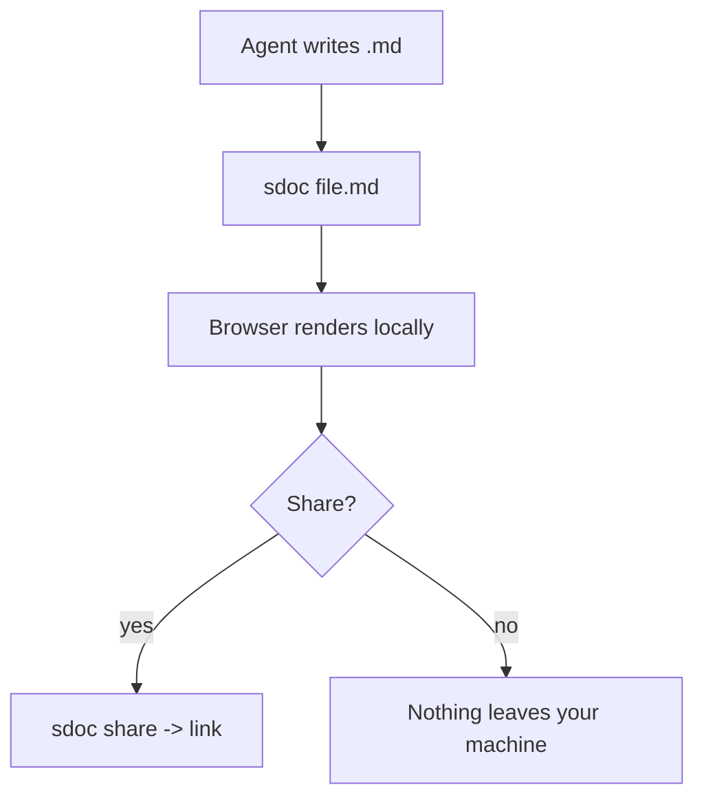

# SmallDocs: as if Claude Code, Microsoft Office and Visual Studio Code had a baby

CLI-based coding agents are a beautiful way to create, analyse and get tasks done. For many of us they have deeply changed how we work. They let us move faster, analyse more completely, and interface with a computer more intuitively.

But strangely, something hasn't changed: the document formats we work with. We still (occasionally) need to touch Word/Docs, PowerPoint/Slides or Excel/Sheets, and to read code we still `cat` it or open up the editor we used to call home.

SmallDocs is the office-document-format-meets-code-reader built for agentic times. It lets your agent produce exquisite office documents (text, slides and spreadsheets) and pop open any code file (`.py`, `.rb`, `.tsx`, and the rest).

SmallDocs are lightweight, private and instantly shareable. They are a Swiss Army knife you put in your agent's pocket: you might not need them every day, but if you need to get deep on a topic, share some analysis with your team, or you would rather sit on a park bench to dig into the intricacies of a plan than do it at your desk, SmallDocs is there for you and your agent. (It is also free for personal use, so you can try it right away.)

SmallDocs adds a new item of vocabulary to you and your agent's conversations: "sdoc".

- "sdoc me a review for this merge request"
- "dig into our logs and sdoc me an analysis on our request latency"
- "sdoc me a presentation on Q3's pipeline prospects"
- "sdoc me a walkthrough of the architecture for this plan"
- "sdoc me the python script and annotate your thinking"

## See it in action

The fastest way to understand SmallDocs is to watch it. The first 30 seconds show the core capabilities; the rest explains how it works, the privacy model, and how to prompt for good results.

```video
PLACEHOLDER
title: SmallDocs in 4 minutes (placeholder - real recording coming soon)
```

Three runs, prompt to open, each on a different agent:

```video
PLACEHOLDER
title: Data analysis, on Claude Code (placeholder)
```

```video
PLACEHOLDER
title: Architecture walkthrough, on opencode (placeholder)
```

```video
PLACEHOLDER
title: A slide deck, on Codex (placeholder)
```

Sharing is one command. `sdoc share file.md` copies a link; the recipient opens it in any browser, on desktop or phone, with no install and no account.

## Sample SmallDocs

These were each produced the way you would produce one: a plain request to a coding agent, pointed at a real codebase or dataset. Open any of them to see what comes back.

- **"dig into the data and sdoc me an analysis of high-yield utilities"** -> [Dividend analysis](https://smalldocs.org/#md=G6QgUQQbB3aP_RpAZ4HdcD0wxuJtLGJ__qOUDv7kgMU2DOpjO2hiLBso6LdIvqm-7lymd_Ikk5JLOjVMKcPa-ENIhwsNKgB-v0xnfz4vj0AZmViJO-aRYqylNae1pStNDKLHdw2iQNfX93_s1ceoV-D8ewJYWeEru7GaUOj_v84yYdkT8HgRqxAXJRZdypQpUzQz976nt5K99E1nZdhz7PEC4JcV8DgE0KUjroD6NlZjVuVtuhQRELEnirj-d6fpQnlvZWTiO1KnFI-b3yZDGHsIOBf9jelRUqu4XXNjZzLwtdTlmjQ07oCJciipqRxUjV2W_RmrYnw9ycvs_fjDeMC_2EsGXVZ-CsMpKx0eHP6tj_7lmGRZGrlnEHUT42CKXrA88vug8rkVQqwcUYDefJsam8mUvWsJC0lWKFEeIUVYlIUEBleWZd2TPqTh7iNDlW-zbCwLuq-vcrTWdpYbgFvmWbKQcaWDyd4cKoeXjItYnpD2vizbHLpc0VsOAA1jKH1U6q-z-e3T_hhayr6uK-pOt6L4iJzfwG2H226xeJhyUQ936T7_31svpcic925SG7GVatqlHTuU75o0_Vw3udU_hy1h7R6XfTyb_EVm4HQ70IlFOfSW5oua6wDtpdG82XAnpWebENNC6EhQyQgYTz1cb6h18paG3A3LqAYlCx72JN7D2cfaMh2xhaggHG3CWQl5AkEbaJVkP5tD-YeZbDOTZaNkRVmibVf8sIGQ9oy_rJVA7sw1Ep-NLFvMEg2uXu9IISOQ2yrNqWT7aFnpSwaB4EGRYkdwx75rZDPdHHgguIr-3iIElvbrJtBRglDUx58v7b5vu-dgaCfxmIyMUIf0SyAEX9o3atcKy-Q2wOasV7PK5qjP0pvD0z2Y1lZCwxP1Irt-7TNJ-3XCCDQevp1fgX43uYfupRnfxX8JGvhNEdJYXOW8vd8bko9YBU7P-ppSCaJsBJj8rphejCzIrvCxmddiVjG66hNbervmOeOX1STD3UO85_NjiZggeQTsln-8aJfBAx7oM1u_mQPgbpADyXyIVQiIt-FT8zIGgmY8XK6z-M533ORnn3MVSs1cUauYWl3T0hFj7SrtoFZF7BYu-ELQl7JlfP8ZlVXv_3jGbcOp0Jm93MYq0DdrYirIALlyIly-MawN9NkLfY9SlEiWR1uinFqVJFiLHxC58ZccfCu6axumk-W0OUDhgmEKpOVeGGWa6YPd9Ojh-If0ziU7FB-ER5E0HQK10ZkHk11OU1pZil5t-zVLdwQotRchDP1MFn83cgKL22CiijPcXuOIS6GEWYSD_Fb5f2QZozDoUnzY6bVDGfGH7cJ-F-416qr9_NSG0uNpFcfaAMEN3f9UKTMFA3K8SloUobljMV0pwAilPLgjNRgdQoTMDEKdwKkacSQRIThWtuBFUCnRHqGoPihQghOEy5JkGAbODMDtSMdKmo-2maaLIkenj5Cre4TwrINhOzdTkdCXWWVAU12UhiCA05DWhmVyL27COwSSexx0k5Koby0nJe6I8appjDtHkYGAcOMflR8dGHfmRvTcYHomRRUw7u3xR-CjAuN8cdtK4CEZJs789lFVgMIe3A1rgX2krHWb8EiYeq6RoxETysS1QTRBEdB9FcNzDiTMYCsw2_NQ_t1Y57W-A619DxMnA97nqn2AnbGHozmHw_2iSr2iSgx8GWGXpb4jloYF7QWF-jnIpaVEL4sMOs9hGxo-SOjnCcywz3cLle_xqwQ8eWnZcGi-lzSifrAQ6em5J9TmUWYr_XUWjaFAYuSgtuu8ADUnSABEQA9CSxUFF1ZPckdqeXQI7i5cuD8XTNi6NL8yBY0Hk5p-Bz1KgPCdjlZOAFeFdNYyzKf5RaH3ixIUy8gYQS1qghEkuEebA5oxf3K_NzyrsvG41NAHPwv2uqQJjQcvqsMM6EAOC-wpdM2d6HC-U2Jw0nlCAO9qbu710bIh7clTrkCkhR6n9s2CLlE0rXliXz-R9diW6nguJHUfofoLK_F1ECsS_CibtDkqYerB4BqK5xbTSreSk0yOGpFhztpFze2Jzioce5vlqlP1trPiT0uz0JLHvAmxL2fitmUmsKfW5Tfz4CFp3UPSXQ3H4Tr0q5Nja6SJ9qNWJp1da_KcdmrFiR73zrrWyISlcrFtCm2dOrUMHZc2aTeE0wARYnffe7vaePbRTqVed8TQtvyGPEfiWkEHoi5luho49H41a6sYZJnYp7bdKIi6yrMn148mq52mVCRxyAHOuyFX75Q0tKxKljRNquh2UdFCd3mhF_rfneg_EQ6UGHOeH3L031qanLUw85Jt-h51Q3GiyZ77KS22J-iRjtEiDjaZaob5aK3gnNMZj0xg8lfqj_HkRkRRnR6L0Q9F39jL1VDSQBQZD8PtbJfbF24lkl3yHzZPjPI_xIH4jR4uDRMjylVH4S0meExipxz8Dkf857-R_MlAWpMaLuwgCCodIwmljXnznLlDOmWnRT6ClGvwMHOCFM0fc2YWaZx_epTKOJX5_3zf0OTtta-GE-_T7BLTVC60QhD-sDZL5tkJydVs0zsc6N22LBefHipCIu6bXZnqMGudhl-pZFJ6n7Lfjn0N9JZ5ngzgCWtThHmRA1hmuiz-Eus2hxbub4Y1E5od3w0NiT58L_kCDn8MPEXQHgeiLRzE6CtUTfdMetif1Lr-Txfw_VyNoCENn_awtyzetgzZeXWPYChiGQSBFelTO9ETo2CfJWj9kOOTFeJZ36FUWtnsIaliSbRNrbJQPdoJHyeN4Lf-8XlK9dRAI9M9pYmtY-bxZAhJszqdBdptVbdG501qzSSwrZCipgZxYAt7i89WndTKa_HQXAu5ozTTsg8yB5gUsJq386UdJxBt-AtQTU2dQpMkuMptAcpB4ErEn18YesqVb_dOLijsiPNXyIGLAvRUL86l2p9y9abRjU4vTndZI5G3nOrq16bOL0eCOwpvrMQ7OvitiLcbHkNJsZ8aoPFgDX9u8_G4_P-wITnJNsJ92HWkcQRhGxJZfJHYpWYkblvjzvPyL63S4LLCg51LPuf5bOB36QQPSa5X5aXp7KNgz0nMQz6CuPOge8jpVarS2Lt2BbsCG7cI8o2SqnAe37lpZyW7Be05i57MvAT1BkWQDvMieumYKlVONWcyO94etGuS0bJe3ESqBdfAcePDkJRPMC80JBItZl2lLTmQ2DI75vkI1i0x5z46MoRbnYuFkoIj7eVyVvO1TuWSqBBAcWjW0EZ0anNiboyA4NUcfyim5dQpAZq8cL1kCVPqN7eVoNuYyFhf5ttIzj7IqN-9f62olExlNK-sNXlLwucl5zWnNSlL50dPrWZd_N8K3ZDYa8Chp18GYkx8YfreYWCvECKoTq8OQe2WtaCeqwu0Z-ETVUollHXZXj2NzSj2KFanIL6VsgBzCjvVM1_uo0Blv5SAcBBJRWV4R3gaZU5zxKUBzprWxw_0DguzTNKYZpea9AYmN65732JyW62rtIg901BO28gCRQRnYUmGYCCkja3RN5Sul7Sas14Fz2upOrQY67r2irTPQiVyYxaBWgimApjWRiyaQWtua_XcNy0nxW0I-8TjGQxGW2z7d5eKifLqVLHZDRmpFMSU6TdpCMMn86clGvoH2VTTQYelvGMb5bKDzQ5Z-71CRXZkR-DVkbefUXb5FP5gT3b5D5QdcdsyslNQG4Sc7JwqRO_8eT48JI3o80xfyG0YMdCZk7PSio2HyzpRPdM8FtettfA9X8YF2gA2PFwyDdNFgkq6zeFtVf51rAIdE1R0DAWNco83Ls3ZjXYPsBcDWNlLljnYTVM2tGy1ATW0qfbZfWV1E25gVS0tfljFgWcYVrwwLbruqByWUMZollfEo9pT4x-YH7EGMjX-RbO7C9KACuXuCKlJW7T4jIfcWP3cpd2yHRs_cywwW6Hr-pwhyau4HgrqIqKXeRYwlkneghTZb8yLgAg1KLrY2s6BNFcbWX47GYKAuOCpoTvUsW8eFd3yL8fExdjJA6eZ0gknS7uvBeqSgldEg0N_ApihJLiEegNfIVIymFI0Qc-31YFXWNqHwDQ5Pg_cm6ZaFDT1EQ2P0ylLd0FcGTozZ9KyMbw4FmIMntU72hRLocNjVbr-QZVNjuZmvs1xB94BGMTz0PcfsOokhe-7_iWjwlqe6UUDLpFsCK9iE_auLG5v0_C0xJaXlUeU3dayZljTW2iutCMa1sVE39lN3BK4KEvV8Hwi5F9xlnsk). Charts and a live spreadsheet you can re-sort and download as Excel.
- **"sdoc me a walkthrough of this project's architecture"** -> [Architecture walkthrough](https://smalldocs.org/#md=G6AZIJwFdsP1Ihzkbj2GQoP1FJv8z3R5_5fTS7cYZE1yNNtMieMt1U7zli-MAqKJQTLsbrwQtq1_SV8tcBsTtLXZNHVZPARFj7fwY2SbfXpvGUee5Hq4-F9rZU4nrCKjTLy49_7vrqG9qsWi2a06IOyZo9kAggPUBzrlIxUJm8eY4P3bzLyIQOKpdUspKejdN6cKTWf7-kzsPX1YCQWrlo5mH8mD8xySVkPLKg2rT47eCT7Yz9JncqyIPddlhZXDhSmOrsKQl_IS9cg9X3u1wS4hjpRNOs1cmb1XeYTkX0bM_AmdM3uNYBPu2gTZGFOP5GW3xoRqDVvYAq9l1QH6UtI1xyvEgx1DXIphdu_CDIiIShOYIJbZrLHG-EB8-DB8c52o-Lq2uFRB1hG7lyKGaswJYgFDHoEtjDGxev-8jKrz_oEF1Rf94enyIMOyRhXGK98ADwtuIMGOrKpPOyPik2KdGcGkfxaQ0_okMfpbBpMY6ToBVb4-HqIZvs6YWp01a0n5ld0i9pqYy4ihslgI3JplC9Blo7NmtH9n-lNzRkjfpq5SLdqouUqZdvAb0PGssXthq7N8TInUI3iYx6DfqlFT4JITgEsgaRBQ1Ok1eABgaDEh3GhdEryEyaCdD0bXi8H1TD8AaSH862t1pspkJNF80wXK83LriIli7-S8zcpMFDMguB_KptrTczfC-R1L-kRvxfRjAY45WBD9r6jcpl5vPhzhzOiiZKaomeD9A3lnS9YgSQQCludRIn6fsD1_ie8RTX2MaTSDRVfv3lrVsmX1C-nYuid3AqyqBUrQSHAUAEXbCQ2ynxh0vMASPG6YvEwb5mREBF9akfF4rzC2t3IWXT7AkBgTNx6U3b0MhPGQ7y4NZStxpDEYUPS8nty7b_RRV-eNQC7piILyzcDBrExMsS8sJ4_I2DNmWOnpZwiGBZzX-O4Z-JzEqo7Nw7Hksqdm4I7qPB-AU0Pu8a7JXRfhbspNaDTYSzqVKWjAuqpuJWDBnHFR_JFex_uFymf_qJEEmDmQlEIMGog07DVF0GAZIo6vHaora0asMTgt2Lkogtn4XCC0dyOpQfFztDwc053oed8dD4gGcfne2PKU-s0WAv9JfBkOIzxUthuLDtJNacEnThQP___Vf3P68HkkegJKIV8f-KxV5jQYJ_xdpjqQUhcrGSh0lI8SN0BPLS12LgH9_w6e8k13T7F436Uj2O1rE0kaRaFRt34bfrIiekEDhdsnUBiFqtsIveWLJTZd7gJ0BjOb8YnLHCRb6F232KKXG5paWfovHGb63dFAej7XGhu33sirnVbEgckTLVpAoNGShB2g3CAxrcN23BHXziAAiQwSoLVzvsZ7HyATwqtDIFG6cMRET5R2lP2CqCOJUb26CJ1YJtNYUvPWOXOnjRMHUeA7_y5VCkK3V-XdAu659vRBCtfvKVqpkFjXsJTX66U0AkzRlqxtG5hIMyQxahmiJu7ZSxOtY4m7QxsxzemDZS6IGtCyvY2TeNthD2CxL9JJwTKJEPxkJgto0c4r7VJEneB7E9P0vQafw0RzF-aMc5gcxAoO2zf1XKS_nyZED0uGmGdT-Mzx7oUrmQBELqtdw4POMhPgwS5GEP_SEQqj5G6YpspWcxGBw8eZ2CkjiWm8c4p3J2OiFJkhKQjsPeBtQ_OSjA4NoAILJVqZ0Wi4Z8cmud0yzy0TxriKsdjGYNBcZDUjD4aFKEeHHNcrvAsFCmgfKEvommnkkPrGWPtNVSoHegq1wQL-D4iaS5KGzkg88Et6AwfiC_3q_JSL2zZrpIb-SzCEX9hmrih3atOxB5qLwoAx0kGJuSRa_GJa6aVFJmBCJ0yg7OA6KpJRfoR-FIn5oFMCl4w-ySMGU-FOtY5cGMj1NLtpmM4uXq-pCNhBG89snaba6wmWtLJJ92_xw3T8iiGGlckukKwbMCww7rNKzeg3etQ1PHIiZTmJZANxEDRh7utAL_YIiuVK1ZGauSyEmwz1WXZdWrviugSQvfoTkJetNFbahJh3yhunF0MSZQVMihn8B_GH3woVDgtbdxi2KPOqwrqRAtavPZCbsFM6dnquxaDC3LAeDB7qGw3k2N2iqICyO942WDhaQOapGdVqkblT-F-ewuzRSEu0TI21GGTVPy0qoqdB9ggZ0Zq7Ful1XkWM8TKFnyaCeZl7wjb-KpGRGKhnFRSBS4PxT2xxN_hRQS08xja-QwixrCktbkdZZS-6ZWA632BML-r9otI-qkuLloXudnA2XvWH9nSTcF6hF1nkbkhFIK0fBlHQJCpDIaAKFDagS_VmJqTR_iH2bRWKdBrjkWAnwy2AtbqHiHNoq2i8a2oP5HogDkolhLK6qgK4zkk44K9CmEQaY19rRJ7AGrsRlhNFPUhnBoJtYJCkbXlr7BbYzU4aA9KkIgmx7FWHEYNglxPLxnnfAg3ppp3xN73iGEibOqsxuHQF_2lNCuHT__2Z7kO_eNrn5HQfgeSnlXejp2x0wpL4A5vKKJ7SpbXQt83zf45ui9HvpzQPHuWgLrVZmj44vyqHT3dnG-k4dN26eelnIGmrCf8qqJZkRYsX0SBiukAqTtn65nnQI2bSe_gqlxip-rfAYWO7uKZmAv4EnbDXFwmKKyLGMEhJViq2OfUkmXIFEXVo4xHxiFJ2PVGp034YNwsv7dQUJ8cgp-XqChHLnHxpxFAWaLml835ONqL_onVIImklYFRkgPE5EU_DFId01UO6X25pNeCk1w0_3usq_2mtZ0Z0S981RzLpKE7IwlREnIwyui-0wuaMF66Yblh9NmQopB5vY_xVZ0RWSnJrRvrsdB557zbhoR6tQ9rOI_FUq5qlq9Pp-69Qnhxft4qreVUND7n6PXZE0IInBKCoqX9wTahdJo7-6hi07iFtQWSq32VO5ugC6tW2kWR3xB3MELckp_MUG8GQYzmWVBOqGt89KN_-SDAlhbJecmAea-Wpa8DHKOSLnr-evPcY0a7ISqMxpFIF5X4HIwWjmVl9G8qfCEPaf0lJj-M1ib4KOyqQwhHBiPWJ8fCqrs_jWuCimaFICgQ-u3bIjczMb44xJdhXhEIPvQinHMM3QuJGAuh1rRSCnj1enpP_22opcHeUuQze1x4m7y0spjEtMIohZ64S9QqcLo-ondg54XBGFHpjVCBY6d8jEoB4UkuaTRlL25HIVFpXCH6rVMFMAaMax8TIODwqITJ7_7axhCCLJPUY8KJXCocRNmnmGDsY6lDoSH8sNobgXI_-4Z90jYMuqiu-Gwh9UmWM3JkKrZDBEyWRY_qPSMUweqfOyyCwDfaFmJsqztRmQ-UM3a7VuJtYPWzO3CpYTjA_yvM3A6zVltqIPAE). A diagram of how a command flows through the system, with the real files to start reading.
- **"sdoc me a short onboarding deck for this project"** -> [Onboarding deck](https://smalldocs.org/#md=G4cPABwHzvkpwLnCvIZ-RoG3rtTLX7COWvn9UvM-l9N_OOngVtiTUloVAhzjwiiAtrQEURDx_137xBIZs-frGtdaee99k7NJlmaKWQCUhUxxWpbfFkjWVgJqlrZCqNoYs717M0A4SdEf0ylFeR_TxLL_VnXZK-ftrn9wgkooC6xC4W08Ryn6Hi19RhBdntABzz4oDNejZuwEQV7x55Nc46froWRmIWsXS1jZSgJXj_c5-jh13LvydgT61x97p-uloQxjidJY8c7v7yZz3xrNx_NJKZHtLg-fkR6I10490GaaRgX2RwVwMXiMQdp0smH89Xa75-gdhp54veU-6qQ-VCNkmEj3OUa8pZykDINuL3-4SXwI3QHzOxHUnznxDaYGbuqw1JUqmJnlUGAQMoMl1XVVTqFAvnyeMSZmkaGirX8h0rQkCP3uDBgQ7VMYHTptbblBwIj41ggGjxCzgHDWMGlrdXZse8ms1BInqJ1DIcyYe8bEM4TxvEB0_YW_nqVTB2Z07mn-zNOoqSsFgyy-Z4mA53drJHfNv_6XKoIPf00OvhjteNif9UcjKLx-_gkK787KhiMmH_7-5lx3m5gpr4qwy_f42-hZOS6ZKgVIvsxdIYdIOjWcOjDCjXKfLNxtIl69eg1N9iUKzwu49TFvrHkj0Z4wnLQivp7YKAkpnUx0To_8RnIkBRhzGlC9g3mvpvIvcdoOTggFO6-A-xiiPTJZjrUH_oa-77gKeQqm3Bl6a6guo4Ij42SnjoeGvD1v7N3aqI979-Lnrd27B4V24cuP3r6GKeABx-MMzfFygFf04cawr9LdCErv5yoUaY93GJeaUZ5S2XhmsoepLN-1GdG6k-8yzkSUDkH3_VpHqmx5slO8c3TvE-cALpVM3VqT836noBh2fAa4NejPpSynhmtzTeFrxg7UicMQDmZmqhj2D-arWbVnuXGsJ2NuFS_hiydSLx1PidUVGtAA6-T7WT5ZGaIwSBu9xoe2ZDw1lrrY3Y4pZFRzhLQ3Q5nV2VHlvBovduqPqRAXM74LwkFxINGxR3yw5N2OpaIqIFFNqkyCKF2cEuwMrInV_8qUlA3JWZvDswP80aICcnUKkyx4ZMKcqYUCjuUMG9vvMd5Tw1e5Zwq3CoDUSqZ1z7whBl5y8CUFS35e01YE9ngt5RQlBEPCww83fAqFt62P1XOpimWTuA1WXiglpp4m_v_P7513yUvV14_SI-_b48Mc3kY1QRJsG35fKWuGA51QWdtb4zTw5tgulD0yOugZAj9mquv6t230CQ4826YJcBb-dtUN8v9YBV7v_gTFTow_54EgUNXBiRT78n36Kd7d5LFpRyVBE85Zwuc_ovU6f8mQIj4s3OgeNNHXy1jeYc6J4fc6CS27J5fS_NuhyaFxHC1GSNYU9yVd0aOkHqgF-EX5Y3AMhOPQSNUF7o15-MtBVQSaauuuwLFPTaacd0VRijjFi2BBstGGZjhRoX4eM5GHhetQGFl2iEy1acVHoLpuaB4bWH1p6NoV-8dwp1sx1Dx5-Hwh_ruru0ZPWGH4fW3P-ASkRaN0PRjvhi8e1NN90P9A1Ex_oPWTM9W0R3pBJYuq_bqGiGTDG90HHH5kPHzSLfCzBgHW3OHeM5oKKXKBaIQA_0fRRbqiHn5wWVc8Vv2Hb83K6lVI6NON5sScUu-v3umy_-vINXq_Q0ZhcLybxePeq1PUSDInltgN1FyfZQNUN_bmXhIKeL1Ga--QJBw5rG0-rGxl8p4fo5aTAam9pdcP3z1wRTn-JDxgFCdr3l3sy1XtTsjYefRmXj98hyN7YRqCq4mfwvLD-ZXVGrl6VRBraA6l3TyW0_4QSgZD5DuTMP8F08_7q4ScoH_qZDNXgSnjtSPGuTIUVHU6ut3W9bySvnqhCKWSztIFI4LiNjnQQCfGwm1AnzorvDlo2HGw7QAq9_1_N77k9NdmyP59Dbhqni4UpDeN055WnUJ_3h34I0cCkF06YexYG9r2JvU6c0ZQm1LUwMBbw7wA). A slide deck you can present fullscreen or export to PDF/PPTX.
- **"sdoc me a review of this code and annotate your thinking"** -> [Code review](https://smalldocs.org/#md=G3EZACwKY2Np3MXLCzeoDEYRirT7It-6Xl-hXO3tXDL__QgVNCC1JpjKiJnN6q_Pqy9PwPC9EDNFIQ4L1regmbLEbtbQptOcn0JE3aWwCj6XCFZzIWWDsE_C4KxaVv4zJ8tOTADRz6zsVlTP7ISm10TMnl0nZ965mvv3SNYjASpoABYEsjG06HtJMYoIOFizt-LAY-8yjmNNCGJdzpGCGO4igArsVHd38mlrGVESa7I8uGX4fDUgczFyndNDvk8hqOfhx9uYiOW--vF51QWXl24M2X7MfZc0LBiJXuHhZZqgvChVErU3ugvT5xI7_mD-_kOBXgZJvNpeTJgM_ulF-LzYqS8pUXmjKRZTsaFGZGB2zlIsg4tWBlru5r8vN1gGaWX529t5iVme2LHaj__kOYkVuDBNa7YaEfsjuDQcvKWAZzGh-Iz2vmhxo8YMQ4F-hmhM_RYfYzdUFZu4YI84PehEKkHJUY2SrNp2IoNXtBqSTNxcSEcP1LsRntN5bitzNu3BNPfBcZxzvJUuYxmncmsk3z14ivbEWArPPce0z-LytoR2RF3rEz-zASXDwOD_nXD_JM9dijT-bn-A_XMCntRy_FOf827ee1u79iX5vbG6ntO9iAR5ryHg6V-zXl3M9t9P87heCCW13WPrRdxw_hms8feOb9HD2xf9c677W0hx2DBIfnR5x4Xn1XXlbFAXdN19zVu4e9P8tvzWvqvDWrAoY9Adkct95jNwT3l58WSUonE0_WnxwIUXX31uXG9EMnG8s_WB5Agubl7TR3HRs7FOker6hVf1k9oy0uRP3uQDc-r2_YHAFpdMUrnhtPHI3xsRsg-MsEnzfkZXgI2FiRWwYM9YMxNFLSriYcxzLUlEkmUdJd_li9nf-LgPP9GFmoNOuX27pTotnvxuF7qNMyWkXylk9aXtt0gmvsqz8nfHJHEF0G9inxLGWw0UNC3zhIi7XTokTS4hEWA89D4PJbpMlvJVMsqGT1ZaKt6g4GBeo-P34PKqX0izl8NWZMNHoXIfEdkaf11qXnsXXs9SrH6oeD1_ZEuoGRICd7QEDIyL91PS4qAJ9WioKFVxQx9Io9L_N2Q8ks0rMXzYOwN6Wq_af6ctZ97GBTB3J61B8i-tnPQiUSLT8RriaZpb9TtpO_aVVhwX7pELBQx59QewYbDahU1og441TMCg_U041YR6V8q2oDDOUENKz56ue6BH-RdWW2Y_mDXkrSHZ5yA8MtAAdPWVrfMYX1x5gpFq4-FFDg6v5g0HePef0EAYl_RA8M99fmwprG5l9sCG012aAC82IwiP8MLky9fXy3v_GS7pVzhaLg1d8j9lOochkPF1IMBUY4sVisM6SqECKbZAogJSatTMypjAfCmjKliydxMG44ml8BrDasar3qBj4eahSUSsyD4PkfqanocpZe6wbJcZmJYt-4aeseGTw6EZ4cN9L6P6sxiYHup2GjuN3yu-ykIfw_GiTcjPI6JGjhhqHWgYEGzpYrJT1u_lyU9LdEzZXKTWdG9TvNjSNV4MlYFii92FsXDXMi9T5xK1EUAlhtRQhpXCD1ONAdp2V5O1GVOoSeencmMo8zz-QrLefS4u_QO1LQCzydH2PlMwnzd2Jxnb72FoDq50xG1mj7-oKkqKjIF6ZvOPbweFj97E9T3Unm_ewxFENzS1AYsBTzN6JubWutuwqY_PmVJg8GassIS_VV08K6DG2xL9i-_7dEknEn-YtQMZ7ydgAPbC8LENiiCqsEsQ5uokPrAalZrwDgIiHMBqD56UjdbRSBKCFjl64MrP6WRelAnci2MDL9SyFDWir5CumMml55Y_2Z3hmZf50jG8q8rP0xGB514nBiI4Rpsk9Qx_l0zBqMnmPU3Sd89i7VnWNgHiK9ibSzyg7InPufyWijlVpwC2ppqcHN4pEpL9ABraUHCAeMmhxR2gfRYoYKDb0_zcNBvNiu_bwEbQa_Uht-1y06qowKh3d0IQHN9tu-lHqi62PAzFiriul7_v7eLx77q7LCk2Tc_72eQQrT6J7Beh3ij9eBVvX5D1ZmR6LG8ZbPLPdJpuHU-ANSvhM8MQr4eHjRKr3r2JwP3LHo92h4Ye8w0VBBOZ8NfnaY6-GjFTk-pYVdQA9XN80BbKsis5qtWoOcNbpLJlN0F95sp1kk4SNMIy_sDQgCzZzN1-VSN6JnyyFO3zTPlCpEAPKjwBP2el02M0J6uHXboji5ZU_y8BFEyQKG05ooPKuMsrXnzTrAqDbVae-rsi16YVvMNAvHBMXhCtKmD1rseZcqznvSfAOTYNdwcCEfng33LKrggL5P00JDELsqGeosBdAyLMAmO-koPznHI4tWZB6HGyqR29MQNxoiMoPjQPuDS0H3tuwsQX_WYG5vTKZIF3Ir8TRT6PWgt0jQnygVnitQVOY6OrL2jYLW52EBQ4BRDCMnTUxQQweQJnIDGyV8EP0c8YMud4onA8MACj2eeqMbeO7QYlCMYJGnDrBmi8K1toMoANVSA9SAE0CF5YcTmpxq6tMRSe7WAKFiZFoszujlVHOr2KTru_8to1CM6qx-X4e_KnpFZ8fHQbnuqYsSrg3oeWsReuQCu8vtqI9yqhJaQxIfNFRmGWz8DEOXMGuOucs12MxgoVetdLzFsiHuIdGx9lElLdBm8j5uBSsbs8X8a50woKvt-VWxy_o9QO2ueVc6DVf0PM8vTzYP2sIXTxs7F0ysqbyYWOrF9yK9yvvZD0zoPpa5QLBbxCaQ2Ykb0NsIkgrAjoYJS8YVKCE93CbxJtnaqcgufCcenwOUv3Q_Z-LIwY0WnUwqVD4BFbG7z29l7Vc9LgzpzfF7l0VMw3LvJaBSnoNJM8OFDy3JmXeeomQFBuGdJq56rESsd7v80ybtMR9yF2UpIdWbHJtIqYKpSnq7eGvcmNz3UQmVNKfR5lhRAp3LDkdjqEYWWQQueSrdVaLHL7N9Nu5HbkXNziu-d59z-1ar_0AwXJ4l2xCTJvNX3u_kGeY004Z2dLN8AxEhQA3i5Al-vT5n09W3r8lR2v7rQ-Zt-TkueA4uh5DOeqx0bYYPnYx9sxI-aQ2bqSLa70O1KacwZDiRKFD47s7HFYYdqNBnfum1zYI01ggc5MQOckbFPqIM2uCoCCaChYtQQsXsCfMGy3wrtZKXglnGAUoYjlGCLFkt1U4ZyqGw2VOEPHSFOzYqJJ0RJ_ZsUQPektACxkNZRmLa3hKDgwYp8BAIkRrI8-w1KsU-wLFPr1nmGKlc7sI8S6JhckX4C13bM4yoaP5qM-3Dx0P8ZC4FNjgsNX3QwguTWFw3B3M9dLr5qzW6-DpwOOK4F3Gtq_CVEcmVV99FmCkDinedzABt3uWtoarsr-1zBRZjScpfKZm1lZPFNpBo7zhRNG7vjOYebvihQOk-p7bk1To7iGF6m3clDZGfMabJeXOwkE_yPF1M5iQN70AJ_7m-eonIqLsV85e_D4btmcAA). A walkthrough of a real module with the source inline and notes on what is risky.

## How to install

SmallDocs is a command-line tool, `sdoc`. It renders local Markdown files in your browser. It needs Node.js already on your machine. Nothing is uploaded unless you run `sdoc share` or explicitly save to the cloud.

### macOS and Linux

Run the installer:

```
curl -fsSL https://smalldocs.org/install | sh
```

This installs `sdoc` under `~/.sdocs` (a directory you own), adds it to your PATH, and never needs root. Re-running it upgrades in place, as does `sdoc upgrade`.

### Windows

Install with npm (needs Node and npm):

```
npm i -g sdocs-dev
```

Upgrade later with `npm i -g sdocs-dev@latest`.

### Or let your agent install it

If you would rather not run commands yourself, paste the prompt below to your coding agent. It detects your operating system, installs or updates SmallDocs, wires it into your agent's config so the agent knows the `sdoc` vocabulary, and offers you a short tour. It asks before any step that changes your filesystem.

```
Please install or update SmallDocs for me, and make sure you (my coding agent) know about its latest features.

SmallDocs is a CLI (`sdoc`) that renders local markdown files as styled, readable documents in the browser. It also supports charts, diagrams, slide decks, and interactive forms inside markdown. Nothing leaves my machine unless I explicitly run `sdoc share`.

Once it is installed and you know about it, I want to be able to say things like:
- "sdoc me a bug report on X"
- "sdoc me this service's architecture"
- "sdoc me an analysis of last month's results"
and you will write the markdown and open it for me as a SmallDoc.

Please do the following, and ask me before any step that changes my filesystem.

1. Check whether `sdoc` is already installed. Run `which sdoc` (or `where sdoc` on Windows).
2. If it is NOT installed, install it for my OS:
   - macOS or Linux: `curl -fsSL https://smalldocs.org/install | sh`
   - Windows: `npm i -g sdocs-dev` (needs Node and npm).
   If it IS installed, update it: run `sdoc upgrade`, or re-run the matching install command above (use `npm i -g sdocs-dev@latest` on Windows).
3. Make sure `sdoc` is on PATH. Run `which sdoc` again (`where sdoc` on Windows). On macOS or Linux, if it is still missing, add `~/.sdocs/bin` to my shell's PATH (zsh: append `export PATH="$HOME/.sdocs/bin:$PATH"` to `~/.zshrc`) and tell me to open a new terminal.
4. Teach yourself the features: run `sdoc setup --yes`. This writes or refreshes a short SmallDocs section in every detected coding-agent config file. It is the canonical writer; do not hand-roll the section.
5. Verify: ask me to start a fresh chat session, then say "sdoc me a test file". A styled document should open in my browser.
6. Offer me a short tour, building each example from my own work, and for each one tell me the plain phrase I could say to get it next time. Ask first.

If any step fails, stop and tell me what happened before doing more.
```

## Teach your agent the "sdoc" vocabulary

For your agent to reach for SmallDocs on its own, it needs a short section in its global config file (the one loaded into every session). One command does this for every agent you have installed:

```
sdoc setup
```

It detects Claude Code, Codex, Gemini CLI, opencode, and others, and appends (or refreshes) a SmallDocs section in each. It is safe to re-run; it skips files already current. You are also prompted to run it the first time you use `sdoc`.

If you would rather paste it in by hand, the block goes in `~/.claude/CLAUDE.md` (Claude Code), `~/.codex/AGENTS.md` (Codex), `~/.gemini/GEMINI.md` (Gemini CLI), or `~/.config/opencode/AGENTS.md` (opencode). See [the agent-block changelog](/agent-changes) for the current wording.

## Features

You write plain Markdown; SmallDocs uses the browser to render it as a styled document, and extends it with charts, diagrams, slide decks, spreadsheets, math, video, and a code viewer. Each block type below has a CLI reference (run `sdoc charts`, `sdoc diagrams`, and so on) that prints the exact syntax, so your agent can get it right.

### Styled reading

Open any `.md` file and it renders with comfortable defaults: readable measure, real typographic spacing, light and dark themes. Sections (H2, H3, H4) load collapsed so you see the document's shape before you read it; click a heading to expand it. Every heading has copy and paste buttons that lift its content (and its children) back into your agent's terminal.

The styling lives in a `styles:` block in the file's [YAML front matter](https://jekyllrb.com/docs/front-matter/), so it travels with the document. Run `sdoc schema` for every property, or click "Raw" (top left) to see this file's own front matter.

### Charts

A ` ```chart ` block with JSON renders as a chart (Chart.js, loaded only when a chart is present).

```chart
{"type":"bar","title":"Quarterly Revenue ($M)","labels":["Q1","Q2","Q3","Q4"],"datasets":[{"label":"2024","values":[12,18,15,22]},{"label":"2025","values":[15,24,20,28]}],"format":"currency"}
```

Thirteen types: pie, doughnut, bar, horizontal/stacked bar, line, area, stacked area, radar, polar area, scatter, bubble, and mixed. See the [full chart gallery](https://smalldocs.org/#md=G8UnAKyOt00DlHxWwjviQk58bNCHEZLMXjp1Z5n-3q1jp40U95IpNFHcxOkFh_Y1qbAHS6AbpMeoS_XEWiiA0suU-rzqL37KktMl6bZ160MSNPnhJPlKXrJ09TWLjkJX_7-1L8-6qsGeYTkr162RG2AVGeFzfLpeve6p1_V_D3CAqW91fVzCH2JFLAlUpGKrV8oguDEUlwaE3m6ZiM4W9xBWoM20RmRHHvB9eAlum_tUt5sls6pxXJDETdoI1mtn4ygyK3NKOiDQfOMfNkoleCUMqvDDsyh-Z1LjOM5yd7Tw-HQs0oShCG-aYfWyjiZSkatREH4PYX_RHNIDUBzd8FwnLPMdFKXBrkbxt5O4-oJeM-eDt5AHa9257284ROtNm9q3phEcD9cNugOB6wddF5TQBQ0o4fpBJ-BY1U9XTT9Qx61GwMkqy2zZlA3jqRh4qm4L16Agw_5OhebMz1aw6TN4qNpsU3OpeF_5RiZSediQfbXhw3sojD3QhC4QCLNQD5PkcjjqbKgnFbzm2xXK7SiVytxe6WEtm8_0XMFhbubs2qeChsZ2XUeZN8nK5DeReXVO8FuXcuFQFDfsB5fNkD40lBGzzRZo7Ffa_Wf6HSyW2X0JYjXztCBU9pr2nNpbqEZR-UsShVEkREQ6G2pohRhrMtIra6wwWs7EHBRxmEH0We0PAlAfLKMKKMDDmYPuuf41-AA3GthWgoDD4VikdsZzk1KSPZHUTpsNAfOzBBozpoABOV-7IFfIVMUBG6ODFRPd5-9eTVxku32Vwqaoc1AP7WFip2SskyZCysbQZGldmfKtfzAjCfUWrnG-9BAtrNQqKq8brS1ARlhxWiQFNSNATgm90IACPARNhf5JbL3J8iYJiAMpM4F-yGzGS_Mf7OBpkpC8WC1MXGnTHp2wCJzWxE5R5RUbOVnyCab_6MbBxp2WX-1rIHlH2HtiYqH7ZyveX6iX1w2DgaxBHQiz5-ywBTnDsNfUqfoyY6rcK8HxDS0MeEZgJVzUUJXqHhmRMQV8bdVmmGZbIAajEu--k9yjKWr10qT2qgppMopso5SBb5MVJHlpuPfKhAl4SZyQQTHDrpkwLxWR7hIjNb9rdfUie3_q50syskidaYWBu_BofhiS9mSl9sRUshL010gZF0MHmn8bpR-LPnwlOohd1GgqYg-qnL26UvyJWIkKDOwMx3fxLMUzs9WDBw8ePHgQaHUzYEaX4KGAAgoooIACBOrVnThfQgECAgICAgICtRsBiwK1n8UBhtfkX5Lu156d-0VVx6-2dud2lUz-5tV6f9SRQD3-nj6_fnmJfv08OiNnZpCjGvGkHn1KlNHhW7ZwEm2s9Blo2-XciLHPJP5IZOFnJGmoTzl5TWhCE5rQhCaUcMwhFcUHN9NtyonuY2fKlYjGz5zwuuiUJBx9Cd24iLy99hL8OnFDSdqdKwt-n4izqyci2c8p5L8De1smbtsaOrW2sRSVG21R_LRNaJBsg8PQ6dI1XaErSR8jd26qVvXiwn3aM1VJhs43eMS1ZFTt5-Ap9q3TqjAzUZuYoR48ePDgQaBlk8Qcxp5uAgICAgICtYaIOY79kD6Usxkq2TSdQOzScglE2TVdExFD4U47ABs0KxGIs1_CnxskFUWMrOq1Kd4hR5_xAVi7jVSza4W9z6ailv3tYTbLtykdjBtolzrxTj2W7YlT-iXjOXoY_uzDQeNi4ynq60zuoQ9lNx7u_MGJPjK5eIsiGS9AdheUUEIX9ELLmslswGvxk-DTomTfeR7iCn6pT3UKd24D91WdeOjtu1Iy8Z5p6q0eTQPKYXNLb84Jrr8dCMrSVMLk8TTu9woslwiFHT4_A4c1fqfNMU2NxveIZ19OrQePHxV5sQl7hWJKGu-pYf9e6Rin5H26H4M1NTXY-3g3mFuvrfuvhoejcR2TPKJoTc25j7ewBGI0in7qoh8sEh5FM2Uz0ImIEeQJCDHlI0a1r2dNpeCiZkYXG435Yidn1teun0Px__MJfBFDsm35NiPtq5nhjIQhVgwvasz75NieY0brWNqvsK8G1QPNNqgI2O75F3_GpU0knaKPcTeufGqW9DpPQY3bgK96jQfWOftbC4nhnrU8dB2KKsJXo6gFnLas9m7IG5ufPmUkkewhyHCJCzZa4krQu6EPdEMTSqjz0oKHNi3CZzCWeUYM59nZRCMVYby2BfeeVos-W1vvtOposK-AENj5vdV4PuHtll17PtotJgllorG_EgWKNerXxHs8XhGFczlL6moURVh5WhTkUjb1_tfOYObbJRtHf3hvtT08QO0I86GEftAfUCeIHQ6HQEd8qraUs5mdmsk1GvN2wzApnCPV4rCUs2jq6Ld_FwNl_XCjAnl88mpuLxRljis2iknh_Vks_rdQvJI3lnxJ3CKZMpmZppL_K4m1v6Kewo6n-3NyBRwOh8MhgHJFyq8fdAJ2MPWOawad48xBd4LkUbf5kfwKRe1zr3OhtkorGPjF6dHHgbGbo5TqIJznaXAslG-G3cXSJ1fHgHtd8rSwhXXxyazphlr3ASvFq5ak7z1MJ-pDiNY-0AV9oQvqXO8q9SajpHWMYoSd0x7lRaiqxECQKkAF-MlVRKbLVO9Y_e0YBKkrRdFyk-63Acr8r_Par-fk4zNv4ysQdeyYrqg2y-86yGx7NLhBDSJud3i-4QG2KcD25wCEvfAY6eU6tdI87bnE05Bantv9KIVJdqbLVQbaQ_RtrUxarCQPLGtRVx9lrSt9MPCsLiajyQ_VxCHG8sFLjIzC0VuH5HRWZEWEJBeKtEu9gMMh0AWOut3QqiiD5j_owFsrWmMj0S4QiM2d8DimqQP4HRUn82wHPvH_VZq1oWRGXoCamq9pMXXHjctQyQCjCvY1rdqYW4HWWK2RFrtze25Mbdf0VurlZUOtS5cm2m7tfm2JbS4PIL08339eUWLhaNR9XcIukvT25yqELbQejcnb2dvPETgwJF4PkC_51mHY42hCCU0oIeRGSa388pcqKFYEt5q0oypb1DpSwIbf-_EZuKoO4yuVisSjHOlUGzB2q8OD04m0oi7lwRNva_wC2-10pqQjqbPcWXX3lt_XEGMsSow2Usgsfxr41vupbNiKIVvJ4uFtTD8iG8NmNszKdvuTWzWmzN0SChAQEBCoNZfM6xIKEBAQEKizicD5WLVHAXgwo7AvoKFhsbN8qzYO2RscCrgP6jxADvydlUyh_bwFIecm-d18mXV6CBAXTz2DpPojQax0AQ).

### Diagrams

A ` ```mermaid ` block renders a diagram (Mermaid, loaded on demand). Click a diagram to open a fullscreen pan/zoom view.



Thirteen diagram types: flowcharts, sequence, class, state, ER, gantt, pie, journey, gitGraph, mindmap, timeline, quadrant, and sankey. See the [full diagram gallery](https://smalldocs.org/#md=G5AXIIyUqnW6GgHzn-Wsey6nNyZEWmfE6Ij4j0yXCmSBivlfy9odcYjZuBgsOBwWYVFI6r3_ftdN35JmhhCT3m7IjkJdcCsUKAqZyyMd2m3YxrQOtHTsD2OKIRK5ev8iPAid2P6zlTSV51EuXrzKTJdkSl5DPCUYCG3Q3LIhOC1KkWrU5oW7vudZ6JaZq5K-7_397Tpy0vtT-AkehQcABx-9OGBed_Jw0poqztS3OQRjGGX27tGH0OgmoU1USou5Yim5eAS_3_hoqBQ2V8Av9FDX305aYJNXyqSR5RORK3cCgCX3d_EEsv1D58fZD2wR94r9bFGJw9sPn9ju7gPHSeMRQd5aE5QKsx4KoQ2KHNe3YOcFme5oqQUze87oAWj2w4knjiOdurmI594dCCYRC-VXS07giSTMOjiPk9N5YKOQZgEz47C85UBN8TAjt7o2cgaj_fszm8cXuinLuIT0oVNMpm10vyNyT8dadyDVfMPFgXnPGAXh6vaUMXezYNgZUriviwZOw5Nx5CQUJWrWz3j1x3oJc_4s7QQf3wnUOtsiX4pLZV35PHFLZf9ZjvwrLgJmjKtDp_yANqo1B4KAPWG4wUshQXumnxn7n2_cyyYzktI3zcsz0yljerJdTGuO-TB1EcpHMQUmVv5s_5eGAxM2jdrozjztRQvVHudHKlc93yG_NzIVH7fTg4BEOUJGlM9ebQ2q_4a5jfND7myzew2evH1mvHyNBZyQcthJbAKhkWiVV7-B0aFzBXfKmmGOvL3us6srJpAIR2gNuyUUXAJEJp-24BRtor5yhoXR-z9vIiqlHgBc6aTdyy0AcCqwfJekaW7odrMpOQVadR86UykA8HhhVF5aDNlqHPoggtVw5NNCeW-_kZ3DuncHAIAikTm4Mlq9qNUr9cwvQPepYprlBgGR-UULuJVZLq1yucZPEWjZu8p9AJj_F-K4D45KGbjWA_2RkUujumpOGEZLe_BWtEtyJGA4WkvRbnO4sfBb7dMYUAWufTIFo8RV1suB0qf52nk3eCqxNiVVEOHyexz1jKDU_uXo8QAAOIrqwUY6VUAXVlS5EGF4z7K1tmfx1QkchX11o6pp0__7Y89pI6kDAN7jwlvRT4NrIXn6yVhh2f4d0uHEUP6vfK-lg98CgJ7Esn_Zwg3V2nljDf2i7jn461oQdKPKnpXtP2X4lfZ4UvYqLzJewaQ0tkv52OqCS2xv9bhKJWjW1gq4UypNMzArgQohCPnLWnYUbuIQsKEZ0tBcnkHv2lQn6HZhn25KWkgyHk2s9usHqf0ix0kLqH-gawlSX-vVKoRE6VNCyDQNeE1yPeLgKR60KO2BWw4Rkky21V10-SZwTgoczH4-sd7KYvA48fi6CA5GtYyN8wqrDnLDi5ubNQrRKXdn98jjd9QmXA8PBRMHjJzXDSl3TJOo9V_VRAgkUcKXO7qJRyNr1r8aMhpKi0s9ANMU6lDgHBSIGheMuBA3CEJ4cXfvswhCl78ZpRMFMEFmwAdRhDA6L0pns05Gieaei2Jqk5E2f8vxEfqlTYR-7Wsqs6W0JOBGo2V2dW7FGJxAs6Xy7MLc4tUr2TRDJQ7H2fWi5Pmk749KEkDGI9VG0qKFlqznQfs3vNNq-e9vFsqhtwL_mQujmq2_frei4H9aZwLU6NDND3VPJdlmsSoNjx8kTvbJXVdEJUTbyCbE07zX-Aw).

Standalone `.mmd` files work too: `sdoc graph.mmd` wraps and opens them. Run `sdoc diagrams` for the reference.

### Slides

A ` ~~~slide ` block renders a presentation slide: inline as a thumbnail, fullscreen when you present, one page per slide when you export to PDF or PPTX.

~~~slide
grid 100 56.25 bg=#0b1220
r 6 9 82 4 text=caption color=#fbbf24 align=left | LAUNCH REVIEW - Q2 2026
r 6 18 84 16 text=title color=#f8fafc align=left | Atlas 2.0 shipped to every customer
r 6 37 78 6 text=subtitle color=#94a3b8 align=left | What changed, what it cost, and what we learned
l 6 47 24 47 stroke=#fbbf24 strokeWidth=0.2
~~~

`@extends` starts a slide from a built-in template (cover, metric, exhibit, two-column, section divider) so you fill named slots instead of placing shapes by hand. Charts, diagrams and math render inside slides. See the [full slide gallery](https://smalldocs.org/#md=G2OUIDwMb4yQHjKyJLTGPZOGwEPQvsAJNUuliu4fZEMjJJn1v_3M__o1rZB4AZV9pVcORWWTiCNsm9kGURjLG7c-2KZ_53J6M0lHKN8kSGVCdOIwGlomhNoXux8-1JZhP021aH1dkzaNYgh58IPI23p_7_dpKmZS6X3ssnCgjHyVOtZ9F3h6lykXQd92lmnnjUq7sKDOgoJUTko3SzV7NNXaWZo7fsh8h9S7qDxzELUioYQf4vgyHaxU0x5NdZ0k23iHTBetm-LxOIoOwBKzt0z-974tq9qIGaZWLOttZnwQyvl4Y-NY46I-59z3NP-12fkNPaX-mFI3UpXoQRZkgFm9_5tGDUIUI8v6kdY4z0jRWpNF1oah5Ak3C9fpUF_xrCbudHCM7f25ih-Lp5QIxzW-tRkh3sqLJqs6cTZko81Fs0y-djGLrJLTNdPc7qVs_M5Yw3Z14SefIQDS8gY6qfUpME2IFCMpmEBR-3yGAQR9uyf6GG8gafrfYRoW31ERHR3MjuNBKJOzA9geLrIiIbwGzdEoFgFCMwyOQIZyP_PNQW_YKJ8DwHtQv3xBzJ3Xy5X49u1KI-4d-Y2fBkDErC79j62KeflcyRwBnw0JWmQw0d-hd12SJUydeqVZqsewB60qG8xY75W8TG90FWfseiyqzPmocJwVdsYsgxxRLDv2967SuswaVFTEf8z5ZWhAAS3o3FsWt8FgNqtBpd5tNJXshG9R0yG3xt6Z6q7Tx-FdtnD7g4YXcU-PHt_Ocy2PJWEx25MeUqm2REJm8Z3mGBjtOCLufEsIij-LMU0BAmygcIm33bt1nOTaidoc602admKA5pnpAV7LAZVJpTZTUDld9-Qh4PmJc-uDMOg3Cin5W7INueo0sLaWGexsfJ-sCf8bVEwTxr7yQQv9GOxiuzbHwR_NMwyWRqgpU0UdN_3HFCUYCV3WKp41pM8KuqX5MnccIJ8vHt9bq5mU0Qka13kBhsbbATT-aaS_UMKfJqu8axLWSEcIUvFT7PmTvFezqK2ticKufIyJFNOv8uNet063uWedYmcctqdtFi5wR6cHtUMASU-eqM6vMj-WYNEC9cQMudsRVHSqMzNOtZ9qMSDmSiqHiUf02p7pQc6LYpF7KyL_dwTv4hBT1Xu1TBoQHZ_mm1ur7OGhwUqcYds98hq1qaC-uNy3Ovp_loJ-Im2AWSlM0JD6nTtReCN4HUus0-HLs7fFJlXYSWd75OeesN3Fe7YS6bFtBeUqGInAOugmyL9iGi93Q41Wu6XZnvS8oZtpVKYws-OotWoDYdPBBwzxZsRsqC_zbxTKX7J8csRKkgREDNoDquUWzPt745trJ4rSPCr-5fdprQcS-RtOlfI8yqx1epSqn1mwT2XpN9ygTg7H4jfcDgbYmHbdZwjARypV_86YgnhvDollHea2vy9x9eRwJheQpxEoDwnaywbyJoVbpxbhMYQ-POpsEwe9Vij7KohhbEMHTGvk-Z8xaLinxrihrpLmY9UTiMoh1WCFo30BcF5h0Q-3YJj75pyWCPRc2AQ6Je0KOL57ZbCsjYmDv9ZEA5vIQbsNcqy4Rj_SpH6XynkwKlLlEH-calPOZkT4vatMuN6ayHWaLA784EKmFG4DPh_H-yc7BEL0Z4Wd896VQSSV3c-7ww59vd23owd3qAtn2frsXS3F477Ihep_b6u1tSDlsM3L_4lpeL5vkLqDdnf3uu1a7kJpwERaSnCksIsjUoSjjZLmYuu-hP_WawQBmxt88pB0wbgTKDWKX9VI9gtS4dqZing40Q7Afr2Pj5d7rnaSb1KorKqSgUprCIxqrbFzP1sQd6nrJdjGOyfUAqDdOXl1zdkhxwg9lTLvySHzyPaEobXvAjTGxajiNjoWRqPhIvUUXCPROI5ZsiSAUBtc-b_d2whL_Kh4AEl7Dm6nXp_zVsPzZwjn720fVT34MGn6MvfApno_qBZQ0mPzJ1XKNI5HmlTqpiGZx5zIB3Dpc43UI2OtkNtiFjmBcWEgwnt9QYYNqJ4pL0oYE-YlpsCjzh7TAhcGQ_5h30CLrKB2N70wD5HYolnXgoxTFZWc-aBIBQ8hxo_ooXQV1aAkollYoqkG_OLNtJfb36tc_Xy27YDN90ejdGJkEi-hVjcJxpwqh0vEiFzUP2ErwnpSdhCD5Hb1tNtsgBdqA8PCV1MI20Gt4ugTnxzOxUA_L1w4A8zmSA68286auEUHxORtgDwKGRXFvwG0KeJyEGC6YHhxh4wGbgmpT2un8JTEUUt6z81O8C0ldAVWwJJWgFOqApQuM4Do8i-eB_3rT4bP8igybeGPRGPoJMQhOIvY_YRRAtOAM30RtRA8BJN8UfdGL17FH64XDtwKaLBIT7XZZLedxmBWLPEtDRSyPKUi_mul9MhvlCcA8lrLY9hlBQkrFddiku0j-WuVIH4-Hl9vSy8ROVp-uXgwvjK7ZuNu5KLQ4yCbTK6T9ORe2xfX6Y-Df-YSTAz_EkLSddpFP21A81LuQAiAtrQI_etbYyhNjP1usEm6e9IajeTVkO-taQja93s2QXRHiVGYEbG2EbTqLjHoVOCm8wLdwfXQ5YZv7Ez3e2Q6Lywn57FwL5Iw8ts7iIxczVleCPm8yzJMJIRd2k7C-JAayS8IuhnyN2CMWOM3bK7yd4G8g-ObBBwn386_I77agz3cE6sFK38b5dVWVCt3DTG9HZouF6OpanhqZ0eQ_o6FqPvu4DM46YygT2x8HvV4CeOqe1pbCgDbSF8pG8OT6AbGwAja5D4Gb_1Pifut-2rFYuhsmvpfVizpRNQ9NKZRA-FMg7teSTywbzF3w31VhTLRRoQFBI_kLh7GUyZi7I75tCvZGomvYg0AlRUmRYCXD4ukSHGQ6pq4KqwK2LVeKTp03F-2eGv13BZWVTUsEcWFhDSN8cvg8zTyuZ0XMeTRt0GHN-b51DJjR5IwvFv6c1LyYp7JMT5fMaiFee948qgWR2cpzVzRGTXUA7dUO5ZIzKLEmNsocxm7c1oUXaukWfQSBA5MReyhWRCMumMtXFRWcB6pl5MVgUiXOeIvfMKDtFabNs5-dQfbxQFQamt_udiVBzmRYqyPQyOTI4UJRka60QKYYd9faY7sRNITEw0GgCrzUZ_gJBs-KMQAlFgOkKzkcxqpYgUsPqk6defNWmRNd5TTqF0p5jrUUp47YkWA8zMzaSc7habeAF8UFgTpStXzKnmKmtErjF0DkR0t-Vl2AJdPKt5VjiwaEELEKnkU4HEzPUPeRkeNfPe_8-ifwwScKUKYJ1NN_p4Mn8nN1Mm55cByg1ZHx0ZAM6EJKhYO5EOE8xjJWRlsWun520Co5E_JVwSXwiRLHdkRNZZczq2MBFTFllNLSTaEwKZL4HKeLYN83BOW_9ms5benfYuVLZMTgf4rWLIX_VsnE-6CI6AgQOM3vQltEZp2KDG_f8Y2CDd6bhz1I1UNd9WSGeS_vkUz_RXMXtENTA1lKkjcuwVTtOzzasdfhVf_CpaFtmzmaKPueB7gHer6__obz-SRlSPI3j_hRdMkgWIBAIE3UvmjgcY9UHuH92oGIAmI2cd21Niln1B38KiDF8ZLJ7rA5psDRprd7XnEOvMRwY-7hDERckhRsZC5zZK-wiEKjQkbzEjJS9G5hTyJmXnbSTVxnZk7EjnEtJrkmfRRccZyvo3opUl4tqo-tJuXqbayHMHDzC1aM2aQ4vEskuYp2H-_Ucr6fs4JuwSSTJI02e-RzvT5sfwSBw0aAxnrt0j5F8U0QtsyXiIe4bDtNJrPrLt-h_gDCAeJ-bb5pHYARmjieX4WScjd1Psruoq2bkFglaok2Yspvoz8pjiQ90xwb52aVZatt_Rad64ndEO3JCBOnQSYfogZziZhtl4eKoAP9ZyCjud8AuOtMdGg5rIuiXK-yqbeEjz3LN1OiHBqks-zSsAqhSmwfb8-csnS6HjC2loez38KEdAZ1fXKu9LuS6WWHL1TKoYV60jqG_8tbx_oWslbyMx8iYmzn6kHUT1cuWNKiDVvOHFGEoNxMDciUvUzbBH9LN52bFBcr8io2iv_lxPthahuVxr-e20eg3H3Dl0BIQ9hJ33GdJ6dhAV1-3eKag7_AJYQzzZP1bPbZzgDOMZdiA45JgkbPEDVgjKpDCgdww2TODTWcI3QhU-CtRMMgDqKfk_mHZM6Fs9kI4Sy220YEAlhgKn1AzoygucnGf-V8jOkyeZ48CW0015ETHZtbnRpUuwOfh2i8Q26_O1vTbdL3_32cP3xc55duV-OsIreenGmIW3ZFKtpVixdQfuWNOD2eljji4dy78JY5uJ7tJT_hNpnUJH_wCiGIzdGuZ8I9PG3c1hXTcUDFu11nb9wfsDmVLIMRF-rXlZB2WIl75fjJjcwIoJs1KfqLrCCWC49iQWRjdaLMYkXVmk4JfUGVLXnOrAoLP8TxhuNn-y5S3KNObzqMDdkbmS9PzTW8nfwGijmlUmP6OzB_5CTokO0nPEnyc0PoKynLMgMqG-EBHZVDx9cdssza_gi6jTDdbNo2Vx5TFfK76Dy6Gv-e2KNSnLkjBuc4hU_HsZDM2u7CEq4d-uBGoMSJDehf1UHHFoqA6USk2yoqLDj3hbWRg2syhmzpJ_mimCD34wctbqqvjMmSN8Cega3LT5q2zTmlzJgCUlT1CPpQ4L8EswsTuWTky-Mk3wh5qgDZVV-NHYRxkR9esIaPmvL709lap4AyU7lGeWszKoc5VjO_1hKJNrQDI9t4lW-HbPRzCBk3Tp7rGMb5ZfkSehjadvhEBV5BPQojUURESEhKzW2LV6i-9dycPjgEfPSrUJhlOOLsxkiMb4kSgix2oHLfxXst6gzGxArFDuGITN20O5TJQZ3TPsIM-OeYH2UkF7SNvtt_vk7E-Uzo3JkCKcQph-zU8ySnQgqr7HRxManN77d2EsxpV9EYJOCst78CYS1Wru9S2aPxlUey104bqF87aWzw6pILhmCjX3UL967pGLG_YBzuTFREdO3GX2E1T27hHa518DECVkbmTCzabN2SGoslDGaoTun9TbHGpEafB3Oeec3L7m4rei99wAIp4XepcHgMEiikc069abfqHZSdTMW4tT1137Rvz4hbNj2I8WfrWqvNr6aQXnsRFsHbdco-5e2M7YJ_FNsnwrNWlHT8fNWZrW5jGZQuw1lyrIy3PzQrHA-IgyhrqN4oDuN0jphHiawgAthFq1e1sNDRZe64iWUcMd1OM05G3p2KtdcHZVWzC-83hKWPOdiBRD8QkGnrOs_g0ivXdhV3Qhle7IHPJe9ZCkz-Pc5r04znZrDf5dQSPnXfKCu3T4aLTue33B3l3ruHrMzfqo0dqB2Vw2TfoodfDufUCoH0Htr21JE7IpPi99J-eDzkfmEMdYmPzVXbsNbie-oK7g3SvWMOwSn_KVpbD1BE3bCKDMHqkZNsiKDFDWCIwh64WmNNp2QmHdAXQCpQyHLdVPvi52sV8lIHkSX5OhHn2FC1oyZKteL6YeBTRYRExqsJalVzWGvlz_8Z8vxqhH4s1ruNhnMz_aCDGdDPtVegfVzB5EmXuP37y_TMSchjrBs17fPdk_6jEEX694S9JIOFT8s4sYb6IP5KezgTdHbWpWdwbuG_X6RLGThCMKSUm7UyDfKb3HHIbPmiRHtXNpR3NTOPNanl-I2cKVwI3DB7YTDiaT4hhRj-21_UQTrrjU6n1ZDpimRgT40Zd9bLPiKdgde3tT5zcPsyIN5ksG3XMiOPcyD11ekfAe87Nt8XIO3KN2mcBXqqnnYgVc3g8JUKC3-GJq0B21_MX8AfBcup7GgCJ2oanGV1pZHv9yw-dA3H1ZfLVaoxfnl8TasPuPqIc06-vjvLn8L_YnVqLXAXC-pZK0TXgNzpB-eGobyBgAXBID8_rJvVX4znUpE3YdGqxWLCCYOjHPTXZ14FwU_62yCNRvozcTCC63VfBqYXs-JsovIHe5mz_NkFV-KeOg-7svJ9MUUNqZLUp7z9v6E5JstBYSxDBYHJB4sLboU0ytKJzCV8u37wNwtSCuw2ZqMdfFgc7xVRBEYNrKz9VSfGFxmkXI_lG2kUFEPEGmXDBqyee3mc3C53sMLdVksNHiWpbifXlzRN_brcs6JjzNYU2FxdPnlOKk9XBRmD68nHhjyUMSA53nS9HqN7b005qhamP73whpxEzHs_HaDsirPneHFmEE52m1xv3uP077JDVAxTX4M6Vsh9L5qwvlF1KgjhhSb5m6sR3Z6JHMc9cjvyRjPwKoiOSKBF63oXfcurOyKvUAab3_QBolsFJ1cd9PMJF050pdlqpvePnA8K4XawuFUaS9tIkVMUrQ2XbBwdW4QnwjvDP5IvWg2MScqLwBRhiBFmOr1h_9E34uWr9GTn3IYuhaTtyREVyIgvLnkqBKZc-dq-SfMJQKaG03xHKPgrqIKRaVqEyQqTsOj2kF2udKst9lGajko1pIaugJ1SKa9noknW3tk7xQrj3FVEM_8LjVIsiHnz5DMfjOREgm4-Esl5SL8gac0BmTFlD-6ekLP8aVxdXLwFA61cNWYMmF4ogFp9xaObN-YKFLnRgeYLLuzQ28-FvRJGgv1UVWTxR3Dl-iKfiXSJVZXRRz5utKrDjcKslBBLeaLUqiXyuSldNhMRJE9I8XzjcG1TemBa1Kn2GcMQdfrxOtqBYhOrc1fFwT5rFhjgxX6AsJB1rHjHIfGUj1TVQyxz_UXcRsGVm1ZVZxCuaQJd35Z2N-wMxoMgYMygT-C1RWgVgiLjR5oW78xzfeflW17G7FAh1-S02Ebbv9crC_4c8HvS_5c3hAH1nfs0vzozjWPtSDWK_fGnda2bEOzy2GBCE3DRLEotF3toB2wLTaREI0AU8fxulKA4PzIXSO7GNnRP86vzSch_Q1UacdkG8u3HVsWsGSvxtH2SoF8WTvPUE2Ze1v_yTteySAEZlPJiVQ8UiBAipvtEFraubpBJ0Ulmn2KQk8E7PxqvmoYTRuqleGcY4VzuA2o1USpf67j7lybTJOfyeOC0aiHdoNx7hcfgdot1iyJg2Fq1SYQvNnN_X-wXMYKyPPuBQRUR2WB4CHJaEqU01Ip-QnGExrvdiqwWENvEMj-TsFA6n3-MGCWANQO3OGIH3klFhar1_9YG1IikEqqvaFu0wQeqYsOyTRjGr5dmRBEVQK5Tu9uSqtOKfB-1mwXa39XBTR9dwC1GZZgYZ_AsYhjP_w7FsQlEkxLyd1zNAKKuLLWQMH6X7-bbDYDgN16kff8tE2GqsOPB38WsH-Gmleuqbom03jPJI9Diw0P2oWgPA-6_Ov6Hm8tLWhXCj6uRbD55PakuRRqEHQjPGDNrk4atlqeD4Oe6UZqXPmTTL8r1grUYpV5OIV3mjU8ypV6RQYMm3tTOpo6RXcwIcHvAXPe6cg-ksIySctMj9XRhLCVTTtg-2WHot6oHqizmIpgU1OP_Ak3q7Rw9LYDdYzMZUjw69JoSen7-N-RtjF1Az3XOFK6dyGtH4sXfKlFb8NSC2OtbbakzsKkEUG2ffmavOv-r71t4rGhlVD_ArgscyptvjcdF7S8qZ-7_gQCZOapP73KGipzUAQbV3V8b4mA98qQ9fUr2Wne9KTu7d7lbJd8d6MDK361CLmRnMxeC10rhyBpbs0rv26mqjBKyPNgTO6zL-bYtlC-MdUZa0h-A1sCWQOrggwKbC7Llw0nWpoHZyIh7E7rVZtsO3qTbKSADKfQTfy8TDZzYlpade1zkzbEGkDrlfuRHN4xuI4h8fgxIwGwQcZpfK4Z0mVwF7RDrNVOxWTy9ctIpfjkNdUvtZzXnSkDlTzbvBgDQeWhEbCyTHqSUKCfeVk3ac1zkd5GZJqqfteMPDpnAY2KJUa7vz5k0RgDNAj25-jIl2TWN5sa8FS_9XP6QgnmsSDJ4IfwiWZn8BsaJefjKSpUheTWM7fU0fLfyoRv6naUiVM0sUPkTWYRBQWKRGNOj9d6Tv4I2OwofuKIo8QJlqwnX0iBFkXc8xl0ZWgNBI_lfHWMrWNUGHJMx6BV3mCgl64inTF65V52R04O-WWYA28Q6PId106NTHFkfnCgO40AHcg6SC0WdC6RX7PzEUCHWezS9jQ1lgH9Vg-xhOGVbH6ZZG3wbZYKI5wPg_OytxuwV3r8XWevXzZLA2-tg2asAQY7Oe-l1qhXnIYD05VuarfGk0nLhqa1qaQd4rTlG4a-3crAz8UFyvKJ3eilAz9hSVOD2iGDLZ0itZlPbLtJBvUxAsUvvke6tKVKgiX8Rh3fQZZvdUozlwW3Nr58giTYW73NkPko3EqXVdra5zSikUa-G_EIbGS7C-WOXz7LsoqSg8j3xiZW0gpZ6eXaFItdainHFDDxMm1-JhD1N_5xQi6hbEsBnAgzHAb450fNO_bxsFh2GFvWeghwOHCax9mWlaP7uke93vjG29R_esSatHJVxQFXF1ahPfh0PwXtVj8cEBiid-fAuVrZKeTTAFHa3ZwFI9tqFSYwcG659fu2yuZWgThzm5uefjXbZbGQVo_DBzChnm39XF_TNIbZSinFfixjJ3RFpxjrg9SOnFX2D2hP986IU-bXPiOvVLnOMOvjhKvYfqkT6w_0T3CuUxjB4Pg2vje1_dn5JMq0qOBMfIb21vwojf7lJ8W-_FQ2Y9r1c3uxRDtFpRFWMpxqv7hcxEtA7S5StiA-vtOD-qxsefjxumL8yeGoR22l18UQVBovwc-fNncuvGB5mcWgudXXhyXGGt42EP4-Q4LA8SL_9QQk-yqd47O-10NdywHnH3ZLVNdESNfzGtmUH1zKjboIJqljvQgKkzQH6xvqdEIHmNNNquRPxWdtGK1YV5PoIUIqwyDk_Hwi6gyHUJNBE3In67DObrteBPb9Ug8fX67vPb42gJ4_SyODiMnMwmYLxG5P1xNO2V8W0pDWj8u9x8w0dOfcZaWPS7LT1UPXIE7nWLPDhuQtTbZ8FmlmOE52ScPButLWmR6vTkfDENsrNLlw8xYmA30sh_UJq4PXTgRFElmVNUsPqaendN_08bdw6X42pjs1Ip4XbrhEVvlpcyYklU-Z2oKJ-NkJQCgn-tQt_i8SP_vsp9TN4sxmTBSxp-ZQ-Gu5G-Mgdxry-wPoMWMwQquXoVfXrH37fywIBvTNonfbMkImpIsAxOxUHiGCXfDBkxCzOKvgNUEW-fA_yI71iaP_k9fTa3Uo4SXAHjH6HRg3l6QRGh5-cByIRFLdFkehd4M3Na7Lri9tDcYbZa2z0C3Wnt8Of3M-qEY732N_DatxKk5mBfM9Os0wi9MC8itOExrOmKKIj2OobWTmXE7XHKTLddqmyKynRgMzENCpjIah_0hdc3NShMHRwe2VhXDITh0-SHbaLBfONUrI_uXTpTSYBizniGovk7YZ7Dy0iL5Puq3NNtBMvCpnPZBBukPx-Vd37erNecKMGl6kYnmlvTyQqhBar3oa5eU-BtxSLBSucMeWcd-WNNK0SenOHlGRWv_lGkc9sMFFd3oWsHGwuXxPLyEoSYTeN3eAufJ0yUYloC98Mh3-p3hJOk_DgRsRWB_LACcdd6UGZs2o7oyL1y9RAz9JsqgqICua_BvN0ClBZ55IA1KjZDLORBEWu-clwy7kqLtVsAljlopI27r4rFULlhm2dKbGLZVarpcV9JDME1FbtOaiy4duPdhEMbDWXz98casWLXSzrJxH96X9zKaJdkUnjYiftCiwilh-Zj3yc3L0JN5oNQPH8kigDdKOp7_GYdRB6jQj3lTdPUfFcJ6pFpLmztlS5Iskr950PPu4lj7MPG5MB7uvnaYzRrccaIrI3g6KwGiB3ebHdBPAjKESPHChr9Nb5nYyfiXhObCf1afnosvBwGbF2XjhwCNUjocKTFAKG5ItrTAX6ZTi9xfd_BgdnDcr4M5twMSdZH8v5hkV052yfYG-I93OaEp-PrgeEJn4j-fuxMBQSvAZPEF2XQqEoRY192oF1lOukOoqaC-pXwO_1GTw8FhZLIQRxH68U0z3m0r3wurSHylfuVKC-kUdCDr9bpV-5RXSWLOnj2acckwEA0_qZWA5y-i93G1Mism5Wqh8-DejHtxB7hSkSJ4-ov-Rcc7LbN-xGu2lgCPp3NKvt5pbe2Cb_9154ujc1_abK_Er_nrjxzlS7eWHys8atR2hzxL8HvfoFx-NZCHuIB8MUfvXR0MvJ67-e8fLsFlyd7qCRpGtyA5y-9NvzrSvyMemcY6YGVyRN4uJrcnEP9JNtjoR9zEivzY3eT9D4CZ6UwIYZE-3Gk3s9hNH0_FPoB8g2p1_-7L3CzSuy1a0zsCo3LVX6DjHu8oI4_mL4w4iHmbcd1qjnyNGZ9-ty6uJehEPauDH5IRTibtGbgDlbO1gemA0ekhPCierg39Joi0tCKBdhEJ8XkO8XsFKiGfCGH451farY4cGPwzCjHyldX8xIPG5IWZveMvI2bb4RMBLB9Yc16u5tOGEoElYEUsp_RzsSefXXtzKD335Mu9H8KYWlxfOlhwc8mmc4MTpOZc9YiapwBiuFz4Uso8R0UXNldLCueeB4csCNx6otpcEsJrfjqhQg7d9KVRToFUb2NRC6qP07_TwPj1Sw1U9lpuebWQvs8_raqI5biVSOzUdF2mtyxcMh2wsAaovlY0D40U57vyswhg1LLYj2EOcxlGQEHI3PjJmusRW36cW0PGXm2_ovD1W2_EmEZXpNYRxVcZ_U4vK-mMTa0-_bO1KLvQROLQ-QsmNGBX9-rsAFEjh8siTYrMrnym1XE2n0ibGvuH1bp9gy27ZGLXkkVP15-zjRFeTmVtm_T1pmgZm_8Q3aJXwbOgowwLh7E7Knmbs9ZZrhuKxwH26tIMOPLazbgHiAF3vrIwXYAJONcgTRxQJneGbLZ2b80h7UxuU9eGxyE2KZTmMFBidgYaQokn6LuA7eTq3xXVccQ7l3VpKps_UvOFEoOBzrNcXUOB-0Zj2hNj515n6kPScmNVF8C5WpqnhNdzhIym-omhyEzYv8hKUstQObtabUAO0qXz7qKQFHRB4mnkiVGcP).

Open a whole file straight into the deck with `sdoc present file.md`.

### Sheets

A ` ```cells ` block is a live spreadsheet: CSV rows where plain values and `=`formulas (SUM, AVERAGE, IF, ROUND...) sit in the same grid and compute as you read.

```cells
format: B=currency C=currency D=currency
Item,Q1,Q2,Total
Hosting,1200,1320,=B2+C2
Domains,90,90,=B3+C3
Tools,540,610,=B4+C4
Total,=SUM(B2:B4),=SUM(C2:C4),=SUM(D2:D4)
```

The reader can sort, select a range for quick stats, edit a scratch copy fullscreen, and download the sheet as Excel (`.xlsx`) with the formulas intact. Name blocks (` ```cells Expenses `) to build a multi-tab workbook whose formulas reference each other across sheets. Run `sdoc cells` for the reference, or `sdoc report.csv` to open a CSV directly.

### Code

A fenced block tagged with a language is syntax-highlighted, with comments given their own lane so a listing reads top to bottom.

```python
# A rate limiter: a bucket fills with tokens at a fixed rate and every
# request spends one. Empty bucket means wait.
def take(self, n=1):
    self._refill()
    if self._tokens >= n:
        self._tokens -= n        # enough in the bucket - let it through
        return True
    return False                 # caller should back off and retry later
```

Point `sdoc` at a source file (`sdoc app.rb`, `sdoc server.js`, `sdoc main.go`) and it opens as a fullscreen listing with a line-number gutter, language-aware folding, and a comment mode for leaving review notes anchored to a line or method. An agent can hand you an explained file: `sdoc app.py 22:"this is the bug" 25-28:"wrong comparison here"` pins notes below those lines. See the [code viewer introduction](https://smalldocs.org/#md=G4MLYIzSHPTSHMFk0_JN9XXHMr2TXBroy1pamyN8EZLpQugIMOmhAP9f01dqA2bA8D3v7pvRylVuVXJLQ61qg2z24cdBsAMSCGKymiR-_qohIQxD0G1vYma66vFtDIYFgqnJAego9NFTm31YypV00Qp_EM3STR5uf00jHt3Eq7ugu0I9_28M_Naw3hevnj7r0jZfDPCm2k_saGFHsKecUTBb-cDYz1FqRgeKzeJu3LWyFBKk0ugQhNyLM23K0E3n3FuHVBZW2Yv9MLYmvPWyJlMgFxmFVcXrWsrWin84EodZnlIkntU-kFcZxbnnZr3Bu4MS3L_ZFX5I6qVS10Rkz_nPybPNEySw-qI6o-6V8POv4hD47xryi4_-yrr4j7eJpmnaiV-QZ5sh25ba7kTo1Wm69G_wame1G5wRfY20LbrzVREWP78dGpq4mATcvWWeF0ff7p7bsjl9l5qZ8RIUkLOSdEUHzez3tZB11aw8rUNNrKPucRpm3y9tv-PCqiqrACer_1jbbQh2fb7SAAT17i7YU13ecHR1-iW379FoeaOceMlhVdN0AnYPYqBJSEfKutytzxoG_IN679bxbQA4Y0zfmx7-aD3-3ivLt0Mx3b-Hem3-tZetcvnoR8Okk8fBmBjXqteGmXTJkKmuhA_pDEyc-S9d1z2TGTCqisWJLYtI1poGjZShMcUSKWgAnMhv8Lll61FJEbcV5dNY8t7Cn1PxbIgOJ-AYENvjkmJnpfMa1k7x3ZXigpiuK5GaQvWGaBzXWO_FwK3p3jsypponZa7T3ksDciO8FJXygkPE35OKXlyWqDN0n1KO2JBBR8Yj6G3PtbiX1h6hzUexf28xHxmd735j4v4NbiSuzKtPFrt2sNQ7S_hzwODQMEnV6yUcXlYr5GDt9ol0bvY7k4oJcgU5qme2shX_pVhSwG4_auOiXuVri4OquRxY_WMWEuLnI9LF3TytwSDrDpFlfs-qdV799O0-VgWoeTwoYIoIElZEOdUK5gHjWTmaloSYxHmb-rWEV7ftFjr8tE2V0tYL9M7LSf1EIM0yKFXi2P2sI7CIWCc9GvwgAanqP_RtS7DyIrVZNRVfmeHCp9agpZXPyOw1I4vx2AFQ3YEM7WmuCJU8J7qT4lVrqZLDeLDXAz1TCpNEiFNA8MKlc7Eh65DLl2Y9WuoZSD47xl8CWImxjA33wFIP7tBX3vaTo5SStNVvcg2cn4OybCcw4upb5V0EWzAjvbuggAVt65GPj447wfhM-b-JEM2PtfblY9y7j6Xu-oS5KghVRIebjv_v_I84ajw88jf0gTXuphJEPLWhQFgkyUaEXiak5RKughzyh3eGGptOKEl0In6FKHUo0eUOOqe3R694SDdcieycJKAlhqhJ5Kayw_wZxG28KhWCmeKgauEHN5pp5X_uqAsVcVhQ_Ip3pr1FZtO3bW3IOOMg68za8XsZRxOROZmOsc63ZfJdPHn7ivTU7miv6TJ97hVuoMbdlCQJ7Gnj22RLYM66EUwrspHNs8lAzHn0If0H).

### Math, video, and more

Write LaTeX between `$...$` (inline) or `$$...$$` (display), rendered by KaTeX. Embed a YouTube video with a ` ```video ` block (the player is `youtube-nocookie.com`, so no tracking cookie until play). Run `sdoc charts`, `sdoc diagrams`, `sdoc slides`, `sdoc cells`, `sdoc code`, or `sdoc videos` for any block's full reference.

### Comments: reviewing agent output

When an agent generates a doc, you often want to push back. Comment mode (the speech-bubble icon) lets you mark up the rendered document: select text for an inline note, or hover a block for the `+` tab to comment on the whole thing. Then click "copy with comments" next to any heading to lift the section and your notes back into the agent's terminal. Comments live in the front matter, so they travel through `sdoc share` and survive export.

### Interactive forms: agents asking you

The other direction: an agent writes a ` ```form ` block and runs `sdoc feedback file.md`. The browser shows real form controls (radios, checkboxes, dropdowns, text fields) with editable defaults. When you submit, your answers are written back into the file and emitted as a JSON line on the CLI's stdout, so the agent reads structured input instead of parsing free text. Run `sdoc feedback` for the DSL.

### Exports

From the rendered document you can export to **PDF** (styled, selectable text, client-side), **Word** (`.docx`), raw **Markdown** (front matter stripped), or **styled Markdown** (the format SmallDocs reads back in). Slides additionally export to **PowerPoint** (`.pptx`), and sheets to **Excel** (`.xlsx`).

### Library, offline, autosave

`sdoc library` opens a browsable index of every `.md` under your home directory, filterable by directory, date, or tag (`sdoc file.md +tag` to tag). The app is cached by a service worker, so it works offline after the first visit. And because the document lives in the URL, every edit is saved to the URL as you type.

## Privacy and trust

SmallDocs is built so your document does not reach a server unless you ask it to. There are three things worth understanding.

**The document lives in the URL.** A SmallDoc URL has the form `https://smalldocs.org/#md=<your compressed document>`. Everything after the `#` is the [URL fragment](https://developer.mozilla.org/en-US/docs/Web/URI/Reference/Fragment), and browsers never send the fragment to the server:

> "The fragment is not sent to the server when the URI is requested; it is processed by the client" - MDN Web Docs

So when you run `sdoc file.md`, the page's JavaScript reads the fragment, decompresses it (Brotli), and renders your Markdown locally. The server only ever served static HTML and JavaScript; your content stayed in the browser.

**Short links are encrypted before upload.** A `#md=` URL can get long. `sdoc share` (or the in-app Generate button) can instead store the document and give you a short link. To keep the document private, your browser encrypts it (AES-GCM) before upload; the server receives and stores only ciphertext. The decryption key is placed in the link's fragment, which (as above) never reaches the server. The link has the shape `https://smalldocs.org/s/<id>#k=<key>`: the `<id>` is sent to the server to find the blob, the `<key>` stays in the browser. To confirm, open devtools, switch to the Network tab, click Generate, and inspect the request body: you will see a base64 blob, not your text.

**The rendering code is open.** The page that decodes and renders your document is [open source](https://github.com/espressoplease/SDocs), and the CLI is plain Node with no third-party runtime dependencies, so the path your document takes is auditable end to end.

The full mechanism, including the bridge-mode trust boundary and the exact byte-by-byte walkthrough, is on the [trust page](/trust).

## How SmallDocs works

### The URL format

```
https://smalldocs.org/#md=<compressed & encoded document>
```

The document (content and styles) is compressed with [Brotli](https://en.wikipedia.org/wiki/Brotli) and encoded with [base64url](https://en.wikipedia.org/wiki/Base64#URL_applications). Style values that match the built-in defaults are dropped, so the URL is only as long as it needs to be. Optional parameters: `mode` (`read`, `style`, `raw`), `sec` (scroll to a heading, copied from any heading's link icon), and `theme` (`light` or `dark`).

### Styling and front matter

Styles live in a `styles:` block in the file's YAML front matter and are applied on render. Colors set at the top level are light-mode values; dark mode is auto-generated by inverting lightness, so you set colors once. Colors cascade from general to specific: set `color` once and it flows to headings, paragraphs and lists; set `blocks.background` once and it flows to code, blockquotes and charts. Add a `dark:` block to override specific dark-mode values. Run `sdoc schema` for every property.

### The file-info card

When you run `sdoc <file>`, a small card shows the filename (which travels in the URL) and, locally only, the relative and absolute paths. The local paths ride in a separate parameter that the browser reads into memory and strips from the address bar on load, so anything you copy is path-free. `sdoc share` never generates that parameter at all.

### Analytics

There is no third-party analytics. On each visit the app makes one background request to `/version-check` to see whether a new version has shipped. Like any HTTP request it carries your IP, user-agent and referer; the server logs the user-agent and referer but not your IP. It also sends a coarse cohort (the week you first visited, grouping you with everyone else from that week) and a device/browser label. None of this identifies you individually, and you can opt out at [smalldocs.org/analytics](https://smalldocs.org/analytics).

## SmallDocs for business

Beyond personal use, SmallDocs offers capabilities for teams:

- **Vault** - a shared, company-wide library of documents and context.
- **Private domains** - serve SmallDocs from your own domain.
- **Dedicated encryption keys** - keys held for your organisation.
- **Brand styling** - your fonts, colors and defaults applied across documents.
- **Documents API** - generate SmallDocs programmatically.
- **SSO and access control** - integrate with your identity provider.

Tell us what your team needs on the [business page](/business).

## Community

- **Open source** - the code is on [GitHub](https://github.com/espressoplease/SDocs).
- **Discord** - questions, ideas, or to follow along, [join the Discord](https://discord.gg/txjATTsDaq).
- **Email** - reach us at `hi@sdocs.dev`.
