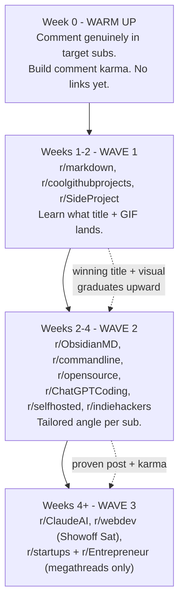

# SmallDocs on Reddit - the deep playbook

A sequenced plan for posting SmallDocs across Reddit, built to **grow
reputation from small subs up to big ones** without tripping spam filters.

This version is backed by a multi-source research pass that fact-checked each
claim with a 3-vote adversarial process (20 claims confirmed, 5 killed). Where
the evidence is solid I say so; where it isn't, I flag it. Read the confidence
tags - they're the difference between "do this" and "check before you trust it."

## How to read the confidence tags

- **[verified]** - confirmed by 2-3 independent sources in the research pass.
- **[directional]** - widely repeated, plausible, but not independently
  confirmed this round. Check the subreddit's own sidebar before you rely on it.
- **[myth]** - claims that sound authoritative and circulate in marketing blogs
  but the research **refuted**. Do not act on these.

One honest caveat up front: most sources on Reddit-marketing are vendor blogs
selling upvote services. The only primary source that survived verification was
the Lobsters about page. So treat exact numbers as approximate and **always
re-read a sub's sidebar rules the day you post** - rules, flairs, and karma
gates change often.

---

## 1. The operating rules (these are the load-bearing ones)

**The 90/10 norm. [verified]** Keep self-promotion to roughly 10% of your
activity; the other ~90% is genuine participation - answering questions,
commenting, being useful. Reddit retired this as *formal* policy, but mods still
enforce it as convention, and many marketers now run closer to **95/5**. This is
the single rule everything else hangs off.

**Warm up the account first. [verified]** Spend **2-4 weeks** as an active,
helpful member *before* you post a project. An account that only ever posts its
own links gets content removed. Comment karma earned by being useful is what
buys you the right to post.

**Cadence that stays under the radar. [verified]**
- Max **2-3 subreddits per day**.
- **One** thoughtful post per community per week - not the same post hammered out
  everywhere.
- **Space submissions across days**, and **customize each post** to its sub.

**What actually trips automod / filters. [verified]**
- Identical content posted across many subs within minutes.
- Near-identical reposts.
- Brand-new accounts posting links (Reddit's site-wide filter + Contributor
  Quality Score weigh account history).
- Posting only, never commenting.

The mechanism behind the cadence advice: it's not that a number of subs is
"banned," it's that *identical content + short time window + thin account
history* is the fingerprint filters look for. Vary the content and spread it
out and you don't match the fingerprint.

---

## 2. Myths the research killed - do NOT act on these

These circulate as fact in Reddit-growth blogs. The verification pass refuted
each one (vote shown). Listing them so you don't waste effort or fear the wrong
things.

| Myth [myth] | Verdict | Reality |
|---|---|---|
| "Posting your link in 5 subs in one day causes an unappealable sitewide shadowban" | refuted 0-3 | Spacing posts is still smart, but a single multi-sub day is not an instant permanent shadowban. The real risk is *identical* content in *minutes*. |
| "r/LocalLLaMA tolerates 10% self-promo, post your tool there" | refuted 1-2 | Not supported. Don't treat it as a promo-friendly sub; check its sidebar. |
| "r/learnprogramming runs Saturday project megathreads for sharing" | refuted 0-3 | No such sanctioned project-share megathread. It's a help sub, not a showcase. |
| "Most subs need ~100 comment karma and a 30-day-old account (e.g. r/CryptoCurrency 500 karma/60d, r/Assistance 400/90d)" | refuted 1-2 | These specific universal gates didn't hold up. Gates vary wildly per sub - read each sidebar. |
| "50 comment karma blocks you from ~70% of mid/large subs" | refuted 0-3 | Not supported as a general rule. |

The takeaway: karma/age gates are **real but per-sub and unpredictable**. There
is no reliable universal threshold, so check each sub's sidebar rather than
trusting a blanket number.

---

## 3. The subreddit map

Grouped by the angle SmallDocs can lead with. Sizes are approximate and sources
disagree (noted where they diverge). **W1/W2/W3** = which wave to post in.

### Project-showcase & open source - your launch home [verified as welcoming]

| Subreddit | Approx size | Wave | Notes |
|---|---|---|---|
| r/SideProject | ~450K-735K (sources disagree) | W1 | The most welcoming sub; expects "I built this" story posts. Your best first target. |
| r/coolgithubprojects | ~60K-105K | W1 | Purpose-built for open-source sharing. Needs a GitHub repo + correct flair (SmallDocs qualifies). |
| r/IMadeThis | ~440K | W1 | Generic "I made a thing" showcase. Friendly. |
| r/opensource | ~210K | W2 | Limited self-promo allowed; lead with the open-source + stateless story. |
| r/indiehackers | ~117K | W2 | Use the **SHOW IH** flair. Build-in-public framing. |

### Markdown / notes / PKM - the most on-topic audience [directional]

These weren't individually verified this round - **check each sidebar** - but
they are where people who live in `.md` files actually are.

| Subreddit | Approx size | Wave | Angle |
|---|---|---|---|
| r/markdown | small / niche | W1-W2 | Most on-topic home. "Stateless renderer, styling lives in the file." |
| r/ObsidianMD | ~200K+ | W2 | "Open/share any .md in the browser; your notes stay plain files." |
| r/PKMS | mid | W2 | Share/export notes without locking them in an app. |
| r/Zettelkasten | small | W2 | Plain-text-first crowd; lead with portability, not features. |
| r/logseq | small | W2 | Same plain-text angle; smaller and friendlier. |

### CLI / terminal / unix [directional]

| Subreddit | Approx size | Wave | Angle |
|---|---|---|---|
| r/commandline | ~200K | W2 | `sdoc file.md` opens it rendered; `sdoc share` copies an encrypted link. |
| r/unix, r/bash | mid | W2 | Only if you have a genuinely terminal-native angle; these are picky. |

### AI coding & agents - your differentiator [directional]

| Subreddit | Approx size | Wave | Angle |
|---|---|---|---|
| r/ClaudeAI | ~965K | W3 | Highest-value target: agent writes a .md and opens it rendered. Use project/show flair, disclose authorship. Big + easy to bury - go last. |
| r/ChatGPTCoding | large | W2-W3 | Agent-integration angle, less crowded than r/ClaudeAI. |
| r/vibecoding | growing | W2 | Younger, more promo-tolerant AI-builder crowd. |
| r/LocalLLaMA | large | - | **Do not assume it's promo-friendly** [myth corrected]. Participate genuinely or skip. |

### Web dev / programming - big and strict [verified strict]

| Subreddit | Approx size | Wave | Rule |
|---|---|---|---|
| r/webdev | ~2.6M | W3 | Self-promo **only** via the weekly **Showoff Saturday** flair, Saturdays only. |
| r/programming | very large | W3 | Reads as news, not "I made this." Frame as a technical write-up; needs karma. |

### Privacy / degoogle / selfhosted [directional - fit caveats]

| Subreddit | Approx size | Wave | Angle |
|---|---|---|---|
| r/privacy | large | W2-W3 | Only via "content lives in the URL hash, server sees ciphertext." No hype. |
| r/selfhosted | large | W2 | Honest fit: SmallDocs is stateless and works *without* a server. Pitch the optional tiny self-hostable renderer, and say so plainly. |
| r/degoogle | mid | W3 | Marginal fit; only if the no-account, no-tracking angle is the lead. |

### Startup / entrepreneur - megathread-gated [verified]

Post here **last**, and only inside the sanctioned thread with the right flair.

| Subreddit | Approx size | Wave | Rule |
|---|---|---|---|
| r/startups | ~1.8M | W3 | **No direct links in main posts.** Promo only in the "Share Your Startup" thread (cadence disputed - weekly vs monthly, verify live). |
| r/Entrepreneur | ~4.8M-4.9M | W3 | **Thursday** promo threads only; needs **~10 in-sub comment karma**; **bans AI-generated content**. |
| r/BootstrappedSaaS | small | W2 | Use the **self-promo** flair. |

---

## 4. The reputation ladder - SmallDocs, week by week



**Week 0 - warm up [verified necessity].** Before any link, spend 2-4 weeks
commenting usefully in the subs you plan to post in. Answer markdown/CLI/agent
questions. This is not optional - it's what stops your first post being removed
as a drive-by.

**Weeks 1-2 - Wave 1.** Post to the welcoming, on-topic, small subs first.
Lead with r/markdown and r/coolgithubprojects (smallest, most on-topic, lowest
risk). One sub per day, tailored title, bring a GIF. Watch which framing wins.

**Weeks 2-4 - Wave 2.** Take the winning title+visual into the niche subs, one
tailored angle each (CLI angle for r/commandline, encrypted-share for r/privacy,
agent-integration for r/ChatGPTCoding). Keep commenting more than you post.

**Weeks 4+ - Wave 3.** Only now hit the big strict subs - and only through their
sanctioned channels: r/webdev's Showoff Saturday flair, r/startups' and
r/Entrepreneur's promo threads, r/ClaudeAI with project flair and authorship
disclosed.

**Graduation criteria - when to move a post up a wave:**
- The title+visual cleared **~50+ upvotes with real comments** in a smaller sub.
- You have **2-4 weeks** of genuine comment history in the next-wave subs.
- You can answer "how is this different from X" in one tight top comment.

---

## 5. Title formulas & timing

**Formula that works for dev-tool posts [verified pattern]:** a story-driven
text post, with the GIF as support, not the headline.

- Title shape: `Launch/Show: ProductName - <one-line value>` (keep under ~100 chars).
- Body shape: **why you built it** (the hook) -> short journey -> 3-5 concrete
  features -> what feedback you want. Disclose you're the author.
- The demo GIF is *support*, not the whole post. (The research flagged
  "demo video is always best" as an overreach - the *story* is what converts;
  the visual reinforces it.)

**Timing [directional].** General guidance: weekday mornings US time for dev
subs; but the hard constraints override this - r/webdev is **Saturdays** (flair
window), r/Entrepreneur is **Thursdays** (thread). Post when the sanctioned
window is open, not when a generic "best time" chart says.

**Voice - match SmallDocs' own style.** Calm, specific, no hype. "It renders
markdown in the browser; content stays in the URL" beats "blazing-fast seamless
markdown." The product's writing voice *is* the right Reddit voice.

---

## 6. Tailored opening lines for SmallDocs

Reword per sub, but these are on-target hooks:

- **r/markdown** - "A stateless markdown renderer - styling lives in the file's
  front matter, nothing hits a server unless you choose to share."
- **r/coolgithubprojects** - "[Open source] sdoc - render, style, and share any
  markdown file from the terminal. No build step, one dependency."
- **r/SideProject** - "I wanted to send a client a styled markdown doc without it
  touching a server, so I built SmallDocs. Here's the story + a demo."
- **r/ObsidianMD** - "Open any .md in the browser with clean styling and share an
  encrypted link - your vault stays plain files."
- **r/commandline** - "`sdoc file.md` opens your markdown rendered in the browser;
  `sdoc share` copies an encrypted short link. Zero-dependency Node CLI."
- **r/ChatGPTCoding / r/ClaudeAI** - "I had my coding agent write a plan as
  markdown and open it rendered automatically. Here's the integration."
- **r/opensource** - "Stateless by design: content lives in the URL hash, the CLI
  is plain Node with no runtime deps. Auditable end to end."
- **r/privacy** - "Markdown sharing where the server only ever sees ciphertext -
  content decrypts in the recipient's browser. Here's the mechanism."

---

## 7. Adjacent launch surfaces (pair these with Reddit)

| Surface | How it fits | Notes |
|---|---|---|
| **Hacker News - Show HN** | The big one for a dev tool. A strong Show HN can dwarf Reddit reach. | Lead with the repo + a one-line "Show HN: ...". Be present in comments all day. Honest, technical framing wins; hype dies. [directional] |
| **Lobsters** | Quality dev audience, but **invitation-only** and **new users are locked ~70 days** (no new-domain submissions, no "show"/"announce" tags). Self-promo capped at <~25% of activity. | **Slow-burn, not a launch lever.** [verified, primary source] Don't count on it for a launch; build presence over months. |
| **Product Hunt** | Good for a coordinated single-day launch with a visual gallery. | Schedule it; line up early supporters. Complements, doesn't replace, Reddit. [directional] |
| **dev.to** | Write the launch as a technical post (the "how it works" of stateless markdown). | Lower risk than Reddit; evergreen; can be cross-linked from comments. [directional] |

**Sequencing idea:** Reddit Wave 1-2 (gather feedback, fix rough edges) ->
write the dev.to technical post -> Show HN once the story and demo are tight ->
Product Hunt as a coordinated day -> keep Lobsters as a long-term presence.
Reddit is the rehearsal; Show HN is the big stage.

---

## 8. Account health - check before you post [directional, verify live]

The research couldn't firmly verify specific shadowban mechanics, so treat this
as a checklist to confirm, not gospel:

- **Check if you're shadowbanned:** open your profile in a logged-out browser /
  incognito. If your posts don't appear there, you may be shadowbanned. (Several
  free "shadowban checker" tools exist; verify against the incognito method.)
- **Don't reuse one link domain too fast** across many subs in a short window -
  domain-level throttling is real even if exact thresholds aren't documented.
- **Comment karma > post karma** for passing gates - another reason the warm-up
  weeks matter.

---

## 9. Track what works (edit this sheet as you go)

Log every post; after a couple of weeks the winning sub + angle + visual is
obvious. Open this doc in the browser to sort/edit the grid; download as Excel
anytime.

```cells
format: F=number G=number
Date,Subreddit,Wave,Angle used,Visual,Upvotes,Comments,Outcome / notes
,r/markdown,1,stateless renderer,GIF,,,
,r/coolgithubprojects,1,open-source CLI,screenshot,,,
,r/SideProject,1,I built this (story),GIF,,,
,r/ObsidianMD,2,share .md as link,screenshot,,,
,r/commandline,2,sdoc CLI,terminal cast,,,
,r/ChatGPTCoding,2,agent integration,GIF,,,
,r/opensource,2,stateless + auditable,diagram,,,
,r/ClaudeAI,3,agent integration,GIF,,,
,r/webdev,3,Showoff Saturday,GIF,,,
```

**Graduation rule of thumb:** a post clearing **~50 upvotes with real comments**
in a Wave-1/2 sub means the title+visual is proven - take that exact pairing up
a wave.

---

## 10. Sources & honesty notes

**Verification:** 20 sources fetched, 99 claims extracted, top 25 fact-checked
with 3-vote adversarial verification; 20 confirmed, 5 refuted (the myths in
section 2). Most sources are Reddit-marketing vendor blogs; the **only primary
source** was the Lobsters about page. Subscriber counts are volatile - sources
disagreed by 2-3x on some (r/SideProject 180K to 735K; r/coolgithubprojects
60K vs 105K; r/Entrepreneur 4.8M vs 4.9M).

**Not independently verified this round (confirm in the sidebar before posting):**
the full niche-tier map (r/markdown, r/ObsidianMD, r/Zettelkasten, r/PKMS,
r/logseq, r/commandline, r/unix, r/privacy, r/degoogle, r/ClaudeAI,
r/ChatGPTCoding, r/LocalLLaMA, r/vibecoding sizes and gates); concrete real
launch-post examples; exact shadowban-detection and domain-throttling
thresholds; Show HN / Product Hunt / dev.to specifics.

**Selected sources:**
- [Lobsters - about / new-user rules](https://lobste.rs/about) (primary)
- [Best subreddits to promote a tech product in 2026 - SubredditSignals](https://www.subredditsignals.com/blog/best-subreddits-to-promote-a-tech-product-in-2026-rules-real-examples-and-outreach-tips-that-don-t-get-you-banned)
- [Reddit self-promotion rules - Redship](https://redship.io/blog/reddit-self-promotion-rules)
- [Reddit account health - Upvote.net](https://upvote.net/blog/reddit-account-health)
- [Market your project on Reddit - CraftEngineer](https://www.craftengineer.com/market-project-reddit-best-subreddits-promote-startup/)
- [Best subreddits to promote your startup 2026 - SaaSCity](https://saascity.io/blog/best-subreddits-promote-startup-2026)
- [Best subreddits for sharing your project - Tereza Tizkova](https://tereza-tizkova.medium.com/best-subreddits-for-sharing-your-project-517c433442f9)
- [Dev-tool Hacker News launch - Markepear](https://www.markepear.dev/blog/dev-tool-hacker-news-launch)
- [Indie launch: PH + HN + Reddit - dev.to](https://dev.to/kanta13jp1/indie-dev-launch-strategy-getting-traction-on-producthunt-hackernews-and-reddit-18g6)
- [Best subreddits for AI marketing 2026 - Linkeddit](https://linkeddit.com/blog/best-subreddits-for-ai-marketing-2026)
