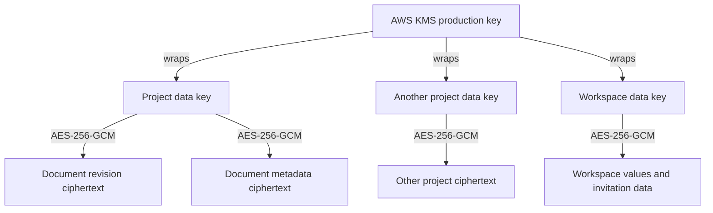

# SmallDocs Cloud key management plan

## Decision

Use managed envelope encryption for SmallDocs Cloud.

The initial provider recommendation is AWS KMS because the same AWS account can also hold the off-site S3 backups. SmallDocs will use separate customer-managed symmetric KMS keys for staging and production. The production application will never use a plaintext master encryption key from a configuration file.

KMS is part of the application encryption design. It is not a remote database and it does not receive Markdown documents.

## What this gives us

If someone obtains only the PostgreSQL database or an encrypted backup, they should not be able to read document bodies, filenames, titles, tags, project names, or other protected workspace values. Those values require both the stored ciphertext and permission to use the correct KMS key.

KMS does not make SmallDocs end-to-end encrypted or zero-knowledge. The application can decrypt data after authorization so that browsers, mobile devices, agents, revisions, and Cloud search work. A compromised production process with valid KMS permission could also decrypt data available to that process.

The protection boundary is therefore:

```text
protected customer fields in DB/backup   -> ciphertext without KMS access
account and operational metadata         -> remains visible where required
authorized SmallDocs production process  -> can decrypt after access checks
compromised production runtime           -> may be able to decrypt customer data
```

## Key hierarchy



### KMS key

AWS holds the customer-managed KMS key. Its plaintext key material does not leave AWS KMS. SmallDocs sends only 32-byte data keys to KMS for wrapping or sends wrapped data keys back for unwrapping.

Planned aliases:

```text
alias/smalldocs-cloud-staging
alias/smalldocs-cloud-production
```

Staging and production keys must remain separate. Staging must not contain production data, production ciphertext, or production KMS credentials.

### Project data keys

Each project receives a random 256-bit data-encryption key. That key encrypts the project's documents and revision metadata locally with AES-256-GCM.

The database stores:

- The KMS-wrapped project key
- The KMS key reference
- A key version
- Nonces, authenticated ciphertext, and the revision records

The database does not store the plaintext project key.

A project is the useful key boundary because membership and access are project-scoped. Compromise of one plaintext project key does not directly reveal another project's ciphertext.

### Workspace data keys

Workspace-level values that do not belong to one project use a separate random workspace data key. The KMS-wrapped key is embedded in the stored envelope. Values are encrypted locally with AES-256-GCM.

The current implementation reuses one cached workspace data key for subsequent values in that workspace. Each value still receives its own random nonce and authenticated encryption operation.

## Save and open flows

### First write to a project

1. Generate a random 32-byte project key in application memory.
2. Send that key to AWS KMS `Encrypt` with the production KMS key and non-secret encryption context.
3. Store the returned wrapped key and KMS key reference.
4. Encrypt the document revision locally with the project key.
5. Store only the authenticated ciphertext and operational metadata.
6. Clear temporary plaintext key buffers where the runtime allows it.

### Reading a document

1. Authenticate the request and authorize access to the workspace and project.
2. Load the wrapped project key and encrypted revision.
3. Ask AWS KMS to decrypt the wrapped project key.
4. Decrypt and authenticate the revision in application memory.
5. Return it only to the authorized browser, mobile client, or CLI session.
6. Keep the plaintext project key only in the bounded in-process cache.

### Searching

Cloud search follows the same authorization and key-unwrapping path. The service streams authorized current documents through bounded application memory, decrypts them, searches them, and returns capped results. It does not persist plaintext documents or query terms in a search index.

KMS is not called once per word or once per revision. It is normally called when a project key is absent from the short-lived cache.

## Plaintext key cache

The existing implementation has a bounded least-recently-used cache:

```text
default lifetime:       5 minutes
default maximum:        256 entries
eviction behavior:      overwrite the Buffer with zeroes, then remove it
process shutdown:       clear the cache
```

This reduces KMS latency and request volume. It also means a process-memory capture may contain recently used plaintext data keys. The cache limits that exposure but does not eliminate it.

Cache lifetime and size will be explicit production settings. Changes should be driven by measured KMS latency, request volume, and memory exposure rather than by convenience.

## Encryption context

Every KMS operation is authenticated with context similar to:

```json
{
  "application": "sdocs-cloud",
  "environment": "production",
  "purpose": "project-key",
  "resource_id": "project UUID",
  "version": "1"
}
```

AWS cryptographically binds this context to the KMS ciphertext. A decrypt request with the wrong environment, purpose, resource, or version fails.

Encryption context is not secret. AWS writes it to CloudTrail. It must contain opaque identifiers and classification values only. It must never contain an email address, document title, filename, tag, query, document content, or invitation token.

[AWS KMS encryption context](https://docs.aws.amazon.com/kms/latest/developerguide/encrypt_context.html)

## AWS access model

The production VM is in Hetzner, so it cannot inherit an EC2 instance role. For the first beta, use a dedicated AWS IAM runtime identity with a narrowly scoped access key.

The credential will be:

- Stored in a root-managed systemd credential or environment file
- Readable by the SmallDocs process, not by SmallCRM or the deployment user
- Restricted to `kms:Encrypt`, `kms:Decrypt`, and the minimum describe operation on the one production key
- Unable to administer, disable, rotate, change the policy, or schedule deletion of the key
- Rotated through a documented process

KMS administration belongs to a separate human administrative identity protected by MFA. Key users and key administrators must not be the same runtime identity. AWS key policies are the primary resource-level access control and must explicitly name the permitted principals.

[AWS KMS least-privilege guidance](https://docs.aws.amazon.com/kms/latest/developerguide/least-privilege.html) and [AWS KMS key policies](https://docs.aws.amazon.com/kms/latest/developerguide/key-policies.html)

IAM Roles Anywhere could replace the long-lived access key later. It adds certificate issuance and renewal operations, so it is not required for the first controlled beta.

## Failure behavior

KMS failures must fail closed.

- A write that cannot wrap or retrieve its data key must not commit a usable revision.
- A read or search that cannot unwrap a required key returns a temporary service error.
- The application must not fall back to `CLOUD_MASTER_KEY` or another local production key.
- A malformed KMS response, wrong encryption context, invalid authentication tag, disabled key, timeout, or access denial is an error.
- Logs record an error category and request correlation ID, not ciphertext, plaintext, key bytes, query text, or customer metadata.

Cached keys may allow a recently accessed project to continue briefly during a KMS outage. Uncached projects will fail. We should either accept that bounded behavior or clear the cache when KMS health fails; it must be an explicit operational decision before launch.

## Rotation and deletion

Enable automatic rotation on each AWS-managed symmetric KMS key. AWS retains the older key material behind the same key ARN, so existing ciphertext remains decryptable without an application rewrap.

[AWS automatic key rotation](https://docs.aws.amazon.com/kms/latest/developerguide/rotating-keys-enable.html)

Do not replace the production key ARN or schedule key deletion casually. Moving to a different KMS key requires a rewrap job that:

1. Unwraps each live project and workspace data key with the old KMS key.
2. Wraps it with the new KMS key.
3. Atomically updates the stored envelope and key reference.
4. Verifies every live row and retained backup policy.
5. Completes a restore and decrypt drill before the old key is disabled.

That rewrap job does not exist yet. Until it does, the KMS key reference used by live data or retained backups must remain usable.

## Backups and recovery

Database backups contain ciphertext and wrapped data keys, not the KMS plaintext key. Restoring a backup therefore also requires:

- The correct application encryption format and environment name
- Access to the referenced KMS key
- The correct database records, nonces, wrapped keys, and versions
- Application authentication and idempotency secrets where relevant

The KMS key must not be exported into the backup archive. Recovery depends on preserving the AWS account, KMS key, key policy, administrative access, and billing state.

Every restore drill must decrypt:

- A workspace name
- A project name
- A current document
- A retained historical revision
- A document created before the most recent automatic KMS rotation

Hetzner native backups are useful for fast VM recovery. Encrypted PostgreSQL archives in S3 provide the off-provider recovery copy. Neither is considered healthy until this decrypt drill succeeds.

## What exists now

The repository already includes:

- Project-key wrapping and unwrapping
- Workspace data-key envelopes
- AES-256-GCM local encryption
- KMS and local associated-data binding
- Stored KMS key references and versions
- A time and size bounded plaintext-key cache
- Buffer clearing on cache eviction
- Fail-closed behavior for malformed data and KMS failures
- Tests through the Cloud document store

The implementation is in `lib/cloud-kms.js` with focused coverage in `test/test-cloud-kms.js`.

## Work still required

- [ ] Refactor the synchronous key-provider and Cloud store boundary to support asynchronous KMS calls.
- [ ] Add the official AWS KMS client with request timeouts and bounded retries.
- [ ] Create staging and production KMS keys and policies.
- [ ] Create the Hetzner runtime IAM identity and root-managed credential delivery.
- [ ] Add startup validation that rejects `CLOUD_MASTER_KEY` in production.
- [ ] Add integration tests against the real staging KMS key.
- [ ] Add metrics for operation latency, denials, timeouts, cache hits, and decrypt failures without customer metadata.
- [ ] Clear the plaintext-key cache on graceful shutdown.
- [ ] Complete a backup restore and decrypt drill.
- [ ] Document key compromise, credential rotation, key disablement, and AWS account recovery procedures.

## SmallCRM boundary

SmallDocs and SmallCRM may share the first CX33, but they must not share KMS keys or AWS runtime credentials.

This document covers SmallDocs Cloud. SmallCRM currently stores CRM records and email bodies as plaintext JSON in SQLite and encrypts Resend credentials using a local application secret. Putting both services on a VM does not automatically extend SmallDocs encryption to SmallCRM.

Before SmallCRM accepts production data, it needs its own encryption-at-rest decision and, if KMS is used, a separate key, IAM identity, data format, restore drill, and rotation procedure. A compromise of the SmallCRM runtime must not grant use of the SmallDocs KMS key.

## Cost

AWS charges about $1 per customer-managed KMS key per month. At this scale, cryptographic request charges should be negligible compared with the key fee.

The SmallDocs plan initially needs two keys:

```text
staging key       $1 per month
production key    $1 per month
```

SmallCRM keys would be additional and separate. Do not reduce cost by sharing one production key between the products or between staging and production.

[AWS KMS pricing](https://aws.amazon.com/kms/pricing/)
