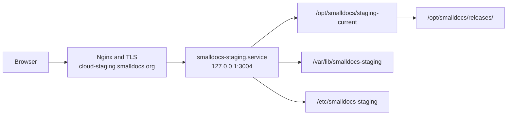

# SmallDocs Cloud: testing, staging deployment, and production readiness

Last checked: 21 August 2026

## Short answer

The Cloud work is on the `feature/cloud-foundation` branch. Publish the exact
tested commit there before deploying it. The staging deploy command refuses a
commit that is not the published branch tip.

The same commit is then installed as an immutable release and served at
[cloud-staging.smalldocs.org](https://cloud-staging.smalldocs.org). Check the
`X-Sdocs-Commit` response header on a public asset to identify the active full
commit. The staging service reaches it through `/opt/smalldocs/staging-current`.

Production still runs separately. Cloud remains hidden there. Shipping work to Cloud staging does not turn Cloud on for normal production users.

## Where the work lives

### Local Git branch

The current local branch is:

```text
feature/cloud-foundation
```

### Origin

The configured Git remote is:

```text
origin  https://github.com/espressoplease/SDocs.git
```

The local and remote Cloud branch tips must match before deployment. This means
the code can be recovered from GitHub, reviewed there, and checked out on
another machine.

### What is and is not deployed

The whole repository at the published branch tip is deployed to Cloud staging.
Staging then enables the Cloud routes and UI through its own environment
configuration.

The production service has a separate release symlink, environment, runtime user, databases, credentials, and public-mode setting. Its Cloud public mode remains hidden. The feature flag is the final UI and route boundary, but it is not being used to mix staging and production data.

## How a staging deployment works

The current deployment process is:

1. Finish a coherent change on `feature/cloud-foundation`.
2. Run the relevant Node and Playwright tests locally.
3. Commit the change.
4. Push `feature/cloud-foundation` to `origin`.
5. Run `ops/deploy-staging.sh SSH_TARGET` from that exact commit with no
   uncommitted tracked changes. The command builds and copies the archive,
   installs dependencies, verifies the staging unit, switches only the staging
   release, checks the loopback service and public hostname, and rolls back the
   staging pointer if activation fails.

The public request path is:



Nginx is the only public caller of the Node service. The Node process listens on port `3004` on loopback, not on a public interface.

### Staging isolation

Staging has its own:

- Linux service account: `smalldocs-staging`
- systemd service: `smalldocs-staging.service`
- application state: `/var/lib/smalldocs-staging`
- configuration and credentials: `/etc/smalldocs-staging`
- hostname and TLS certificate: `cloud-staging.smalldocs.org`
- Stripe sandbox key, products, prices, webhook, and customer portal
- Resend staging credential
- application secrets and test-login secret

It must not receive production customer data or use production payment webhooks.

### Staging deployment boundary

`ops/deploy-staging.sh` refuses uncommitted tracked changes and a commit that is
not the published `feature/cloud-foundation` tip. It modifies only the staging
release symlink and `smalldocs-staging.service`. It records the full commit in
the release, verifies that commit over loopback and public HTTPS, and restores
the prior staging release if activation fails. It does not read or print Cloud,
Stripe, OAuth, KMS, or email credentials.

## How we test the Cloud work

We use four layers. Each catches a different class of problem.

### 1. Node tests

`node test/run.js` exercises the server and its data models without a full browser. It covers areas including:

- authentication and session behavior;
- deployment configuration and feature flags;
- document encryption, revisions, conflicts, deletion, and recovery;
- workspaces, membership, invitations, permission groups, and tags;
- Stripe webhook validation and subscription state;
- CLI parsing and Cloud commands;
- jobs, idempotency, rate limits, and search limits;
- cache busting and service-worker update behavior;
- security headers and route boundaries.

The most recent full run against the staged release commit completed with `1269 passed`.

### 2. Playwright browser tests

Playwright opens the real UI in Chromium and checks behavior and layout. The focused Cloud and Library suites currently cover:

- Personal and Team account selection;
- checkout success, cancellation, retry, return paths, and mobile layout;
- first and last name collection;
- sign-in return behavior for long document URLs;
- invitation acceptance and invitation error states;
- one-account and multi-account navigation;
- personal settings and team administration;
- connected machines and credential revocation;
- company-domain invitation policy;
- member and admin invitation roles;
- owner-only team deletion;
- Local and Cloud Library navigation;
- adding a real document to Cloud;
- Only you, Everyone, and custom permission choices in the document UI;
- Cloud tags;
- revision conflicts;
- Cloud document updates and removal;
- desktop and phone-sized layouts.

The most recent focused Cloud and Library run completed with `70 passed`.

Some browser tests mock provider edges so they can be fast and deterministic. A passing Playwright suite does not prove that Resend, Stripe, KMS, DNS, or a real mailbox is working.

Email has an additional local test layer. `npm run email:preview` captures the
real multipart messages in Mailpit and exposes the rendered HTML and plain-text
versions at `http://127.0.0.1:8025`. The automated suite tests templates, MIME,
escaping, SMTP capture, links, and narrow-screen rendering without contacting
Resend. See `maintainers/email-testing.md` for the workflow.

A separate `npm run test:cloud-e2e` suite starts an isolated staging-shaped
service over local TLS. It seeds reusable identities, signs each required
identity in once, and uses their real browser sessions for the permission and
tag matrix. The current matrix proves Only you, a selected-person custom
group, Everyone, removal, list visibility, direct reads, search, Cloud tags,
and the Library UI. It cleans up its document and restores the removed member.

The same suite can target only `https://cloud-staging.smalldocs.org`. A live
run requires the exact-email staging allowlist and an owner-only secret file.
Production startup rejects the complete test-login configuration.

### 3. Live staging flows

We also test the deployed site with real staging boundaries:

- HTTPS, DNS, Nginx, systemd, and the real release path;
- email delivery through the staging Resend credential;
- Stripe sandbox Checkout, webhooks, cancellation, and the customer portal;
- browser sessions and return paths on the real staging hostname;
- adding and reopening Cloud documents;
- desktop and mobile behavior;
- CLI requests directed at the staging URL.

This is where configuration mistakes and provider integration problems appear.

### 4. Production preflight and private beta

Production preflight proves that the exact tested commit can run with production boundaries while Cloud remains hidden. A private beta then tests the product with real people before a public paid launch.

Automated tests are necessary, but they cannot settle unclear product policy, mail reputation, tax treatment, support expectations, or whether the UI makes sense to someone who did not build it.

## What is already in good shape

- Cloud is isolated behind `CLOUD_PUBLIC_MODE`; production Cloud routes and controls can remain hidden.
- The current Cloud branch is pushed and staging is running its exact commit.
- Staging has separate state, credentials, runtime identity, hostname, Stripe sandbox resources, and email credential.
- Production has a hardened single-host service shape, a restricted AWS KMS workload identity, coordinated encrypted backups, and a completed restore rehearsal.
- Personal and Team prices exist in Stripe sandbox and live mode in GBP, USD, and EUR.
- Checkout uses automatic tax and collects billing details and tax IDs.
- The Cloud UI, account selection, tags, permission groups, invitations, connected machines, billing entry points, and document revision flow have meaningful automated browser coverage.
- Local SmallDocs and Cloud can be released independently because the production Cloud surface is feature-flagged.

## Production-readiness checklist

The list below is intentionally stricter than a demo checklist. A paid Cloud product holds customer documents and controls access to them.

### A. Confirm the product rules

- [ ] Freeze the Personal and Team plan allowances: stored bytes, maximum file size, search workload, members, and any seat-based differences.
- [ ] Confirm revision retention. The implementation currently keeps up to three previous revisions and expires them after 90 days.
- [ ] Confirm deleted-document and deleted-team recovery. The current design uses a 30-day recovery window.
- [ ] Confirm the failed-payment grace period and exactly what becomes read-only.
- [ ] Confirm cancellation behavior at period end, including document access, export, deletion, and recovery.
- [ ] Confirm whether Cloud comments remain local or become persisted collaborative data. Current tests deliberately ensure a local comment does not create a Cloud revision.
- [ ] Confirm the one-account default and the account switcher behavior for the uncommon person who belongs to more than one account.
- [ ] Confirm that the single-host availability model is acceptable for the first paid release. PostgreSQL and multiple replicas are not required for a small private beta if we accept and document that limitation.

### B. Prove tags and permission groups end to end

The first three flows below pass in the isolated automated acceptance suite and
in the deployed staging two-account test. This is staging evidence. Production
remains separate and Cloud is not enabled there.

- [x] Add a document with Only you access and prove another account cannot discover or open it.
- [x] Change the same document to Everyone and prove all active account members can discover and open it.
- [x] Create a custom permission group, add and remove people, and prove access changes immediately.
- [ ] Confirm the owner, selected member, unselected member, removed member, and signed-out cases for read, search, edit, history, restore, delete, and undelete.
- [ ] Confirm changing tags never changes permissions, and changing permissions never drops tags.
- [ ] Confirm local tags become Cloud tags on first upload using the agreed merge behavior.
- [ ] Confirm Cloud tag edits remain consistent in the document view, Library, search, and CLI.
- [ ] Confirm stable document identity when a local document is pushed more than once.
- [x] Confirm two clients creating a revision conflict preserve both edits. The
  automatic recent-target path is covered; recovery for an expired target is a
  separate remaining UI task.

### C. Prove account and invitation behavior

- [ ] Complete the Personal signup, payment, return-to-document, upload, reopen, and cancellation flow with a new account.
- [ ] Complete the Team signup, payment, domain setup, invitation, acceptance, sharing, removal, and cancellation flow with separate people.
- [ ] Confirm first and last names produce correct initials everywhere.
- [ ] Confirm members can invite only an address on an allowed team domain.
- [ ] Confirm admins can invite any email and can choose Member or Admin.
- [ ] Confirm only the owner can delete the team, and the final owner cannot be removed.
- [ ] Test expired, revoked, already-used, resent, and wrong-email invitations.
- [ ] Confirm an invited member can sign in and open their area from the homepage on a phone.

### D. Finish authentication and email proof

- [ ] Decide which production sign-in methods launch: email code, Google, GitHub, or a smaller subset.
- [ ] Configure separate, business-owned production and staging OAuth applications for every enabled provider.
- [ ] Test OAuth success, denial, replay, expired state, private-email accounts, and accounts without a usable verified email.
- [ ] Deliver login codes and invitations to Gmail, Outlook, iCloud, and a custom-domain mailbox.
- [ ] Check latency, spam placement, expiry, resend invalidation, bounce handling, and provider outage behavior.
- [x] Inspect the staging delivery queue with `npm run cloud:jobs -- --email`;
  confirm the diagnostic output contains no recipients, document data, notes,
  or tokens.
- [ ] Publish DMARC reporting, review it, and decide when to move to a stricter policy.
- [ ] Confirm codes, invitation tokens, OAuth values, cookies, and customer email never appear in application or proxy logs.
- [ ] Confirm auth abuse limits are understandable to a legitimate user and effective against repeated attempts.

### E. Prove CLI and connected-machine behavior

- [ ] Run CLI sign-in on macOS, Linux, and a headless remote server.
- [ ] Confirm the credential survives a shell restart and uses the intended secure store or restricted file fallback.
- [ ] Confirm Connected machines shows the correct person and device, not a workspace-wide mixture.
- [ ] Revoke a credential in the UI and confirm its next CLI request fails.
- [ ] Exercise `status`, `members`, `tags`, `permission-groups`, `ls`, `search`, `create`, `pull`, `push`, `history`, `restore`, `delete`, `deleted`, and `undelete`.
- [ ] Test both human output and stable `--json` output.
- [ ] Confirm the CLI defaults a new document to Only you unless the user or agent explicitly selects a broader group.
- [ ] Confirm the CLI can list and select tags and permission groups without guessing names or IDs.

### F. Finish billing and tax proof

- [ ] Confirm the legal entity, billing address, support contact, and statement descriptor.
- [ ] Confirm whether each displayed GBP, EUR, and USD price includes tax and make the product page, Checkout, invoices, and accounting treatment agree.
- [ ] Confirm required tax registrations before enabling collection in a jurisdiction.
- [ ] Use Stripe test clocks or test events for subscribe, renew, payment failure, grace, recovery, cancellation, duplicate webhook, delayed webhook, and replay.
- [ ] Confirm an older Stripe event cannot overwrite newer subscription state.
- [ ] Confirm a Team invitation adds a billed seat only when accepted.
- [ ] Confirm member removal changes the billed quantity and failed seat updates reconcile through the job queue.
- [ ] Confirm the customer portal supports the exact promised actions and returns to the correct account.
- [ ] Confirm refund and cancellation policy, then make the UI and legal copy match it.

### G. Security and data handling

- [ ] Run tenant-isolation tests against the real staging service, including direct requests with IDs copied from another account.
- [ ] Run real KMS staging tests for encrypt, decrypt, wrong context, denial, timeout, disabled key, restart with an empty cache, and an old key reference.
- [ ] Confirm production cannot start with `CLOUD_MASTER_KEY`, development code logging, partial billing, partial mail, or an insecure public origin.
- [ ] Confirm request size limits match the published file limit plus encryption overhead.
- [ ] Review cookies, CSRF and same-origin checks, CSP, redirect validation, and proxy trust with the final hostname configuration.
- [ ] Review dependencies and run the security test suite against the exact release commit.
- [ ] Inspect application, Nginx, Stripe, email, KMS, job, and error logs for document text, filenames, titles, tags, searches, email addresses, credentials, and raw webhooks.
- [ ] Document who can access the host, databases, backups, KMS administration, Stripe, DNS, and email provider. Require MFA and individual operator accounts.

### H. Monitoring, backup, and failure drills

- [ ] Monitor HTTPS availability, latency, CPU, memory, open files, disk space, disk latency, database sizes, WAL growth, and filesystem errors.
- [ ] Alert on old backups, database corruption, KMS failures, email failures, Stripe webhook failures, subscription drift, seat drift, stuck jobs, and search timeouts.
- [ ] Run a coordinated backup and full restore using the final production configuration and exact release.
- [ ] Restore a known Cloud document and more than one revision after a process restart with an empty KMS cache.
- [ ] Drill KMS outage, email outage, Stripe outage, disk full, database corruption, lost webhook, and compromised session responses.
- [ ] Confirm certificate renewal and the operating-system and Node patch process.
- [ ] Write a rollback procedure that preserves Cloud writes created after launch. Code rollback must not mean database rollback.
- [ ] Name the person responsible for first-response incidents and provider-account recovery.

### I. Legal, privacy, and customer support

- [ ] Confirm the legal entity selling the subscription and complete the ICO fee self-assessment.
- [ ] Publish Terms, Privacy, acceptable-use, cancellation and refund, and subprocessors pages.
- [ ] State the trust boundary accurately: Cloud is encrypted at rest, but SmallDocs decrypts authorized documents in application memory to serve and search them. It is not end-to-end encrypted or zero knowledge.
- [ ] List plaintext personal data and provider identifiers, their purposes, lawful bases, retention, deletion, backup expiry, and international transfers.
- [ ] Put the appropriate provider terms or data-processing agreements on file.
- [ ] Define the export, account deletion, data-rights, and support request processes.
- [ ] Write the breach assessment, recording, customer notification, and regulatory reporting procedure.
- [ ] Make public security, pricing, privacy, and retention copy agree with the shipped behavior.

### J. Acceptance, private beta, and release

- [ ] Run the full staging matrix with two human accounts, two browser profiles, one phone-sized browser, and two CLI credentials.
- [ ] Run the full Node suite and the complete Playwright suite against the exact release commit.
- [ ] Invite 5 to 10 known private-beta users and define the beta period and support channel.
- [ ] Review support issues, file sizes, revision growth, search latency, mail delivery, billing drift, backup results, and restore readiness during beta.
- [ ] Complete at least one restore drill during beta.
- [ ] Merge the accepted branch into `main` and tag the exact release.
- [ ] Back up the existing production service and take the final short-link database snapshot immediately before cutover.
- [ ] Deploy the exact tested commit with Cloud still hidden, then run production preflight.
- [ ] Enable the public Cloud mode only after preflight passes.
- [ ] Smoke test sign-in, Checkout, webhook, create, read, search, update, permissions, tags, CLI, invitation, portal, cancellation, Local mode, and encrypted short links.
- [ ] Watch the service, Stripe, Resend, KMS, jobs, disk, and backups through the first real payments.

## The biggest remaining blockers

The application is past the proof-of-concept stage. The main blockers are now cross-system proof and policy, not the existence of the basic UI.

1. **Product policy:** decide plan allowances, failed-payment behavior, cancellation, retention, and whether comments become Cloud data.
2. **Full authorization proof:** complete the Only you, Everyone, custom group, removed-member, search, history, restore, and CLI matrix with separate real accounts.
3. **Real provider lifecycle tests:** finish production OAuth choices, mailbox coverage, Stripe failure and seat reconciliation, and KMS failure drills.
4. **Monitoring and incident readiness:** add alerts, operator procedures, and a final-config restore drill.
5. **Legal and support:** publish the customer terms, privacy and security explanation, cancellation policy, subprocessors, and support path.
6. **Private beta:** let a small group use the complete flow before enabling paid Cloud publicly.

## Recommended path from here

1. Freeze the small set of product policies that affect code and public copy.
2. Fill the missing automated authorization, CLI, billing-lifecycle, and failure tests.
3. Turn the full staging journey into one repeatable acceptance script, while keeping Playwright coverage for every confirmed flow.
4. Add monitoring and run the provider and restore failure drills.
5. Finish legal, privacy, tax, and support materials.
6. Run a time-boxed private beta.
7. Merge and tag the exact accepted commit, deploy with Cloud hidden, run production preflight, then enable the feature.

This sequence keeps the production feature switch as the last action. It does not ask the feature flag to compensate for an untested billing, access, or recovery path.
