# Google Sheets DOM teardown

A live dissection of how Google Sheets renders, edits, and recalculates a
grid in the browser, captured by attaching to a real session over CDP and
inspecting the DOM. The goal is to decide how SDocs should structure its
own `cells` feature so that the read-only v1 does not box in editing and
formulas later.

Sheet under inspection: a small "Demo" sheet. Row 1 holds month labels,
row 2 Revenue, row 3 COGS, row 4 Profit. Profit is a calculated row.

## The one finding that decides everything

**The grid is painted on a single `<canvas>`. It is not built from DOM
cells.** The entire visible grid - text, fills, gridlines, column letters,
row numbers - is one `<canvas>` element sized to the viewport. A query for
`[role=gridcell], td` across the whole grid returns 8 nodes (stray bits of
other UI), not the hundreds a real cell-per-element grid would have.

So a spreadsheet cell in Google Sheets is **not a thing in the DOM at all**.
It is a record in a JavaScript data model, and the canvas is just a cheap
way to draw the visible slice of that model.

This is the opposite of a `<table>`, and it is the answer to "are we
boxing ourselves in": the `<table>` is a *rendering* of data, never the
data itself.

## How the surface is assembled

```mermaid
graph TD
  A[grid-table-container] --> B[grid-scrollable-wrapper]
  B --> L[left inner container - 46px row-number gutter]
  B --> R[right inner container - main grid]
  R --> SP[waffle-background-container - 50000px wide spacer]
  R --> CV[canvas - viewport-sized, paints visible cells]
  R --> OV[uberlay layers - selection, editor, overlays]
  C[waffle-footer-container - 4000px tall spacer]
```

Three cooperating pieces:

- **A giant empty spacer div** (`waffle-background-container`, measured at
  50000px wide; the footer spacer 4000px tall). It has no content. Its only
  job is to make the native scrollbar represent the *whole* sheet, even
  though almost none of it is drawn.
- **A viewport-sized `<canvas>`** that paints only the cells currently in
  view. On this DPR-1 display the canvas backing store equals its CSS size
  (1188x1006); on a retina screen it would be scaled by `devicePixelRatio`
  for crisp text. A sub-pixel `padding-top: 0.42px` nudges gridlines onto
  exact device pixels.
- **Overlay layers** (`uberlay` divs, ids like `fixed_left`,
  `scrollable_right_3`...). These are the frozen-pane quadrants
  (`fixed_*` = frozen rows/cols, `scrollable_*` = scrolling area;
  `left` = row gutter, `right` = grid body) crossed with z-order strata.
  Anything interactive that needs real focus or text input lives here as
  actual DOM, floating above the paint.

When you scroll, the spacer keeps the scrollbar honest while the canvas
repaints for the new window. That is the whole virtualization trick: draw
the visible ~50 cells, never the 100,000 that exist.

## The cell is two values, not one

Selecting B4 (a Profit cell):

- The **canvas shows `-5`** (the computed result).
- The **formula bar shows `=B2-B3`** (the raw input).

So each cell carries at least:

| field | example | meaning |
| --- | --- | --- |
| raw input | `=B2-B3` | what the user typed: a literal or a formula |
| computed value | `-5` | what gets painted |
| type/format | number | drives alignment and display |

Jan Revenue 5 minus Jan COGS 10 gives the painted `-5`. The formula is
**stored** and **recomputed in the browser**, which is why editing an input
cell updates Profit instantly with no server round-trip. The formula engine
and the dependency graph are client-side.

**Confirmed live.** Driving a real edit through the page: B2 (Jan Revenue)
changed `5` -> `1000`, and B4 (Jan Profit) repainted `-5` -> `990` in the
same frame. B4's formula bar stayed `=B2-B3` throughout - only the computed
value changed. The dependency Revenue -> Profit was resolved and repainted
entirely client-side.

A `<td>` natively holds one thing: its text. Modelling a cell as a `<td>`
means the raw-vs-computed distinction, the formula, and the format all have
to be bolted on as a side-table and hand-synced. Modelling the cell as a
record makes all of that native.

## Editing is a floating overlay, not an editable cell

There is always a `
` sitting
inside an `input-box`, parked in an overlay layer. In view-only mode it
carries `-webkit-user-modify: read-only`. To edit, Sheets positions this one
editor over the active cell's pixel rect and flips it writable. On commit the
typed string goes into the data model, the engine recomputes dependents, and
the canvas repaints. One editor element is reused for every cell; it is not
one input per cell.

## Selection is four positioned divs

The active-cell highlight is not a CSS border on a cell. It is four separate
`range-border` divs - one each for top, bottom, left, right - absolutely
positioned in pixel coordinates over the canvas (top/left/width/height set
inline). For B4 the box measured ~102px wide and ~22px tall: that is the
cell's geometry, computed from cumulative column widths and row heights, not
read off any element. All selection, range-drag, and fill-handle chrome is
built this way: geometry math plus positioned divs over the paint.

## What this means for SDocs `cells`

The throughline: **separate the data model from the render surface, and do
it in v1 even though v1 is read-only.**

1. **The model is the source of truth, not the DOM.** Define a headless grid
   model: addressable cells `(row, col)` each holding `{ raw, value, type }`.
   Everything renders *from* this model. Nothing reads truth back *out* of a
   `<table>`.

2. **`raw` vs `value` from day one.** Even with no formula engine in v1, store
   each cell as raw input plus computed value. For a literal they are equal.
   When formulas arrive (v3), `raw` already holds `=B2-B3` and only the
   compute step is new - no model migration, no boxing-in.

3. **Two renderers, one model.**
   - *Inline preview* (in the doc): small and read-only, so a plain
     `<table>` or CSS grid is fine and simple. It is just one cheap view of
     the model, explicitly disposable.
   - *Fullscreen sheet* (later, for scale + editing + formulas): a
     virtualized surface - spacer for scroll extent, paint only the visible
     window, float selection and the editor as positioned overlays. This is
     where canvas-or-virtualized-DOM earns its keep; a `<table>` here would
     be slow on big CSVs and fight frozen headers and selection.

4. **A coordinate layer is unavoidable for editing.** Selection and the editor
   need `(row,col) -> pixel rect` from cumulative column widths / row heights.
   Build it when we build the fullscreen surface, not before.

5. **Formula engine is a later, self-contained slab.** Store `=...` strings
   untouched now; add a recalc pass (parse, dependency graph, evaluate) when
   we get there. The model already carries the input it needs.

### Verdict on the original question

Rendering as a `<table>` is the right call for the **inline preview** and the
wrong call for the **data model** and the **fullscreen sheet**. Keep the
`<table>` as one disposable view; make a real cell model the backbone. That
keeps v1 small while leaving the door open to editing and formulas exactly
the way Google does it.
