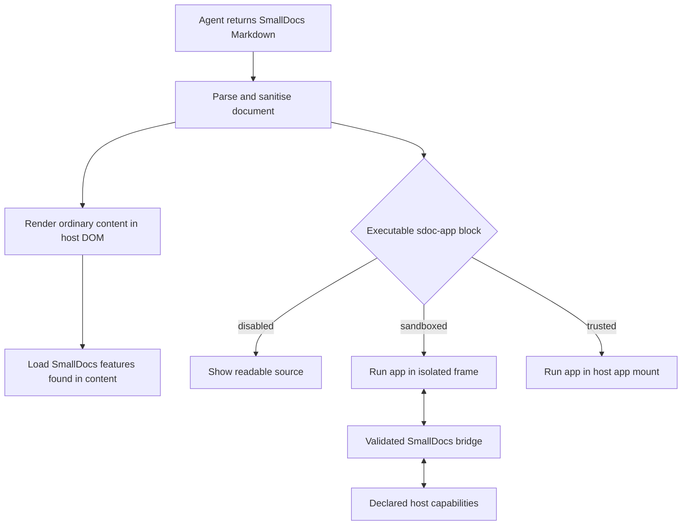

# HTML and JavaScript content in SmallDocs

## Status

This is a product and technical proposal for a future SmallDocs capability. It is intended to guide the direct-DOM SDK architecture before executable documents are implemented.

The agreed direction is:

- Ordinary Markdown, static HTML, and existing SmallDocs features render directly into the host application's DOM.
- The SDK installs scoped default styles. The host application can override them with ordinary CSS and documented custom properties.
- Agent-authored JavaScript is controlled by the integrating application, not by the document.
- The application chooses `disabled`, `sandboxed`, or `trusted` execution.
- In sandboxed mode, only an explicitly executable app block is isolated. The rest of the SmallDoc remains directly integrated with the host page.

This proposal does not add image hosting, upload, or proxying.

## Product goal

An agent should be able to return one SmallDocs Markdown document that combines readable analysis with the existing rich features, static HTML, and optional interactive tools.

The developer should be able to render that document with one SDK import and one render call. They should control the document's appearance through CSS and decide whether agent-authored JavaScript can run.

The permission decision belongs to application code because the application understands how its agent was configured, what source material it reads, and what data is present on the page. A document cannot request or increase its own execution mode.

## User stories

### Readable analysis with application styling

A company runs an analysis agent and receives SmallDocs Markdown. It renders the document inside its existing report page. Headings, navigation, code, charts, spreadsheets, slides, Mermaid, math, copy controls, and focus views use SmallDocs behavior, while typography, width, colors, spacing, and surrounding layout follow the company's application.

### Static agent-authored HTML

An agent needs a semantic layout that ordinary Markdown cannot express. It includes a small amount of HTML in the document. SmallDocs sanitises the HTML and inserts the safe result into the same document DOM. No agent-authored script runs.

### Sandboxed interactive tool

An agent produces a scenario calculator as part of a report. The company enables sandboxed JavaScript. The report itself remains in the application DOM, while the calculator runs inside one isolated app block. It can update its own controls and send declared events to the host, but it cannot read the surrounding page, login state, storage, or application JavaScript.

### Trusted internal tool

A company operates a controlled agent that only uses approved internal templates. It explicitly enables trusted JavaScript for an internal application. The interactive block runs in the host page and can integrate with application services. The company accepts that this code has the same browser authority as its own frontend code.

### JavaScript remains off

A company wants the full SmallDocs renderer but does not want generated code to run. It keeps the default `disabled` mode. Executable blocks remain visible as source, so the document is understandable and no content silently disappears.

## Authoring format

### Static HTML

Static HTML uses the normal HTML support in Markdown:

```html
<section class="analysis-summary" aria-labelledby="summary-title">
  <h2 id="summary-title">Scenario summary</h2>
  <p>Revenue grows fastest when retention improves first.</p>
</section>
```

SmallDocs parses the document, sanitises the HTML, and renders the safe result directly in the document mount. A fenced `html` block continues to mean a code listing. This preserves existing Markdown behavior and avoids making existing examples executable.

The static HTML allowlist should retain semantic elements, classes, safe `data-*` attributes, and accessibility attributes. It should remove scripts, event-handler attributes, unsafe URLs, embedded browsing contexts, and document-level elements. Agent-authored `<style>` elements and inline style attributes should not enter the host page. The integrating application supplies document styling.

### Executable app block

An executable tool uses an explicit `sdoc-app` fence:

````markdown
```sdoc-app
---
id: retention-scenario
title: Retention scenario calculator
height: auto
---
<form class="scenario">
  <label>
    Monthly retention
    <input name="retention" type="range" min="70" max="100" value="88">
  </label>
  <output aria-live="polite"></output>
</form>

<style>
  .scenario {
    display: grid;
    gap: 1rem;
  }
</style>

<script type="module">
  const form = document.querySelector('.scenario');
  const output = form.querySelector('output');

  function update() {
    const retention = Number(form.elements.retention.value);
    const projected = Math.round(1200000 * retention / 88);
    output.value = `Projected revenue: £${projected.toLocaleString()}`;
    SmallDocs.emit('scenario-change', { retention, projected });
  }

  form.addEventListener('input', update);
  update();
```
````

The front matter belongs to the app block, not to the whole document.

Proposed fields:

| Field | Required | Meaning |
| --- | --- | --- |
| `id` | Recommended | Stable identity used for updates and host events |
| `title` | Required for sandboxed mode | Accessible name for the interactive region or frame |
| `height` | No | `auto` by default, or an application-approved CSS length |

The block contains one HTML fragment, optional local styles, and at most one module script. External `<script src>` elements are not part of the first version. Unknown or malformed app blocks render as source with an error label.

Using a new fence is deliberate. Existing raw HTML remains static, existing `html` fences remain code, and old SmallDocs versions show the unknown `sdoc-app` fence as readable source.

## SDK contract

The basic integration remains one import and one render call:

```javascript
import { render } from 'https://smalldocs.org/sdk/0.2.0/smalldocs.js';

const markdown = await runAnalysisAgent();

const view = await render('#report', markdown, {
  sections: {
    collapsible: true,
    defaultOpen: true
  },
  javascript: 'disabled'
});
```

The SDK owns installation of its version-matched base stylesheet. The developer does not add a second SDK import. The internal delivery may be bundled CSS or a stylesheet loaded by the module, but that is not part of the public contract.

### Execution modes

The concise form accepts one of three values:

```javascript
javascript: 'disabled'  // default
javascript: 'sandboxed'
javascript: 'trusted'
```

An object form adds explicit integration points:

```javascript
const view = await render('#report', markdown, {
  javascript: {
    mode: 'sandboxed',
    connectTo: [],
    capabilities: {
      saveScenario: async (payload, context) => {
        return saveScenarioForReport(context.documentId, payload);
      }
    },
    onEvent(event, context) {
      analytics.record(event.name, event.payload, context.blockId);
    }
  }
});
```

`disabled` is the default. SmallDocs does not execute the app. It renders the fenced source with a clear "Interactive content is disabled" status. This is safer and more honest than showing a partly working static preview.

`sandboxed` runs each app block in its own sandbox. The block may manipulate its own HTML and CSS. It cannot directly access the surrounding SmallDoc, host application DOM, cookies, local storage, session storage, service workers, or application JavaScript.

`trusted` mounts the app block in the host document and runs its module script with host-page authority. The script can read and change the host DOM and use the host's browser credentials. SmallDocs must describe this as full trust. SDK options cannot reliably make trusted code partially trusted. Applications that need restrictions should use sandboxed mode.

The renderer rejects an unknown execution mode. A document cannot set `javascript`, `connectTo`, capabilities, or a CSP nonce in its own front matter.

## Rendering architecture



Charts, cells, slides, Mermaid, math, code tools, navigation, copy controls, and heading behavior remain part of the direct renderer. They are trusted SmallDocs code operating on sanitised document data. Their presence does not turn the document into an executable app.

The SDK discovers required features from the finished document and lazy-loads them. The agent does not declare a capability manifest before analysis.

## Trust and security model

There are three relevant sources of code and content:

1. The host application trusts the SmallDocs SDK in the same way it trusts another frontend dependency.
2. Agent-authored Markdown and HTML are data. They are parsed and sanitised before direct-DOM insertion.
3. Agent-authored JavaScript is executable code. Its authority is selected by the host application's SDK configuration.

Agent output should still be treated as untrusted when the application owns the agent. The agent may quote a web page, document, email, tool result, or user message that contains hostile markup or instructions. Sanitisation protects the host when this content is reproduced.

### Direct document sanitisation

Before direct-DOM insertion, SmallDocs should:

- Remove scripts, event attributes, iframes, objects, embeds, document-level tags, and unsafe SVG constructs.
- Permit only safe URL protocols and remove `javascript:` and equivalent encoded forms.
- Remove agent-authored style elements and inline styles from ordinary document HTML.
- Sanitize rich-feature output, including generated Mermaid SVG, before insertion.
- Avoid string-to-code operations such as `eval` and `new Function` in the normal renderer.
- Remain compatible with a host application's Trusted Types policy.

Sanitisation is required in every JavaScript mode. Enabling sandboxed or trusted apps does not weaken the treatment of ordinary document content.

### Sandboxed app isolation

Each sandboxed `sdoc-app` should use a sandboxed iframe without `allow-same-origin` and without top-navigation permission. The iframe receives only the app block's HTML, local CSS, module script, the SmallDocs bridge, and an app-specific channel token.

The frame should receive an injected Content Security Policy. The starting policy is:

```text
default-src 'none';
script-src 'unsafe-inline';
style-src 'unsafe-inline';
connect-src 'none';
base-uri 'none';
form-action 'none';
frame-ancestors 'none'
```

The inline permissions apply inside the isolated frame, not to the host document. The frame has an opaque origin and no ambient credentials. Image and media permissions are outside the first implementation and remain blocked.

The SDK must validate the message source, block identity, channel token, message type, and payload shape before acting on any frame message. Messages from another frame, another SmallDocs instance, or application code without the matching channel must be ignored.

An isolated frame reduces access to host data. It does not guarantee that generated code is correct, responsive, or free of misleading behavior. A badly written app can still consume CPU inside its execution environment or present incorrect results.

### Trusted app execution

Trusted execution requires an explicit host option. It must not be inferred from same-origin hosting, development mode, document metadata, or a previous render.

If the host uses a strict CSP, the SDK should accept a host-provided nonce in the JavaScript configuration:

```javascript
javascript: {
  mode: 'trusted',
  cspNonce: window.applicationCspNonce
}
```

The SDK applies that nonce only to the script element it creates for the trusted block. The document cannot supply the nonce. If the CSP still blocks execution, the block falls back to source and reports the error through the view API.

## Sandbox bridge

The sandbox bridge should be small and capability-based.

### APIs available inside an app

```javascript
SmallDocs.emit(name, payload)
SmallDocs.call(capabilityName, payload)
SmallDocs.onInput(handler)
SmallDocs.onCleanup(handler)
```

`emit` sends a named application event to the host's `onEvent` callback. It does not cause a host action by itself.

`call` invokes only a capability registered by the integrating application. Calling an absent capability rejects with a structured `CAPABILITY_NOT_AVAILABLE` error. The application validates payloads and performs the action under its own authorization rules.

`onInput` receives serialisable input supplied through `view.setAppInput(blockId, value)`. It gives the application a way to update an app without granting it access to host state.

`onCleanup` registers app-local cleanup for timers, observers, and other resources. The sandbox also disappears on teardown, so cleanup does not depend on generated code behaving correctly.

The bridge accepts structured-clone data rather than HTML, DOM nodes, functions, or executable source. Capability results follow the same rule.

### Host-side input and events

```javascript
view.setAppInput('retention-scenario', {
  baselineRevenue: 1200000,
  currency: 'GBP'
});

view.on('app-event', event => {
  console.log(event.blockId, event.name, event.payload);
});
```

The render option callback and the view event are two interfaces to the same event stream. An implementation may support both, but it should document one as the primary path before release.

## Links and network access

### Ordinary document links

Links in ordinary Markdown and sanitised HTML remain normal host-page links. Fragment links navigate within the rendered document. Relative links resolve against the host page unless the application supplies a base URL. Unsafe protocols are removed during sanitisation.

### Links inside sandboxed apps

A sandboxed app cannot navigate the top-level page directly. A user click on a safe link is relayed to the host SDK. The SDK applies the document link policy and lets the application handle the result. Programmatic navigation is not treated as a user click and requires an explicit host capability.

This prevents an app from escaping its frame while allowing ordinary user-driven links to behave consistently with the surrounding document.

### Network access

Sandboxed apps begin with `connect-src 'none'` and no host credentials. The application may permit public cross-origin requests:

```javascript
javascript: {
  mode: 'sandboxed',
  connectTo: ['https://api.example.com']
}
```

SmallDocs adds only those origins to the frame's `connect-src`. Browser CORS rules still apply, and requests originate from an opaque origin without host cookies. `connectTo` is not a proxy and does not make a private API available.

Authenticated or private operations should normally be exposed as named capabilities. The host application then controls credentials, validation, authorization, logging, and the response fields returned to the app.

Trusted apps use the host page's network authority. `connectTo` cannot restrict trusted code and should be rejected in combination with `mode: 'trusted'` rather than imply protection it cannot provide. The host application's CSP remains the applicable network boundary.

## Styling and layout

### The main document

The SDK automatically installs SmallDocs base CSS once per SDK version. All selectors are scoped beneath `.smalldocs-document` and placed in a low-priority cascade layer:

```css
@layer smalldocs {
  .smalldocs-document {
    font-family: var(--sdocs-font-family, Inter, sans-serif);
    color: var(--sdocs-text-color, #202124);
  }
}
```

The SDK must not apply global rules to `body`, unscoped headings, links, buttons, or form elements. The host can override variables or target SmallDocs classes with normal application CSS:

```css
#report {
  --sdocs-font-family: inherit;
  --sdocs-accent: #6d4aff;
  --sdocs-max-width: 100%;
}

#report .sdoc-code {
  border-radius: 0.75rem;
}
```

Heading expansion, copy controls, navigation, and fullscreen affordances are renderer options rather than document instructions. The initial configuration surface should cover:

```javascript
render('#report', markdown, {
  sections: {
    collapsible: true,
    defaultOpen: true
  },
  controls: {
    copy: true,
    fullscreen: true
  },
  navigation: true
});
```

Existing SmallDocs style front matter may still set document defaults. Host CSS has final control in SDK integrations.

### Sandboxed app blocks

An app's local `<style>` element applies only inside that app frame. The SDK passes documented SmallDocs design variables and relevant user preferences, including color scheme and reduced motion, into the frame when it is created. General host selectors do not cross the frame boundary.

The host controls the app container, width, border, background, and spacing. The frame itself should be borderless and fill the container width. A `ResizeObserver` inside the frame reports content height so `height: auto` does not create a nested scrollbar during normal use. Height changes should be applied without visible scrollbar flashes.

### Trusted app blocks

Trusted app HTML receives a unique block root. Local app CSS must be scoped to that root before it enters the host document. The host can override the app through that root and the same documented custom properties. The scoping implementation must use a CSS parser rather than text prefixing so keyframes, nested rules, and at-rules remain valid.

Trusted JavaScript can deliberately change host styles because it has host authority. CSS scoping is an integration convenience, not a security boundary.

## Accessibility

The direct renderer should preserve the existing semantic heading hierarchy, navigation labels, code controls, table semantics, and keyboard behavior.

Each app block should:

- Have an accessible name from its `title` field.
- Occupy one predictable position in the document's tab order.
- Avoid trapping focus when the user enters the app.
- Return focus to a stable nearby control if an update removes the focused app.
- Forward `prefers-reduced-motion`, color scheme, text direction, and relevant contrast variables to a sandboxed frame.
- Announce execution errors without repeatedly interrupting assistive technology.
- Preserve browser zoom and text scaling.

The sandbox frame title and the visible block label should use the same wording. Automatic height must not clip content at 200 percent zoom. Fullscreen app behavior is out of scope until the keyboard and focus model is specified.

## Lifecycle

The existing view lifecycle remains the foundation:

```javascript
const view = await render('#report', firstMarkdown, options);

await view.update(nextMarkdown);
view.destroy();
```

`render` replaces the mount's existing children, adds one instance-scoped SmallDocs root, installs any required feature modules, and starts app blocks according to policy.

`update` parses and sanitises the new document before changing the live view. An app block may be preserved when its stable `id`, source, and execution policy are unchanged. If any of those change, SmallDocs destroys the old app before starting the replacement. The implementation must not reuse an app solely because it occupies the same document position.

`destroy` removes the SmallDocs root, event listeners, observers, fullscreen surfaces, feature instances, app frames, trusted scripts, and SDK-owned references. Shared cached modules and the one shared base stylesheet may remain for other SmallDocs instances.

An app that registers `SmallDocs.onCleanup` receives cleanup before replacement when possible. The host must still complete teardown if generated cleanup throws or never returns.

Multiple renderer instances on one page must not share document state, navigation state, app channels, block identities, events, or CSS overrides.

## Errors and source fallback

Executable content should fail visibly and remain inspectable.

An app block falls back to a source listing when:

- JavaScript is disabled.
- Its source or metadata cannot be parsed.
- Required metadata is missing.
- The host CSP prevents the selected execution mode.
- Sandbox setup fails.
- Trusted script compilation or initial execution fails.

Runtime errors after a successful start should replace neither the document nor the source automatically. The block shows a concise error state with controls to inspect or copy its source. The SDK emits a structured error containing the document instance, block ID, phase, mode, and original error where it is safe to expose.

```javascript
view.on('error', error => {
  reportSdkError({
    blockId: error.blockId,
    phase: error.phase,
    mode: error.mode,
    message: error.message
  });
});
```

One broken app must not prevent ordinary Markdown or another rich feature from rendering. Unknown fences continue to render as code.

## Compatibility with existing SmallDocs

The proposal is additive:

- Existing Markdown renders as before.
- Existing raw HTML remains sanitised and non-executable.
- Existing `html` code fences remain code listings.
- Existing charts, cells, slides, Mermaid, math, code, navigation, and document styling retain their current source formats.
- Existing documents do not gain JavaScript behavior.
- Old renderers display an unknown `sdoc-app` fence as source.
- New renderers default to `javascript: 'disabled'`, so upgrading the SDK does not begin executing existing or newly received app blocks.

The native SmallDocs application should use the same parser and execution policy as the SDK. Its first public policy should also default to disabled. If SmallDocs later offers a per-document run control, that is a separate product decision and must not change the saved document into a permission grant.

## Implications for the SDK architecture now

The direct-DOM renderer should be extracted with future executable blocks in mind even before `sdoc-app` is implemented.

### Required foundations

1. **Instance-scoped rendering.** Every function receives a renderer context and a root element. Current global IDs, document-wide selectors, singleton state, and global listeners must not become part of the SDK contract.
2. **One sanitisation boundary.** Markdown, raw HTML, and rich-feature output pass through explicit sanitisation stages before direct insertion. App block source is separated before ordinary HTML processing.
3. **Feature registry.** Rich fences are discovered after parsing and load their renderer modules on demand. An app runner is another registered feature, not a special page mode.
4. **Stable block identity.** Rich blocks receive an instance-local identity. Explicit `sdoc-app` IDs support lifecycle continuity and host events.
5. **Scoped styles.** Base CSS is owned by the SDK, scoped under the renderer root, driven by custom properties, and installed once.
6. **Renderer event channel.** Errors, lifecycle changes, app events, and future feature events use an instance event interface rather than window globals.
7. **Policy before execution.** The renderer context carries immutable execution policy from the host render call. Document parsing cannot modify it.
8. **Pluggable app runners.** Disabled, sandboxed, and trusted runners implement the same mount, update, input, and destroy interface.
9. **CSP-aware resource loading.** Lazy-loaded SmallDocs modules, SDK CSS, sandbox policy, trusted scripts, and optional nonces are designed together rather than patched after release.

These foundations also improve ordinary SDK embedding. They allow several documents on one page, predictable teardown, CSS control, and feature-level lazy loading without requiring executable content.

## Staged implementation

### Stage 1: Direct-DOM renderer parity

- Extract an instance-scoped renderer for ordinary Markdown and the full current SmallDocs feature set.
- Install scoped overridable CSS through the SDK.
- Add configuration for collapsible sections, copy controls, navigation, and fullscreen controls.
- Retain sanitisation and rich-feature security tests.
- Compare representative SDK documents with the native SmallDocs renderer.

Do not add executable content in this stage.

### Stage 2: Static HTML contract

- Publish the exact sanitiser allowlist for raw HTML.
- Test semantic elements, classes, `data-*`, ARIA, URLs, SVG, inline styles, and malformed markup.
- Confirm host CSS can style safe static HTML without affecting another renderer instance.

### Stage 3: App syntax with execution disabled

- Parse `sdoc-app` blocks and metadata.
- Render accessible source fallback and errors.
- Establish stable IDs, events, and lifecycle behavior.
- Keep `javascript: 'disabled'` as the only accepted runtime policy until fallback behavior is settled.

### Stage 4: Sandboxed apps

- Add the opaque-origin frame runner and injected CSP.
- Add automatic height, accessibility naming, teardown, event emission, host input, and declared capability calls.
- Keep network access disabled initially.
- Test several apps within one document and several SmallDocs instances on one page.

### Stage 5: Controlled connections

- Add `connectTo` for unauthenticated CORS endpoints.
- Add named host capabilities for authenticated operations.
- Add user-driven link relay through the application's link policy.
- Document logging and authorization responsibilities for capability handlers.

### Stage 6: Trusted execution

- Add the explicit trusted runner and CSP nonce integration.
- Scope app-local CSS to its block root.
- Make the full host authority visible in developer documentation and runtime diagnostics.
- Ship only after trusted execution is tested under strict CSP and deliberate host-access examples.

Each stage should be usable and testable without requiring the next one. Sandbox work should not delay the direct-DOM renderer.

## Acceptance tests

### Renderer and compatibility

- Render representative existing documents containing prose, nested headings, tables, code, charts, cells, slides, Mermaid, and math. Compare structure and behavior with native SmallDocs.
- Render two SDK documents on one page with different CSS variables. Confirm state, selectors, navigation, fullscreen controls, and feature instances do not cross.
- Confirm an old document produces no executable block and no new network request beyond the renderer's feature assets.
- Confirm an unknown fence and an `sdoc-app` fence in an older renderer remain readable source.

### Styling

- Import only the JavaScript SDK and confirm the complete SmallDocs appearance is installed once.
- Override typography, document width, accent color, code radius, and controls from host CSS.
- Confirm SDK selectors do not change headings, buttons, tables, or forms outside the mount.
- Confirm section expansion defaults and copy or fullscreen controls follow each render instance's options.
- Resize an auto-height sandbox app repeatedly and assert there is no nested scrollbar or clipped content at rest.

### Sanitisation

- Attempt `<script>`, event handlers, `javascript:` URLs, encoded unsafe URLs, iframes, objects, unsafe SVG, DOM clobbering names, malformed tags, inline styles, and CSS escape attempts in ordinary content.
- Confirm the payload cannot change the host DOM, read a host marker, execute code, or create an unapproved network request.
- Run the same payload through every rich-feature output path that creates HTML or SVG.
- Test under a host Trusted Types requirement.

### Disabled mode

- Render a valid app in the default configuration. Confirm no app code executes, the source remains copyable, and the disabled status is announced once.
- Put an attempted host access and network request in the app. Confirm neither runs.
- Update from one disabled block to another and confirm no hidden execution occurs.

### Sandbox isolation

- From a sandbox app, attempt to read or change `parent.document`, host cookies, local storage, session storage, indexed storage, service workers, and host JavaScript globals. Confirm access fails.
- Confirm the frame has an opaque origin and lacks `allow-same-origin`, top-navigation, popup, and form permissions.
- Attempt `fetch`, WebSocket, EventSource, external scripts, and form submission with the default CSP. Confirm each is blocked.
- Permit one `connectTo` origin. Confirm that origin is reachable only when its CORS policy permits an opaque origin, and a second origin remains blocked.
- Send valid-looking bridge messages from the host window, another renderer instance, and another app frame. Confirm the SDK ignores them.
- Send unsupported capability names and invalid payload shapes. Confirm structured errors and no host call.
- Remove a sandbox app while it has timers and pending capability calls. Confirm the frame disappears and late results cannot affect the replacement block.
- Click safe, unsafe, fragment, relative, and external links. Confirm only safe user-driven navigation reaches the host link policy.

### Trusted mode

- Confirm trusted code does not run unless the host explicitly selects `trusted` for that render call.
- In trusted mode, run a deliberate example that reads and changes a host marker. This proves the permission description is accurate.
- Under a nonce-based CSP, confirm the correct host-provided nonce permits execution and a missing or incorrect nonce produces source fallback.
- Confirm a document-supplied nonce or mode field has no effect.
- Confirm `connectTo` with trusted mode is rejected rather than presented as a restriction.
- Update or destroy a trusted app and confirm registered cleanup runs, SDK listeners are removed, and the old script receives no later input.

### Accessibility and errors

- Navigate from surrounding document content into and out of each app using only the keyboard.
- Confirm a sandbox frame has a useful title and a disabled or failed block has a readable status.
- Test browser zoom at 200 percent, reduced motion, dark mode, right-to-left text, and long translated labels.
- Cause parse, CSP, startup, runtime, capability, and teardown errors. Confirm one app failure does not remove the document or another app.
- Confirm each error is available through the view event API without exposing host secrets in the rendered message.

## Open product questions

1. Should the first sandbox bridge support both `onEvent` and `view.on('app-event')`, or choose one public event model?
2. Should applications be able to allow `connectTo` in the first sandbox release, or should all network activity initially go through named host capabilities?
3. Should a sandbox app preserve internal state across a document update when its ID and source are unchanged, or should every update restart executable content?
4. How should the native SmallDocs reader present the decision to run a sandboxed app, if it supports execution at all?
5. Should trusted mode ship in the first executable-content release, or follow after sandbox use reveals the required integration points?
6. Which HTML and ARIA elements belong in the published static HTML allowlist?
7. Should app-local styles in trusted mode support the full CSS grammar at launch, or should trusted apps initially use host styles and CSS variables only?
8. Should the SDK expose a custom link callback for ordinary document links as well as sandbox app links?

## Recommended decisions for the first implementation

- Build the direct-DOM SDK and full existing-feature parity before executable blocks.
- Keep raw HTML static and sanitised. Do not change the meaning of fenced `html` code.
- Reserve `sdoc-app` now as the explicit executable boundary.
- Default JavaScript to disabled and make the host application the only authority that can change it.
- Implement disabled and sandboxed modes before trusted mode.
- Begin sandboxed apps with no network and add named capabilities before general network allowlists.
- Keep the whole SmallDoc in the host DOM. Isolate only the app block that contains agent-authored executable code.

This sequence preserves the natural SDK integration while leaving a defined path for interactive agent output.
