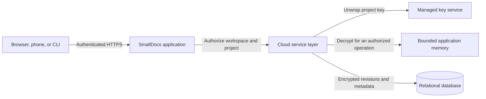

---
tags:
  - cloud
  - product
  - architecture
---

# SmallDocs Cloud implementation design

**Status:** Ready for phased implementation
**Audience:** Product and engineering
**Scope:** An optional paid cloud service around the existing free local SmallDocs product

## 1. Product boundary

Local SmallDocs remains free, account-free, and fully functional. Opening, editing, styling, exporting, using the local library, and serving a local file must not require a Cloud account.

The local library is built intentionally from files opened with `sdoc path/to/file.md`. V1 removes automatic home-directory scanning. Opening an unrelated Markdown file does not make every neighboring or discoverable file part of the library.

SmallDocs Cloud adds:

- A personal hosted Markdown library
- Company workspaces and project membership
- Explicit browser and CLI save, pull, and push operations
- Search across authorized Cloud documents
- Immutable revision history and restore
- Invitations, member removal, and audit history
- Persistent CLI access for humans and local agents

V1 sharing means authenticated membership in a workspace project. The existing encrypted `sdoc share` snapshot links remain a separate feature with their existing security model.

V1 does not provide automatic folder synchronization. The browser saves a Cloud document explicitly, and the CLI uses explicit `pull` and `push` commands. A change feed and background synchronization can be designed later without changing document or revision identity.

## 2. Fixed implementation decisions

| Area | V1 decision | Reason |
| --- | --- | --- |
| Local product | Remains independent and free | Cloud is an optional service, not a requirement for using SmallDocs |
| Persistent storage | Encrypt customer content before writing it | Database dumps, storage snapshots, and backups should not contain plaintext documents |
| Key ownership | Server-managed envelope encryption | Invitations, mobile access, search, recovery, and offboarding work without customers exchanging keys |
| Search | Decrypt and scan current revisions in bounded application memory | Avoid committing to a persistent search index before scale requires one |
| Document identity | Stable UUID | Titles, paths, tags, and projects can change without changing identity |
| Revision identity | Opaque server-generated UUID plus display number | Concurrency must not depend on a client-calculated counter |
| Writes | Full compressed encrypted snapshots | Every revision remains independently readable and restorable |
| Concurrency | Expected-head comparison and immutable revisions | Prevent lost updates without edit locks |
| CLI login | One persistent, revocable credential per installation | Normal terminal and agent sessions should not repeatedly authenticate |
| Agent API | Small command set with stable JSON output | Agents need predictable discovery, errors, and conflict handling |
| Library navigation | Separate Local and Cloud scopes in one library | Preserve one place to find documents without mixing different storage and search models |
| Cloud ingestion | Add from an open document or use `cloud create` | Keep destination and user intent explicit |
| Commercial access | Paid from activation, with no trial | Keep subscription state and customer expectations direct |

## 3. Trust boundary

SmallDocs Cloud uses server-managed encryption, not end-to-end encryption.



The resulting boundary is explicit:

- Persistent service storage contains encrypted document bodies and encrypted customer metadata.
- Project keys are wrapped by a managed key service and are not stored as plaintext in the database.
- The application can decrypt authorized customer content while opening, searching, exporting, or revising it.
- SmallDocs operators with sufficient production application and key-service access may be technically capable of accessing plaintext.
- A compromised application runtime may expose plaintext and cached keys.
- Pulled or exported files are plaintext on the user's device. Cloud encryption does not protect those local copies.
- Ciphertext sizes, workspace relationships, timestamps, access patterns, and billing data remain visible to the service.

Plaintext is not intentionally written to persistent service storage. It exists in application memory during authorized processing and may remain observable through a compromised runtime, allocator behavior, swap, or diagnostic capture. Public copy must describe this mechanism rather than claiming guaranteed memory erasure or zero access.

## 4. Domain model

```text
User
├── Personal workspace
│   └── Default project
└── Company workspace memberships
    └── Workspace
        ├── Members and roles
        ├── Subscription and entitlements
        └── Projects
            ├── Project grants
            ├── Documents
            │   └── Immutable revisions
            └── Audit events
```

### 4.1 Identity and hierarchy

- A user is a human account.
- Every user receives one personal workspace and default project when Cloud is first activated.
- A workspace is the billing, member, and administration boundary.
- A project is the document permission and encryption boundary.
- A document has one stable UUID and belongs to one project.
- A revision has one opaque UUID, one document, and one parent revision.
- Revision numbers are document-local display values only.
- UUIDs are identifiers, never authorization secrets.

Moving a document between projects is an authorized decrypt-and-re-encrypt operation. Updating only its `project_id` is invalid because the source and destination projects use different keys.

### 4.2 Roles

V1 uses these effective permissions:

| Role | Workspace administration | Project content | Billing and deletion |
| --- | --- | --- | --- |
| Owner | Manage all members and projects | Editor on all projects | Manage billing, transfer ownership, delete workspace |
| Admin | Manage members and projects | Editor on all projects | No ownership transfer or workspace deletion |
| Member | No workspace administration | Only explicit project grants | None |
| Project viewer | Not applicable | List, search, pull, open, and export | None |
| Project editor | Not applicable | Viewer actions plus create, push, restore, and delete documents | None |

The final owner cannot be removed or demoted until ownership is transferred. Permission absence, disabled membership, expired invitation, and inconsistent state all default to deny.

### 4.3 Customer content and operational metadata

Encrypt these as customer content:

- Markdown bodies and YAML front matter
- Titles, filenames, tags, comments, and revision messages
- Workspace and project display names
- Search queries and result snippets are transient plaintext and must not be logged

The service may keep these fields as operational metadata:

- Opaque UUID relationships
- Current revision pointer and revision ancestry
- Creation, update, deletion, and last-access timestamps
- Compressed and encrypted byte sizes
- Membership roles and status
- Subscription, quota, and billing state
- Encryption and compression format identifiers

The Markdown revision is the source of truth for document title and tags. On save, the service derives an encrypted metadata envelope from YAML front matter and filename or heading fallbacks. The envelope allows listing current documents without decrypting every full body while keeping metadata versioned atomically with the body.

## 5. Relational data model

Use a transactional relational database. PostgreSQL is the intended production database because atomic expected-head updates, foreign-key invariants, concurrent writes, and row-level security are useful here. The existing `cloud.db` is a prototype and not the production schema.

Core tables:

```text
users
browser_sessions
cli_credentials
workspaces
workspace_memberships
projects
project_grants
project_keys
documents
document_revisions
invitations
subscriptions
entitlements
idempotency_records
audit_events
outbox_jobs
```

### 5.1 Required document fields

```text
documents
  id UUID primary key
  workspace_id UUID
  project_id UUID
  current_revision_id UUID nullable until first revision commits
  created_by_user_id UUID
  created_at timestamp
  updated_at timestamp
  deleted_at timestamp nullable
  purge_after timestamp nullable
```

### 5.2 Required revision fields

```text
document_revisions
  id UUID primary key
  workspace_id UUID
  project_id UUID
  document_id UUID
  parent_revision_id UUID nullable
  revision_number bigint
  body_ciphertext bytes
  metadata_ciphertext bytes
  body_nonce bytes
  metadata_nonce bytes
  algorithm text
  compression_format text
  crypto_format_version integer
  project_key_version integer
  compressed_size bigint
  uncompressed_size bigint
  created_by_user_id UUID
  created_by_credential_id UUID nullable
  created_at timestamp
```

Store any service-side content digest inside authenticated encrypted metadata rather than as a plaintext column. The CLI independently uses a local SHA-256 digest to detect file changes.

Workspace, project, document, and revision relationships must be enforced by composite foreign keys or equivalent constraints. A revision parent must belong to the same document and project.

### 5.3 Tenant isolation

Every request begins with the authenticated principal and derives authorized workspace and project scope before reading a resource. A global UUID lookup followed by an optional permission check is not acceptable.

Enforcement layers:

1. Service-layer authorization on every request and background job
2. Tenant and project predicates on every database operation
3. PostgreSQL row-level security as defense in depth
4. Composite relationship constraints between workspace, project, document, and revision
5. Cross-tenant UUID substitution tests for every endpoint

Search, exports, invitations, audit views, cleanup jobs, and object storage added later carry explicit workspace and project context. Returning another tenant's ciphertext is still a data breach.

## 6. Encryption format and key lifecycle

### 6.1 Key hierarchy

```text
Environment-specific managed KMS key
-> wraps one random 256-bit project key
-> project key encrypts each revision body and metadata envelope
```

- Generate project keys and nonces with the platform cryptographic random generator.
- Use AES-256-GCM through a maintained cryptographic library.
- Generate and store a fresh random 96-bit nonce for every encryption operation.
- Never derive a nonce from a revision number.
- Compress Markdown before encryption.
- Decompression happens only after successful AEAD authentication.

Each ciphertext uses associated authenticated data containing:

```text
environment
workspace UUID
project UUID
document UUID
revision UUID
payload kind: body or metadata
crypto format version
compression format version
```

This prevents a valid encrypted payload from being moved silently between environments, tenants, projects, documents, revisions, or payload fields.

Store the algorithm, nonce, KMS key reference, project-key version, crypto format version, compression format, compressed size, and authenticated uncompressed size with each revision. Authentication or decompression failure is a hard internal failure and returns no partial plaintext or detailed cryptographic diagnostic to the client.

### 6.2 KMS controls

- Development, staging, and production use separate KMS keys and access policies.
- Only the narrow Cloud runtime role receives decrypt permission.
- General deployment and operator credentials do not automatically receive decrypt permission.
- KMS audit events contain identifiers and outcomes, not customer plaintext.
- Project keys may be cached in process with bounded count and TTL. Cache entries are environment-scoped and cleared on revocation or key events where applicable.
- KMS unavailability fails closed. Reads, search, and writes return a temporary service error rather than bypassing encryption.

Rotating the KMS key rewraps project keys without rewriting every document. Rotating a compromised project key protects future revisions. Protecting retained historical revisions after a project-key compromise requires decrypting and re-encrypting those revisions.

Backups are valid only if the restore process can recover ciphertext, wrapped project keys, KMS references, and required key policies together. Restore drills must decrypt representative revisions in an isolated recovery environment.

## 7. Authentication, CLI credentials, and offboarding

### 7.1 Browser sessions

Use an established authentication implementation or identity provider. Browser sessions use Secure, HttpOnly, SameSite cookies, CSRF protection, login-time session rotation, expiration, and server-side revocation.

V1 offers three ways to authenticate:

1. Continue with Google
2. Continue with GitHub
3. Enter an email address and receive a six-digit one-time code

There is no separate signup form and SmallDocs does not store passwords. The first successful authentication creates the user and personal workspace. Email codes are the universal fallback for people who do not use or do not want to connect Google or GitHub. V1 uses codes rather than depending on magic links so the email may be opened on a different device, the pending browser tab remains authoritative, and automated email-link scanning cannot consume the login action.

Users are separate from authentication identities:

```text
users
  id

user_identities
  id
  user_id
  provider: google | github | email
  provider_subject
  normalized_verified_email
```

Provider subjects are the stable login identity. Email addresses are verified contact attributes and invitation targets, not provider-independent primary keys. SmallDocs does not automatically merge existing accounts only because two providers report the same email address. Adding another login method to an existing account requires an authenticated account-linking flow.

Google authentication uses OpenID Connect and validates signature, issuer, audience, expiry, state, nonce, and PKCE. GitHub authentication uses its OAuth authorization-code flow with state and PKCE where supported, then obtains the stable GitHub user identifier and a verified email with the minimum required scopes. Provider access tokens are discarded after identity resolution and never become SmallDocs browser or CLI credentials.

Email codes are random, short-lived, single-use, stored only as a keyed digest, and bound to the browser transaction that requested them. Requests and verification attempts are rate-limited by normalized email, source address, and transaction. Responses do not reveal whether an account already exists.

Require recent authentication or MFA for ownership transfer, workspace deletion, bulk export, session revocation, and billing changes. Login, signup, invitation, password reset, search, export, and writes are rate-limited.

### 7.2 Persistent CLI login

`sdoc cloud login` runs once per CLI installation under normal use:

1. The CLI starts a short-lived device authorization.
2. It opens the SmallDocs authorization page, or prints a URL and code with `--no-open`.
3. The browser shows the account, machine name, and requested access for confirmation.
4. The CLI polls until approval, denial, or expiry.
5. The service issues a short-lived access token and one rotating refresh token for that installation.
6. Later terminals and local agent sessions reuse the stored installation credential.

The refresh token is stored in macOS Keychain, Windows Credential Manager, or the platform secret store. A fallback owner-only file requires explicit user acceptance and reports its weaker local protection. The server stores only a hash or keyed digest of the refresh token.

Refresh tokens rotate on use. Reuse of an already rotated token revokes the installation token family. Access tokens remain short-lived, and every operation checks current membership rather than treating old token claims as permanent authorization.

Normal commands never expose credentials in arguments, URLs, environment variables, stdout, or debug output. Processes running with the same OS-user privileges may still be able to invoke the authenticated CLI or access its local credential. The local OS account is the boundary.

Users can inspect and revoke installations. Audit records identify the user and CLI installation, for example `Josh via CLI on Josh's Mac`. V1 cannot prove which agent process invoked a shared installation. Verified per-agent attribution requires a later automation identity.

Only `cloud login` is interactive. A revoked or expired credential during `create`, `ls`, `search`, `pull`, or `push` returns `login_required` and never opens a browser unexpectedly.

On a remote development machine, `sdoc cloud login --no-open` prints a URL and short code for approval in any browser, then persists the resulting installation credential on that machine. A truly disposable CI job should not copy a person's refresh token into every run. Dedicated project-scoped automation credentials or workload identity can be added when unattended CI becomes a release requirement.

### 7.3 Invitations

Invitation tokens are random, single-use, expiring, stored hashed, and bound to:

- Intended normalized email identity
- Workspace
- Project grants
- Role
- Inviting user

Acceptance revalidates the server-side invitation values and creates membership and grants in one transaction. Values returned by the browser are never trusted as the grant source.

### 7.4 Offboarding

Removing a member is one system-wide invalidation operation:

1. Disable workspace membership and project grants.
2. Revoke affected browser sessions and CLI refresh-token families according to workspace policy.
3. Invalidate authorization caches and active streaming requests.
4. Reauthorize or cancel queued exports, searches, and writes.
5. Reject any write whose authorization disappeared before transaction commit.
6. Append an audit event with actor, target, workspace, outcome, and request ID.

Project-key rotation is not required for ordinary offboarding because users never receive the project key. Removal prevents future server access but cannot retract plaintext already downloaded, exported, copied, or captured.

## 8. Revision and concurrency protocol

### 8.1 Save representation

Every accepted save creates one complete immutable revision:

```text
Markdown and YAML front matter
-> derive current encrypted listing metadata
-> compress complete Markdown
-> encrypt body and metadata
-> atomically insert revision and advance document head
```

Full snapshots intentionally repeat content. Markdown compresses well, and each revision can be opened, restored, compared, or merged without reconstructing a patch chain. V1 does not store delta chains.

### 8.2 Atomic write

The client sends:

```json
{
  "expected_head_revision_id": "rev_base",
  "markdown": "...",
  "idempotency_key": "client-generated-uuid"
}
```

Prepare compression and encryption outside the database transaction after an initial authorization check. Then use one short database transaction that rechecks authorization and performs the authoritative write:

1. Authenticates the user and installation.
2. Authorizes editor access through the document's current project.
3. Confirms the expected head belongs to this document and is still current.
4. Inserts the prepared immutable encrypted revision.
5. Advances `documents.current_revision_id` with compare-and-swap semantics.
6. Commits the audit event or durable outbox record.

The server creates the revision UUID and display number. Clients never calculate the next revision.

Idempotency records are scoped to principal, credential, endpoint, and document. Store a request digest with the record. Reusing an idempotency key with different request content fails. If the first write commits but its response is lost, retrying returns the original success rather than creating another revision or reporting a false conflict.

### 8.3 Conflict response

If the expected head is stale, return HTTP 409:

```json
{
  "ok": false,
  "command": "cloud.push",
  "error": "revision_conflict",
  "message": "The document changed after this file was pulled.",
  "document_id": "doc_uuid",
  "base_revision_id": "rev_base",
  "current_revision_id": "rev_current"
}
```

Content for either revision requires a fresh authorized revision read. A conflict never advances the local binding automatically.

V1 exposes base, local, and current versions so an agent or human can perform a three-way merge. It does not automatically publish a merge. After resolution, the client pushes the merged file against `rev_current`.

### 8.4 Restore and delete

Restore creates a new head revision whose content equals an authorized historical snapshot. It does not move the head pointer backward.

Delete also names the expected head. It creates a tombstone only if the head is still current, preventing deletion from hiding a concurrent edit. Restore during the soft-delete window clears the tombstone through an authorized expected-head operation.

## 9. Revision retention

Retain a configurable number of recent complete revisions according to workspace entitlements. Browser autosave coalesces rapid edits so revisions represent meaningful saves rather than every keystroke.

Retention rules:

- Never prune the current head.
- Keep soft-deleted document revisions through the restore window.
- Pruning operates on independent encrypted snapshots and does not affect later revisions.
- The CLI caches the exact plaintext base used for an active local binding so conflict resolution can continue if the server later prunes that revision.
- Local base caches use owner-only permissions, are scoped by account and document, and are removed when their binding is removed or expires.
- If neither server history nor the local base cache contains the base, report `base_revision_unavailable`; do not attempt a two-way overwrite.

If measured storage cost becomes material, evaluate periodic snapshots plus deltas or content chunking behind the same revision API. Clients continue to receive complete versions regardless of internal representation.

## 10. Search execution

V1 does not persist a plaintext or blind keyword index.

For each request:

1. Authenticate the principal and resolve authorized projects.
2. Restrict the query to current document heads.
3. Unwrap each project key once for the bounded request or use its bounded process cache.
4. Stream encrypted revisions in batches.
5. Authenticate, decrypt, and decompress one bounded batch at a time.
6. Match body, title, tags, and project filters in memory.
7. Produce capped snippets and deterministic result ordering.
8. Recheck authorization before returning results if membership changed during the request.
9. Release request buffers without claiming guaranteed memory erasure.

Search limits are configuration and entitlement values with conservative beta defaults:

- Query character limit
- Authorized project count per search
- Total ciphertext and decompressed bytes scanned
- Per-document decompressed size
- Execution deadline and bounded concurrency
- Result and snippet count
- Request rate by user, workspace, installation, and source address

Authenticated uncompressed size is checked during decompression to reject oversized or malformed payloads. Cancellation stops outstanding work when the client disconnects.

No request or response body capture is enabled for search endpoints. Queries and snippets do not enter logs, traces, analytics, exceptions, or crash reports. Search and document responses use `Cache-Control: no-store` and bypass CDN or proxy caching.

If measurements show full scans are too expensive, evaluate a short-lived in-memory index first and a persistent blind index second. A blind index is not part of V1.

## 11. Cloud API

All endpoints are versioned under `/api/cloud/v1`. JSON identifiers are UUID strings. Timestamps use UTC RFC 3339. Lists use opaque cursor pagination and deterministic sorting.

Minimum resource operations:

```text
POST   /cli/device-authorizations
POST   /cli/device-authorizations/token
POST   /cli/token/refresh
DELETE /cli/credentials/:credential_id

GET    /projects
GET    /tags
GET    /documents
POST   /documents
GET    /documents/:document_id
GET    /documents/:document_id/revisions/:revision_id
POST   /documents/:document_id/revisions
DELETE /documents/:document_id
POST   /documents/:document_id/restore
POST   /search

POST   /workspaces/:workspace_id/invitations
POST   /invitations/:token/accept
DELETE /workspaces/:workspace_id/members/:user_id
```

Every document result includes:

```json
{
  "id": "doc_uuid",
  "title": "Roadmap",
  "project": { "id": "project_uuid", "name": "Product" },
  "tags": ["planning"],
  "current_revision_id": "rev_uuid",
  "revision_number": 42,
  "updated_at": "2026-08-13T10:00:00Z"
}
```

Stable API error codes include:

```text
invalid_request
login_required
permission_denied
resource_unavailable
revision_conflict
base_revision_unavailable
idempotency_mismatch
unsafe_local_state
rate_limited
temporary_service_failure
```

Unavailable resources should not reveal whether an unauthorized UUID exists. Conflict bodies return identifiers only until a fresh read authorization succeeds.

## 12. CLI contract

### 12.1 V1 commands

```text
sdoc cloud login [--no-open]
sdoc cloud logout
sdoc cloud status
sdoc cloud projects
sdoc cloud tags [--project UUID]
sdoc cloud ls [--project UUID] [--tag TAG] [--limit N]
sdoc cloud search QUERY [--project UUID] [--tag TAG] [--limit N]
sdoc cloud create PATH --project UUID
sdoc cloud pull DOCUMENT_UUID [--revision REVISION_UUID] --output PATH [--no-bind]
sdoc cloud push PATH
```

`cloud create` is the direct agent upload path. It reads the Markdown file, creates a Cloud document and first revision, prints the new document UUID, and binds the local path to that revision. It does not render the document or open a browser. No separate `--headless` flag is required because every Cloud command except `login` is noninteractive by default.

`cloud tags` lists the normalized tags visible to the current credential and the number of current documents using each tag. With `--project`, counts are restricted to that project. This lets people and agents reuse the existing vocabulary before creating or updating a document.

```text
# Agent writes release-notes.md with normal file tools
sdoc cloud create release-notes.md --project PROJECT_UUID --json
# Later edits use the binding created above
sdoc cloud push release-notes.md --json
```

Creation requires an explicit project UUID so an unattended agent never guesses a destination. The service generates the document and first revision UUIDs and treats creation as an idempotent operation. A retry after a lost response returns the original document rather than creating a duplicate.

`pull` requires the full document UUID. V1 does not resolve documents by title. Search and list display titles for humans but return UUIDs as canonical identity. Project filters also use UUIDs, discovered through `cloud projects`.

All discovery commands default to every authorized project and include project identity in every result. There is no hidden current-project context. `--tag` is repeatable and matches documents whose current revision contains every requested tag.

### 12.2 Local bindings

Normal pull creates a persistent binding under `~/.sdocs/cloud/`:

```json
{
  "account_id": "user_uuid",
  "path": "/absolute/path/plan.md",
  "document_id": "doc_uuid",
  "revision_id": "rev_uuid",
  "content_sha256": "hex",
  "updated_at": "2026-08-13T10:00:00Z"
}
```

Binding rules:

- Normalize paths to absolute canonical paths and scope them by Cloud account.
- One path binds to one document; one document may bind to several paths.
- Refuse to overwrite an existing unbound file unless `--force` is supplied.
- Refuse to replace a locally modified bound file during pull unless `--force` is supplied.
- Treat an unchanged push as success without creating a revision.
- Update a binding atomically only after confirmed server success.
- If a file changes during upload, bind the uploaded hash and report that the local file changed again.
- Do not accept stdin for V1 push because it has no durable path binding.

If a moved or copied file loses its binding, recovery must include both identities:

```text
sdoc cloud push plan.md --document DOCUMENT_UUID --base-revision REVISION_UUID
```

`--document` alone is unsafe because it does not establish which Cloud revision the local file was based on. A successful explicit recovery push creates the new binding.

Pulling a revision for conflict resolution uses `--no-bind`, so diagnostic files cannot advance or replace the active binding.

### 12.3 Push retry state

Before upload, the CLI creates an idempotency UUID and stores the pending operation locally with document UUID, base revision UUID, and content hash. A retry after a timeout reuses the same idempotency key until the outcome is known. Confirmed success atomically updates the binding and clears pending state.

### 12.4 Machine-readable output

With `--json`, stdout contains exactly one JSON object. Progress, browser-launch notices, update notices, and decoration go to stderr. JSON errors remain on stdout with a nonzero process status so agents can always parse the result.

Success envelope:

```json
{
  "ok": true,
  "command": "cloud.search",
  "documents": [],
  "next_cursor": null
}
```

Tag listing:

```json
{
  "ok": true,
  "command": "cloud.tags",
  "tags": [
    { "tag": "auth", "document_count": 12 },
    { "tag": "webhooks", "document_count": 7 }
  ]
}
```

Search matches use the common document shape plus:

```json
{
  "matches": [
    {
      "field": "body",
      "snippet": "Move the service to Kubernetes...",
      "line": 18
    }
  ]
}
```

Pull result:

```json
{
  "ok": true,
  "command": "cloud.pull",
  "document_id": "doc_uuid",
  "revision_id": "rev_uuid",
  "revision_number": 42,
  "path": "/absolute/path/plan.md",
  "tags": ["planning", "kubernetes"],
  "sha256": "hex",
  "binding_created": true
}
```

Create result:

```json
{
  "ok": true,
  "command": "cloud.create",
  "document_id": "doc_uuid",
  "revision_id": "rev_uuid",
  "revision_number": 1,
  "project_id": "project_uuid",
  "path": "/absolute/path/release-notes.md",
  "tags": ["release", "kubernetes"],
  "sha256": "hex",
  "binding_created": true
}
```

Push result:

```json
{
  "ok": true,
  "command": "cloud.push",
  "document_id": "doc_uuid",
  "base_revision_id": "rev_base",
  "revision_id": "rev_new",
  "revision_number": 43,
  "tags": ["planning", "kubernetes"],
  "sha256": "hex",
  "no_change": false
}
```

No search matches and an unchanged push are successful operations.

Stable CLI exit codes:

```text
0  Success, including no results and no-op push
1  Unexpected local failure
2  Invalid command or arguments
3  Login required, expired, or revoked
4  Resource unavailable or permission denied
5  Revision conflict
6  Unsafe local state or missing base revision
7  Network, rate-limit, or temporary service failure
```

Agents should branch on the JSON `error` field. Exit codes provide coarse shell behavior.

## 13. Library, browser, and mobile flows

### 13.1 Unified library

The browser presents one Library with two explicit scopes:

- **Local** shows files intentionally added by opening them with `sdoc`. It uses local metadata search and remains available without a Cloud account.
- **Cloud** shows documents in the selected Cloud workspace. It searches authorized titles, tags, and document text through the Cloud search endpoint.

V1 does not include an `All` or blended scope. A blended result set would require duplicate detection, merged ranking, mixed offline behavior, and an explanation of why some documents support content search while others do not. Local and Cloud may contain related copies, but V1 does not silently merge or deduplicate them.

The Cloud scope contains:

- A workspace selector for personal and company workspaces
- Project, updated-by, date, tag, and starred filters
- Workspace-labelled search results with stable document UUIDs behind each row
- The signed-in account shown quietly on the left below the scope control
- `Workspace settings` inside the workspace selector for owners and admins

The Info panel may include a secondary account or Cloud link later, but it is not the primary route to workspace administration. Its current purpose remains community, product notifications, and feedback.

There is no global `Add document` button in the Library for V1. Documents enter Cloud through either:

1. `Add to Cloud` in the open document's file-information table
2. `sdoc cloud create PATH --project UUID` from the CLI

The file-information action uses the Lucide `cloud-upload` icon before upload and `cloud-check` once the current document has a Cloud identity. Its supporting copy is:

```text
Encrypted document on our server; paid feature (learn more)
```

`learn more` opens `/cloud`. The Cloud product page explains human and agent use, pricing, the server-managed encryption boundary, and the fact that Cloud is not end-to-end encrypted.

### 13.2 First Cloud save

1. A local document remains open while the user chooses `Add to Cloud`.
2. If required, the file-information area asks for an email address and sends a six-digit one-time code.
3. The user returns to the same pending document after authentication.
4. If the user has no active Cloud subscription, the browser opens checkout before storing the document.
5. Cloud activation creates a personal workspace and default project.
6. The user confirms the destination project.
7. The service creates the document UUID and first encrypted revision.
8. The browser returns to the document and shows its Cloud project and saved state.

The original local file remains a local file. V1 does not imply background synchronization between that path and the Cloud document.

### 13.3 Company invitation

1. An owner or admin enters an email, role, and project grants.
2. The service sends an expiring invitation.
3. The recipient signs in or creates an account.
4. The browser shows the inviting company and granted projects.
5. Acceptance creates membership and grants transactionally.
6. The recipient opens the company library without an encryption-key step.

### 13.4 Workspace administration

Owners and admins reach workspace administration from the workspace selector in the Cloud library. The V1 administration area contains:

- Overview
- Members and pending invitations
- Projects and project access
- Signed-in CLI installations and later automation credentials
- Billing, subscription state, and invoices

Inviting a person does not create a paid seat until the invitation is accepted. Each active human workspace member, including the owner, counts as a Team seat. Agent processes using a human's revocable CLI installation do not create separate seats. Membership acceptance and removal update the subscription quantity automatically and record an audit event. Billing adjustments follow the terms shown before confirmation rather than appearing as an unexplained charge.

### 13.5 Mobile search

1. Authenticate the browser session.
2. Load authorized projects.
3. Send the query over HTTPS.
4. The service performs bounded in-memory search over authorized current heads.
5. Return project-labelled results and snippets.
6. Open the selected document through an authorized decrypt request.

The phone does not need the complete corpus or a customer-managed project key.

## 14. Deletion, export, and subscription state

Deletion uses three states:

1. Active
2. Soft-deleted and restorable until `purge_after`
3. Purged from active storage by a tenant-scoped idempotent job

Revision pruning, document purge, workspace deletion, temporary exports, and orphaned uploads have explicit retention jobs. Backup retention is documented separately and never described as immediate deletion. Ciphertext may remain in encrypted backups until their stated expiry.

Workspace owners can export all current documents and retained revisions before deletion or downgrade. Failed payment enters a configurable grace period followed by read-only access. It does not immediately delete customer data. Entitlements define member count, project count, stored bytes, search limits, and revision retention.

The exact commercial allowance can change without changing this architecture. The free local product never depends on subscription state.

The initial public offer is:

| Plan | Price | Intended use |
| --- | --- | --- |
| Personal | £4, $5, or €5 per month | One person using Cloud across devices and authenticated agents |
| Team | £7, $9, or €8 per active human member per month | Shared workspaces, projects, member administration, and team access |

There is no free Cloud tier and no trial in V1. Subscription calls to action go directly to checkout. There is no document-count limit. Entitlements use stored bytes, maximum file size, revision retention, search workload, project count, and member count because these correspond to service cost and safety. Exact allowance values must be chosen before public launch and shown on `/cloud` and at checkout.

## 15. Operations and diagnostics

Use the existing service shape initially rather than adding microservices. Add a durable outbox or jobs table for:

- Email delivery
- Expired invitation and session cleanup
- Revision pruning
- Tombstone and export purge
- KMS project-key rewrap
- Subscription state changes

Operational requirements:

- Request IDs across API, audit, and job execution
- Per-tenant quotas and rate limits
- `Cache-Control: no-store` on authenticated content and auth responses
- No request or response body logging for document, search, export, or auth endpoints
- No customer content in APM, traces, analytics, crash reports, or exception metadata
- Production core dumps and unrestricted heap snapshots disabled
- Encrypted or disabled host swap where operationally appropriate
- Append-only audit writes for ordinary application roles
- Backup restore drills that verify KMS-wrapped keys remain usable
- Alerts for KMS failures, authorization anomalies, job backlog, and cross-tenant test failures

Audit events contain principal, CLI credential or browser session, action, opaque resource UUIDs, workspace and project UUIDs, result, source address, user agent, and request ID. They do not contain titles, filenames, tags, queries, snippets, or Markdown.

## 16. Testing requirements

### 16.1 Authorization

- Substitute another tenant's UUID in every endpoint and background-job path.
- Verify viewer, editor, member, admin, and owner permissions.
- Verify final-owner protection and transactional invitation acceptance.
- Remove a member during search and upload, then confirm no result or write commits afterward.
- Verify document moves decrypt under the source key and re-encrypt under the destination key.

### 16.2 Encryption

- Round-trip every supported crypto and compression format version.
- Tamper with ciphertext, nonce, associated data, sizes, and row placement.
- Verify authentication failure releases no partial plaintext.
- Verify nonce uniqueness tests and CSPRNG usage.
- Rotate the KMS key and rewrap project keys.
- Restore encrypted backups with their KMS references in an isolated environment.

### 16.3 Revisions

- Race two writes against the same expected head; exactly one advances it.
- Lose a successful response and retry with the same idempotency key.
- Reuse an idempotency key with different content and reject it.
- Delete concurrently with an edit and preserve the winning head correctly.
- Restore an old snapshot by creating a new revision.
- Prune history without deleting the head or breaking locally cached conflict bases.

### 16.4 CLI

- Persist login across terminals and agent sessions.
- Rotate, revoke, and reuse-detect refresh tokens.
- Keep `--json` stdout to one valid object for success and every error.
- Protect existing and locally modified files from accidental overwrite.
- Confirm unchanged pushes create no revision.
- Retry pending uploads idempotently after process and network failure.
- Require both document and base revision when recovering a lost binding.

### 16.5 Search

- Enforce every size, time, project, result, and rate limit.
- Reject malformed and oversized compressed input.
- Stop work after cancellation.
- Return deterministic pages without logging queries or snippets.
- Confirm only current authorized revisions appear.

## 17. Implementation sequence

1. Create PostgreSQL migrations, tenant-scoped repositories, and authorization tests.
2. Implement browser identity, persistent CLI credential records, rotation, revocation, and device authorization.
3. Implement workspaces, projects, roles, grants, invitations, and final-owner protection.
4. Add the managed KMS project-key service and versioned AEAD envelope format.
5. Implement encrypted document creation, current reads, immutable revisions, atomic expected-head writes, and idempotency.
6. Implement `cloud status`, `projects`, `ls`, `pull`, and `push` with bindings, base caches, pending retry state, JSON contracts, and conflicts.
7. Implement browser save, open, history, restore, and conflict UI.
8. Implement bounded in-memory search shared by web, mobile, and CLI.
9. Add deletion, purge, revision-retention, email, and KMS-rewrap jobs plus audit views.
10. Add subscriptions, entitlements, grace and read-only states, export, and administrator offboarding controls.
11. Measure corpus sizes, search latency, revision storage, and conflict frequency before considering sync, blind indexing, deltas, or automatic merges.

Each step should produce a usable vertical slice and preserve the free local behavior.

## 18. Implementation readiness

The design is ready to implement as a staged vertical slice. The following are settled sufficiently to begin:

- Product boundary between free Local and paid Cloud
- Server-managed encryption and its trust boundary
- Workspace, project, document, revision, membership, and credential identities
- Expected-head revision writes without locks
- Persistent revocable CLI login
- Browser, CLI, agent, and mobile search behavior
- Local and Cloud library navigation
- Cloud creation entry points
- Tags and stable JSON output
- Workspace administration and seat-based Team billing behavior
- No trial, no blended library, and no automatic folder synchronization

Before accepting real customer data, implementation must also complete these deployment selections and launch values:

- Authentication and email delivery provider
- Managed KMS provider and production key policies
- PostgreSQL hosting, encrypted backups, and restore procedure
- Payment provider checkout, webhook, tax, invoice, and proration behavior
- Personal and Team storage, file-size, search, project, and revision-retention allowances
- Soft-delete, backup-expiry, audit-retention, and failed-payment grace periods
- Production monitoring, incident access, and operator authorization procedures

These are not reasons to delay the first vertical slice. They are gates for production launch. The first implementation should use configuration values and provider interfaces so these selections do not alter the document or API model.

## 19. V1 non-goals

- End-to-end or customer-managed document keys
- Customer key exchange or device approval ceremonies
- Automatic background folder synchronization
- Live collaborative editing
- Hard edit locks
- CRDTs
- Automatic conflict publication
- Delta-compressed revision chains
- Persistent blind, plaintext, or semantic search indexes
- Public live-document links
- Document-level permissions below the project boundary
- Native mobile applications
- Verified per-agent identities

These can be evaluated from measured product use. They are not prerequisites for a secure and usable first Cloud implementation.

## 20. Reference mechanisms

- [OWASP Cryptographic Storage guidance](https://cheatsheetseries.owasp.org/cheatsheets/Cryptographic_Storage_Cheat_Sheet.html)
- [OWASP Multi-Tenant Security guidance](https://cheatsheetseries.owasp.org/cheatsheets/Multi_Tenant_Security_Cheat_Sheet.html)
- [OAuth 2.0 Device Authorization Grant](https://www.rfc-editor.org/rfc/rfc8628.html)
- [UUID specification](https://www.rfc-editor.org/rfc/rfc9562.html)
- [AWS KMS encryption context](https://docs.aws.amazon.com/kms/latest/developerguide/encrypt_context.html)
